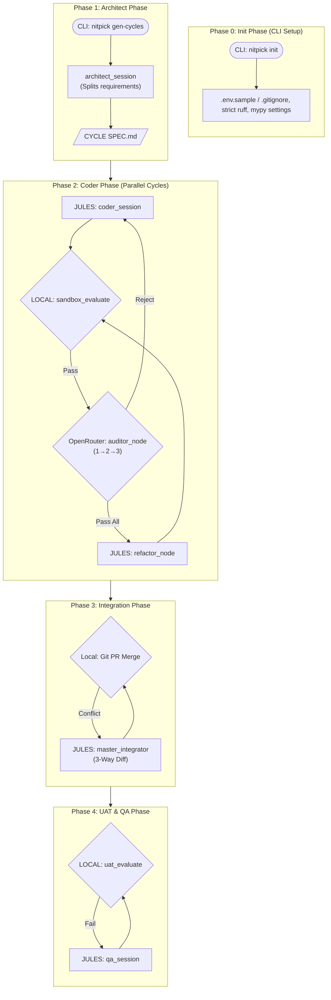

# Nitpickers

 

Nitpickers is an AI-native, multi-agent code development environment employing an autonomous "5-Phase Architecture" to decompose requirements, implement features in parallel, integrate conflicts, and enforce end-to-end user acceptance testing (UAT).

## Key Features

*   **Autonomous 5-Phase Workflow**: Distinct pipeline separating planning, coding, integration, and final testing, preventing "God Class" AI agents.
*   **Sequential Auditing & Refactoring**: Dedicated red-teaming loops (Auditor 1 -> 2 -> 3) and a final refactoring loop ensure code is safe and maintainable before integration.
*   **AI-Assisted 3-Way Diff Integration**: Intelligent conflict resolution that analyzes the Base, Branch A, and Branch B to safely merge parallel development cycles.
*   **Automated E2E Remediation**: Separated UAT Graph that runs final verifications and auto-heals bugs discovered in the global integrated environment.

## Architecture Overview

Nitpickers employs `LangGraph` to route states through five distinct phases, isolating responsibilities to ensure stability.



## Prerequisites

*   Python 3.12+
*   `uv` (Python package manager)
*   Docker & Docker Compose (for containerized execution)
*   API Keys: `JULES_API_KEY`, `OPENROUTER_API_KEY`, `E2B_API_KEY`

## Installation & Setup

1.  **Clone the Repository**
    ```bash
    git clone https://github.com/your-org/nitpickers.git
    cd nitpickers
    ```

2.  **Sync Dependencies using `uv`**
    ```bash
    uv sync
    ```

3.  **Configure Environment**
    ```bash
    cp .env.example .env
    # Edit .env and insert your API keys
    ```

## Usage

### Quick Start

1.  **Initialize the Project**
    ```bash
    uv run nitpick init
    ```

2.  **Generate Architecture and Cycle Plans** (Phase 1)
    ```bash
    uv run nitpick gen-cycles
    ```

3.  **Run the Full Pipeline** (Phase 2 to 4)
    ```bash
    uv run nitpick run-pipeline
    ```

### Interactive Tutorials

To understand the system flow or run it in a mocked CI environment, execute the interactive Marimo notebook:
```bash
uv run marimo edit tutorials/UAT_AND_TUTORIAL.py
```

## Development Workflow

*   **Running Tests**: `uv run pytest`
*   **Running Linters**: `uv run ruff check` and `uv run mypy src`
*   The project enforces a strict separation of concerns; when modifying LangGraph nodes, ensure they are thoroughly isolated and unit tested using mocked states.

## Project Structure

```text
nitpickers/
├── dev_documents/         # Architecture definitions and specifications
├── src/                   # Main application code
│   ├── graph.py           # LangGraph definitions
│   ├── state.py           # Pydantic state models
│   ├── services/          # Core orchestration and managers
│   └── nodes/             # Individual LLM/Execution nodes
├── tests/                 # Unit and Integration test suite
└── tutorials/             # Marimo notebooks for UAT
```

## License

MIT License. See `LICENSE` for details.
