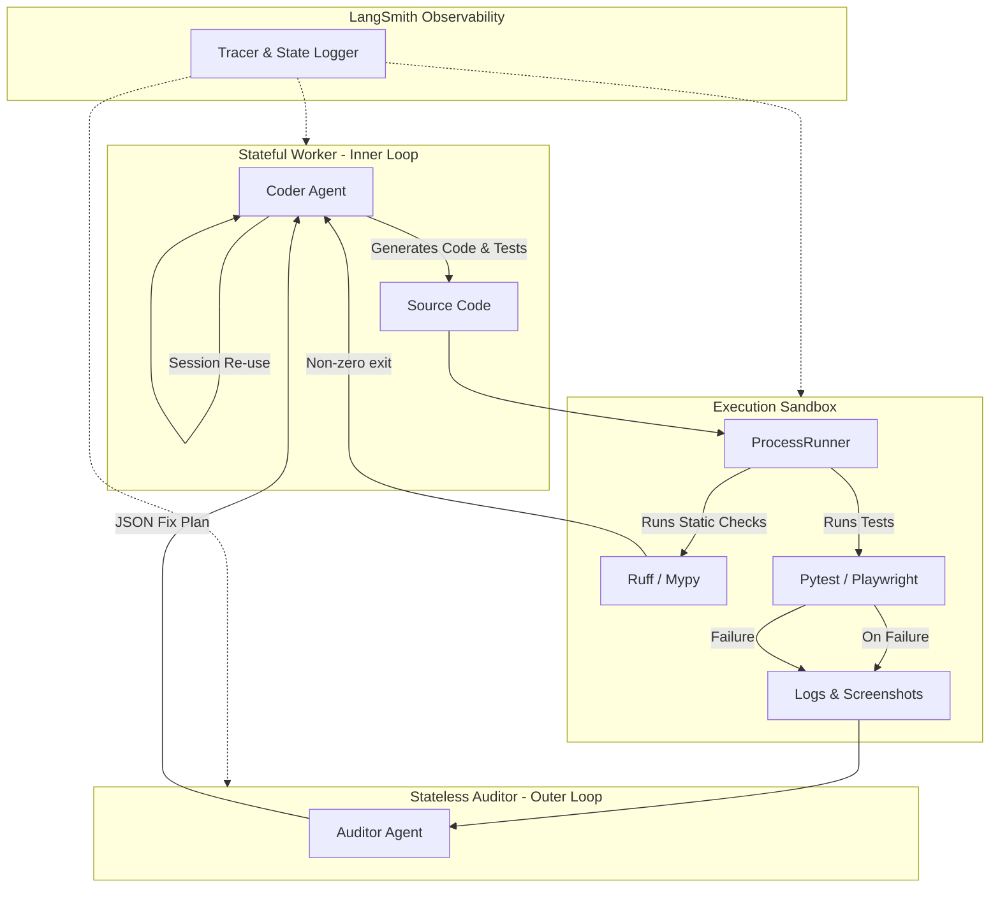

# NITPICKERS

An AI-native development environment based on a highly robust methodology designed to enforce absolute zero-trust validation of AI-generated code. NITPICKERS uses static analysis, dynamic testing in a secure sandbox, and automated red team auditing to ensure that generated code meets professional engineering standards.


## Key Features

- **Automated Mechanical Blockade:** Zero-trust validation. Pull requests are explicitly blocked until all static (Ruff, Mypy) and dynamic (Pytest) structural checks pass with a zero exit code, eliminating assumed success.
- **Docs-as-Tests Integration:** Natively parse and execute `uat-scenario` blocks directly from markdown specifications (`ALL_SPEC.md`), ensuring the implementation accurately reflects the documented requirements.
- **Multi-Modal Diagnostic Capture:** Automatically capture rich UI failure context, including high-resolution screenshots and DOM traces via Playwright, providing undeniable evidence of frontend regressions.
- **Self-Healing Loop with Stateless Auditor:** Utilize advanced Vision LLMs (via OpenRouter) strictly as outer-loop diagnosticians. They analyze error artifacts without project context fatigue and return structured JSON fix plans to the Worker agent for autonomous remediation.
- **Total Observability:** Fully integrated LangSmith tracing visualizes complex LangGraph node transitions, internal state mutations, and multi-modal API payloads, transforming the "Black Box" of agent execution into quantifiable, debuggable datasets.

## Architecture Overview

The NITPICKERS pipeline is designed around a strictly decoupled Worker-Auditor-Observer paradigm.

-   **Stateful Worker (Inner Loop):** Generates code and tests, maintaining project context across iterations.
-   **Sandbox (Gatekeeper):** A secure execution environment using `ProcessRunner` that mechanically halts the pipeline on any failure, generating multi-modal artifacts when UI tests break.
-   **Stateless Auditor (Outer Loop):** Diagnoses isolated failures using Vision LLMs and returns precise JSON fix plans to the Worker.
-   **Observability Layer:** LangSmith silently traces all graph transitions and state mutations to prevent infinite loops and hallucinated logic.



## Prerequisites

Ensure the following tools are available on your system:
- `uv` - The fastest Python package installer and resolver.
- `git` - Version control for your codebase.
- `Docker` - (Optional, depending on sandbox configuration).
- Valid API keys:
    - `JULES_API_KEY` (Gemini Pro/Worker)
    - `E2B_API_KEY` (Sandbox Execution)
    - `OPENROUTER_API_KEY` (Auditor/Vision Models)
- LangSmith Observability Configuration:
    - `LANGCHAIN_TRACING_V2=true`
    - `LANGCHAIN_API_KEY`
    - `LANGCHAIN_PROJECT`

## Installation & Setup

1. Clone the repository and navigate to the project directory:
   ```bash
   git clone <your-repository>
   cd <your-repository>
   ```

2. Sync the dependencies and initialize the virtual environment:
   ```bash
   uv sync
   ```

3. Configure your environment variables. The Gatekeeper explicitly requires LangSmith to be configured before any execution will start:
   ```bash
   cp .env.example .env
   # Edit .env and populate your API keys and LangSmith variables.
   ```

## Usage

NITPICKERS operates primarily through its Command-Line Interface.

### Generate Development Cycles (Phase 1)
Parse your raw architectural documents into structured specifications and UAT plans.
```bash
uv run python -m src.cli gen-cycles
```

### Run a Specific Cycle (Phase 2 & 3)
Execute a specific development cycle (e.g., `01`) defined by the manifest. The system will automatically verify your environment configuration, build the schemas, write tests, and implement logic within the E2B sandbox.
```bash
uv run python -m src.cli run-cycle --id 01
```

### Finalize & Refactor
```bash
uv run python -m src.cli finalize-session
```

## Troubleshooting

- **Hard Stop during execution:** If the execution halts with an "Environment & Observability Verification" error, ensure your `.env` is correctly populated with `LANGCHAIN_TRACING_V2=true` and valid LangSmith keys.

## Development Workflow

-   **Run Linters & Type Checks:**
    ```bash
    uv run ruff check .
    uv run mypy .
    ```
-   **Run Unit & Integration Tests:**
    ```bash
    uv run pytest
    ```
-   **Run UATs manually:**
    ```bash
    uv run pytest tests/uat/ --browser=chromium
    ```

## Project Structure

```text
/
├── dev_documents/          # Auto-generated specs, UATs, logs
├── src/                    # The main implementation for NITPICKERS
│   ├── cli.py              # CLI entrypoint
│   ├── domain_models/      # Pydantic schemas enforcing interface locks
│   ├── nodes/              # LangGraph workflow nodes
│   ├── services/           # Business logic and external API integrations
│   └── templates/          # System prompts for the agents
├── tests/                  # Unit, Integration, and UAT tests
│   └── uat/                # Dynamic UAT scripts (Marimo/Pytest)
├── tutorials/              # Marimo-based interactive tutorials
├── pyproject.toml          # Project configuration (Dependencies & Linting)
└── README.md               # User documentation
```

## License

MIT License
