# NITPICKERS: 5-Phase Zero-Trust Architecture

Nitpickers is an AI-native code development environment designed to enforce absolute zero-trust validation of AI-generated code. By employing a rigorous 5-Phase Architecture, Nitpickers integrates parallel coding agents, a robust 3-Way Diff integration system, and a standalone multi-modal User Acceptance Testing (UAT) phase, ensuring that generated code perfectly meets professional engineering standards.


## Key Features

- **5-Phase Parallel & Sequential Architecture:** Seamlessly orchestrates requirement decomposition, parallel feature implementation, 3-Way Diff integration, and full-system E2E UI testing.
- **Serial Auditing Loop:** AI agents are subjected to rigorous review by a chain of distinct serial auditors, enforcing red team validation before code enters the integration phase.
- **Master Integrator with 3-Way Diff:** Resolves Git conflicts intelligently by feeding a unified `Base`, `Local`, and `Remote` context into an integration LLM.
- **Stateless Vision UAT Diagnosticians:** Leverages advanced Vision LLMs (via OpenRouter) as outer-loop diagnosticians. They analyze error artifacts (e.g., Playwright screenshots) and return structured JSON fix plans to worker agents.

## Architecture Overview

The system operates across 5 distinct phases to guarantee code quality from planning to final integration.

```mermaid
flowchart TD
    %% Phase0: Init Phase (CLI Setup)
    subgraph Phase0 ["Phase 0: Init Phase (CLI Setup)"]
        direction TB
        InitCmd([CLI: nitpick init])
    end

    %% Phase1: Architect Graph
    subgraph Phase1 ["Phase 1: Architect Graph"]
        direction TB
        InitCmd2([CLI: nitpick gen-cycles])
        ArchSession["JULES: architect_session\n(Requirement Decomposition)"]
        ArchCritic{"JULES: architect_critic\n(Red Team Self-Critic)"}
        InitCmd2 --> ArchSession
        ArchSession --> ArchCritic
        ArchCritic -- "Reject" --> ArchSession
    end

    %% Phase2: Coder Graph (Parallel: Cycle 1...N)
    subgraph Phase2 ["Phase 2: Coder Graph (Parallel: Cycle 1...N)"]
        direction TB
        CoderSession["JULES: coder_session\n(Test/Implementation)"]
        SelfCritic["JULES: self_critic\n(Pre-Sandbox Polish)"]
        SandboxEval{"LOCAL: sandbox_evaluate\n(Linter / Unit Test)"}
        AuditorNode{"OpenRouter: auditor_node\n(Serial: Auditor 1→2→3)"}
        RefactorNode["JULES: refactor_node\n(Post-Audit Refactor)"]
        FinalCritic["JULES: final_critic\n(Final Logic Verification)"]

        CoderSession --> SelfCritic
        SelfCritic --> SandboxEval
        SandboxEval -- "Pass" --> AuditorNode
        AuditorNode -- "Reject" --> CoderSession
        AuditorNode -- "Pass All" --> RefactorNode
        RefactorNode --> SandboxEval
        SandboxEval -- "Pass (Post-Refactor)" --> FinalCritic
        FinalCritic -- "Reject" --> CoderSession
    end

    %% Phase3: Integration Phase
    subgraph Phase3 ["Phase 3: Integration Phase"]
        direction TB
        MergeTry{"Local: Git PR Merge\n(Integration Branch)"}
        MasterIntegrator["JULES: master_integrator\n(3-Way Diff Resolution)"]
        GlobalSandbox{"LOCAL: global_sandbox\n(Global Linter/Pytest)"}
    end

    %% Phase4: UAT & QA Graph
    subgraph Phase4 ["Phase 4: UAT & QA Graph"]
        direction TB
        UatEval{"LOCAL: uat_evaluate\n(Playwright E2E Tests)"}
        UxAuditor["OpenRouter: ux_auditor\n(Multimodal UX Review)"]
        QaAuditor["OpenRouter: qa_auditor\n(Diagnostic Analysis)"]
        QaSession["JULES: qa_session\n(Integration Fixes)"]
    end

    %% Inter-Phase Connections
    Phase0 --> Phase1
    Phase1 --> Phase2
    Phase2 -- "All Coder Cycles Complete" --> MergeTry

    MergeTry -- "Conflict" --> MasterIntegrator
    MasterIntegrator --> MergeTry
    MergeTry -- "Success" --> GlobalSandbox

    GlobalSandbox -- "Pass" --> UatEval

    UatEval -- "Fail" --> QaAuditor
    UatEval -- "Pass" --> UxAuditor
    QaAuditor --> QaSession
    QaSession --> UatEval
```



## Prerequisites

Ensure the following tools are available on your system:
- `uv` - The fastest Python package installer and resolver.
- `git` - Version control for your codebase.
- `Docker` - (Optional, depending on sandbox configuration).
- Valid API keys (`OPENROUTER_API_KEY`, `JULES_API_KEY`, `E2B_API_KEY`).

## Installation & Setup

1. Clone the repository and navigate to the project directory:
   ```bash
   git clone <your-repository>
   cd <your-repository>
   ```

2. Synchronize dependencies using `uv`:
   ```bash
   uv sync
   ```

3. Configure your core environment variables:
   ```bash
   cp .env.example .env
   # Edit .env and populate your OPENROUTER_API_KEY, JULES_API_KEY, and E2B_API_KEY.
   ```

## Usage

### Quick Start
To trigger the automated architecture generation and subsequent parallel development cycles:

1. Initialize your project's `dev_documents/ALL_SPEC.md` with raw feature requirements.
2. Run the Architect Phase to generate CYCLE directories:
   ```bash
   uv run nitpick gen-cycles
   ```
3. Run the complete pipeline (Phase 2 through 4):
   ```bash
   uv run nitpick run-pipeline
   ```

### Running the Marimo Tutorial
To interactively experience the Multi-Modal UAT, the 3-Way Diff, and the Serial Auditing loops in Mock Mode or Real Mode:
```bash
uv run marimo edit tutorials/UAT_AND_TUTORIAL.py
```

## Development Workflow

-   **Run Linters & Type Checks:**
    ```bash
    uv run ruff check .
    uv run mypy .
    ```
-   **Run Unit & Integration Tests:**
    ```bash
    uv run pytest
    ```

Nitpickers employs strict `pyproject.toml` guidelines enforcing `max-complexity = 10` for Ruff, and strict typings with `mypy`. Ensure that modifications to `src/` follow the defined Pydantic standards.

## Project Structure

```text
/
├── dev_documents/          # Auto-generated specs, UATs, logs
│   ├── system_prompts/     # Cycle specific specs and UAT documents
│   └── USER_TEST_SCENARIO.md
├── src/                    # The main implementation for NITPICKERS
│   ├── cli.py              # CLI entrypoint
│   ├── state.py            # Pydantic state models (CycleState, IntegrationState)
│   ├── graph.py            # Main LangGraph declarations (Coder, Integration, QA)
│   ├── nodes/              # LangGraph node routing functions
│   └── services/           # Orchestration & Conflict Resolution (3-Way Diff)
├── tests/                  # Unit, Integration, and UAT tests
├── tutorials/              # Marimo-based interactive tutorials
├── pyproject.toml          # Project configuration (Dependencies & Linting)
└── README.md               # User documentation
```

## License

MIT License
