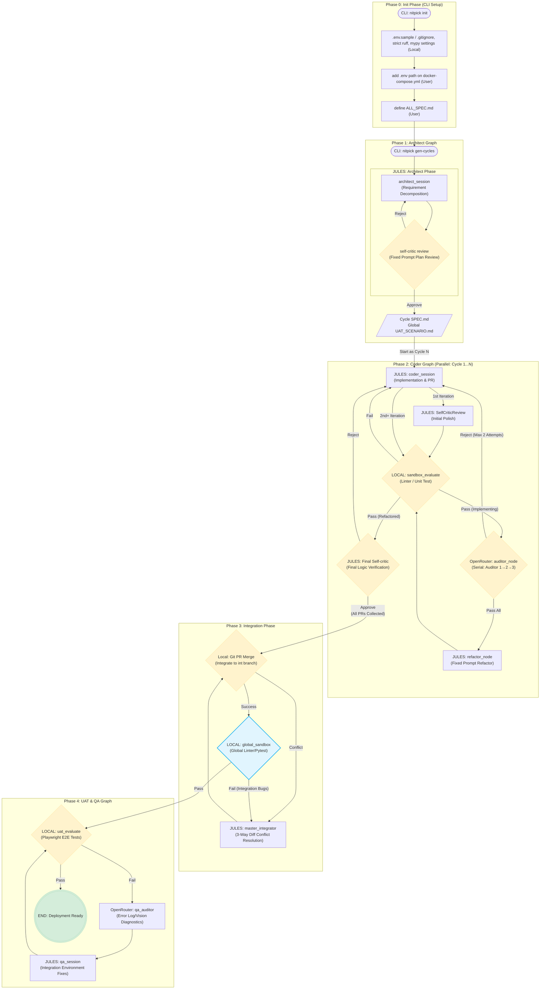

# NITPICKERS

An AI-Native Code Development Environment with Red Teaming built to deliver robust software through isolated parallel development phases and deterministic AI conflict resolution.

 

## Key Features

- **Automated Mechanical Blockade:** Zero-trust validation. Pull requests are explicitly blocked until all static (Ruff, Mypy) and dynamic (Pytest) structural checks pass with a zero exit code, eliminating assumed success.
- **5-Phase Parallel & Sequential Architecture:** Seamlessly orchestrates requirement decomposition, parallel feature implementation, 3-Way Diff integration, and full-system E2E UI testing in strict phases.
- **3-Way Git Merge Conflict System:** Intelligent conflict resolution system utilizing an AI Master Integrator. Automatically detects git conflicts, extracts Base, Local, and Remote file versions, and synthesizes a unified code block to guarantee seamless parallel branch integration.
- **Multi-Modal Diagnostic Capture:** Automatically capture rich UI failure context, including high-resolution screenshots and DOM traces via Playwright, providing undeniable evidence of frontend regressions.
- **Self-Healing Loop with Stateless Auditor:** Utilize advanced Vision LLMs (via OpenRouter) strictly as outer-loop diagnosticians. They analyze error artifacts without project context fatigue and return structured JSON fix plans to the Worker agent.

## Architecture Overview

NITPICKERS operates on a strict 5-Phase pipeline managed by LangGraph. Following initialization, the system architects the workload into independent cycles. Each cycle runs concurrently in an isolated environment, creating, evaluating, and refactoring code. Once all parallel threads conclude successfully, a central integration phase kicks in, merging all outcomes natively or via AI-driven conflict resolution. Finally, the system executes E2E QA checks in an integrated environment to secure deployment stability.



## Prerequisites

- Python >= 3.12, < 3.14
- `uv` Package Manager
- Docker
- Git
- API Keys (OPENROUTER_API_KEY, E2B_API_KEY, JULES_API_KEY)

## Installation & Setup

Ensure you have `uv` installed, then synchronize the environment:

```bash
git clone <repository_url>
cd nitpickers
uv sync
cp .env.example .env
# Edit .env to add required API Keys
```

## Usage

Start by initializing the current directory structure:
```bash
uv run nitpick init
```
*Note: This generates boilerplate definitions. You must customize `dev_documents/ALL_SPEC.md` prior to the next step.*

Generate development cycles automatically based on the specification:
```bash
uv run nitpick gen-cycles
```

Execute the full orchestration pipeline covering all 5 phases:
```bash
uv run nitpick run-pipeline
```

## Development Workflow

This codebase enforces strict code quality checks.

To format and lint your code:
```bash
uv run ruff check --fix
uv run ruff format
uv run mypy src
```

To run unit and integration testing (incorporating DB transaction rollbacks where applicable):
```bash
uv run pytest --cov=src --cov=dev_src
```

## Project Structure

```text
nitpickers/
├── dev_documents/
│   ├── system_prompts/   # Architectural design and Phase specifications (CYCLE01-CYCLE05)
│   ├── ALL_SPEC.md       # Target project specifications
│   └── required_envs.json
├── src/
│   ├── cli.py            # Typer command line entries & phase orchestration
│   ├── graph.py          # Phase definitions for Coder, Integration, and QA graphs
│   ├── state.py          # Typed definitions for CycleState & IntegrationState
│   ├── services/         # Core application services (e.g. Workflow, Conflict Manager)
│   └── nodes/            # Isolated LangGraph components and routing conditionals
├── tests/                # Unit and Integration test modules
└── tutorials/            # Marimo UAT scenarios
```

## License

MIT License