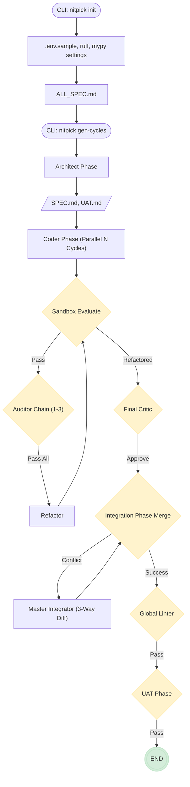

# NITPICKERS

An AI-Native Code Development Environment with Red Teaming built to deliver robust software through isolated parallel development phases and deterministic AI conflict resolution.
 

## Key Features

- **5-Phase Parallel Architecture**: Safely separates implementation, auditing, and integration across distinct graphs to prevent global state corruption.
- **Zero-Trust Validation (Red Teaming)**: Enforces self-correction through sequential Auditor AI chains before code ever reaches the integration phase.
- **Master Integrator 3-Way Diff**: Employs advanced LLMs to intelligently resolve concurrent Git merge conflicts directly using common ancestral bases.
- **Interactive UAT & Reproducible Pipelines**: Utilizes Marimo notebooks for robust interactive end-to-end testing scenarios without compromising CI environments.

## Architecture Overview

NITPICKERS operates on a strict 5-Phase pipeline managed by LangGraph. Following initialization, the system architectures the workload into independent cycles. Each cycle runs concurrently in an isolated environment, creating, evaluating, and refactoring code. Once all parallel threads conclude successfully, a central integration phase kicks in, merging all outcomes natively or via AI-driven conflict resolution. Finally, the system executes E2E QA checks in an integrated environment to secure deployment stability.



## Prerequisites

- Python >= 3.12, < 3.14
- `uv` Package Manager
- Docker
- Git
- API Keys (e.g., OPENROUTER_API_KEY, E2B_API_KEY, JULES_API_KEY)

## Installation & Setup

Ensure you have `uv` installed, then synchronize the environment:

```bash
git clone <repository_url>
cd nitpickers
uv sync
cp .env.example .env
# Edit .env to add required API Keys
```

## Usage

Start by initializing the current directory structure:
```bash
uv run nitpick init
```
*Note: This generates boilerplate definitions. You must customize `dev_documents/ALL_SPEC.md` prior to the next step.*

Generate development cycles automatically based on the specification:
```bash
uv run nitpick gen-cycles
```

Execute the full orchestration pipeline covering all 5 phases:
```bash
uv run nitpick run-pipeline
```

## Development Workflow

This codebase enforces strict code quality checks.

To format and lint your code:
```bash
uv run ruff check --fix
uv run ruff format
uv run mypy src
```

To run unit and integration testing (incorporating DB transaction rollbacks where applicable):
```bash
uv run pytest --cov=src --cov=dev_src
```

## Project Structure

```text
nitpickers/
├── dev_documents/
│   ├── system_prompts/   # Architectural design and Phase specifications
│   ├── ALL_SPEC.md       # Target project specifications
│   └── required_envs.json
├── src/
│   ├── cli.py            # Typer command line entries
│   ├── graph.py          # Phase definitions for Coder, Integration, and QA graphs
│   ├── state.py          # Typed definitions for CycleState & IntegrationState
│   ├── services/         # Core application services (e.g. Workflow, Conflict Manager)
│   └── nodes/            # Isolated LangGraph components
├── tests/                # Unit and Integration test modules
└── tutorials/            # Marimo UAT scenarios
```

## License

MIT License
