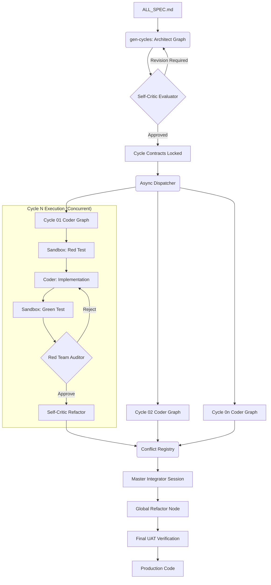

# NITPICKERS (NEXUS-CDD)

> An AI-Native Cycle-Based Contract-Driven Development Environment focusing on Zero-Trust Validation and Concurrent Execution.

[](./LICENSE)
[](https://www.python.org/)
[](https://github.com/langchain-ai/langgraph)
[](https://jules.google.com)

## What is NITPICKERS?

NITPICKERS is an evolution of the AC-CDD framework, designed to operate as a completely autonomous, virtual development team. It overcomes the "sequential bottleneck" of traditional AI coding assistants by running multiple functional cycles entirely in parallel. It strictly enforces a "Zero-Trust" policy, refusing to merge code unless it statically passes linters (`ruff`, `mypy`), survives an AI "Red Team" audit, and dynamically passes User Acceptance Tests (UAT) in an isolated E2B cloud sandbox. Finally, it uses AI to resolve Git merge conflicts semantically, self-evolving the architecture instead of just copying text.

## Key Features

*   **⚡ Massive Throughput via Concurrent Development:**
    Multiple cycles are executed simultaneously with strict pre-defined interface locks. No more waiting for feature A to finish before starting feature B.
*   **🛡️ Zero-Trust Validation (Red Team Intra-Cycle):**
    AI-generated code is aggressively attacked by an automated Red Team Auditor checking for N+1 queries, race conditions, and vulnerabilities.
*   **🔒 Agentic Test-Driven Development (E2B Sandbox):**
    All AI code goes through a strict Red-Green-Refactor loop. The Coder must write failing tests *first*, and prove they fail and then pass inside a secure, ephemeral E2B sandbox.
*   **🧬 Evolutionary Refactoring & Conflict Resolution:**
    Git merge conflicts aren't failures; they are opportunities. A stateful "Master Integrator" AI session semantically resolves conflicts, enforcing DRY principles and refactoring logic to be as elegant as possible.

## Architecture Overview

NITPICKERS uses LangGraph as its orchestration engine to manage different execution states.



## Prerequisites

*   **Python 3.12+**
*   **`uv`** (astoundingly fast Python package installer and resolver)
*   **Docker** (to host the isolated `ac-cdd` runtime if not installing locally)
*   **API Keys**: You will need keys for Google Jules, OpenRouter, and E2B.

## Installation & Setup

1. **Clone the repository:**
   ```bash
   git clone https://github.com/your-org/nitpickers.git
   cd nitpickers
   ```

2. **Sync dependencies using `uv`:**
   ```bash
   uv sync
   ```

3. **Initialize the project configuration:**
   ```bash
   uv run ac-cdd init
   cp .ac_cdd/.env.example .ac_cdd/.env
   # Add your API keys to .ac_cdd/.env
   ```

## Usage

### 1. Plan Phase (Architecture Generation)

Write your raw product requirements in `dev_documents/ALL_SPEC.md`, then run:

```bash
uv run ac-cdd gen-cycles
```
This triggers the Architect agent and the Self-Critic. It evaluates your requirements, ensures there are no architectural vulnerabilities, and generates exact blue-prints for each cycle.

### 2. Execution Phase (Concurrent Development)

Once the cycle specifications (`SPEC.md` and `UAT.md`) are generated, kick off the massive parallel execution:

```bash
uv run ac-cdd run-cycle --id all --parallel
```
This will dispatch all cycles simultaneously, putting the code through the E2B Sandbox for dynamic testing and the Red Team Auditor for static analysis.

### 3. Finalize Phase

After the concurrent runs complete, conflicts will be resolved by the Master Integrator, and the Global Refactor node will unify the codebase. Finally, merge it:

```bash
uv run ac-cdd finalize-session
```

## Development Workflow

To verify the integrity of the project locally before committing:

- **Run Linters (Ruff):**
  ```bash
  uv run ruff check .
  ```
- **Run Type Checks (Mypy):**
  ```bash
  uv run mypy .
  ```
- **Run Tests (Pytest):**
  ```bash
  uv run pytest tests/
  ```

## Project Structure

```text
/
├── pyproject.toml              # Project dependencies and strict linter configurations
├── README.md                   # This file
├── dev_documents/              # Core requirement and output specification documents
│   ├── ALL_SPEC.md
│   ├── USER_TEST_SCENARIO.md
│   └── system_prompts/         # Fixed AI prompts and Architectural outputs
├── src/                        # Main application source code
│   └── ...                     # Core logic, services, LangGraph nodes
└── tests/                      # Unit and integration test suite
```

## License

This project is licensed under the **MIT License** — see the [LICENSE](./LICENSE) file for details.
