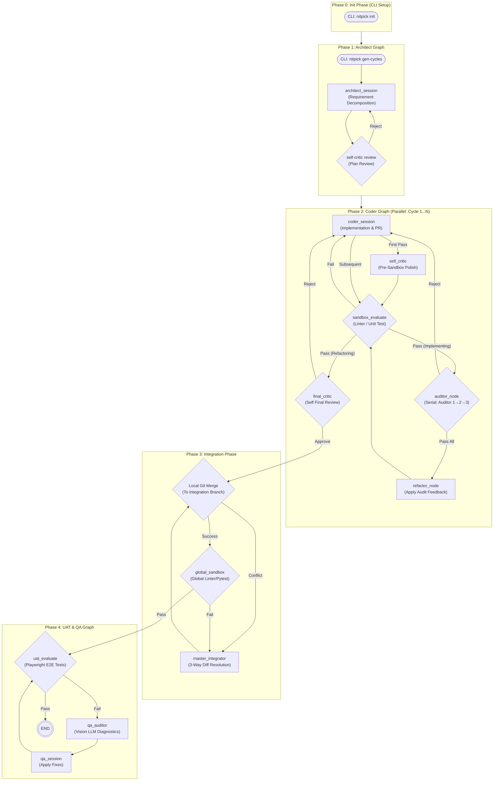

# NITPICKERS: AI-Native Code Development Environment

An AI-native development environment based on a highly robust methodology designed to enforce absolute zero-trust validation of AI-generated code. NITPICKERS uses a 5-Phase Architecture, static analysis, dynamic testing in a secure sandbox, and automated red team auditing to ensure that generated code meets professional engineering standards.


## Key Features

- **5-Phase Parallel & Sequential Architecture:** Seamlessly orchestrates requirement decomposition, parallel feature implementation, 3-Way Diff integration, and full-system E2E UI testing to manage scale and complexity.
- **Automated Mechanical Blockade (Zero-Trust Validation):** Pull requests are explicitly blocked until all static (Ruff, Mypy) and dynamic (Pytest) structural checks pass with a zero exit code.
- **Resilient 3-Way Diff Integration:** Ensures robust code integration from parallel coding cycles by combining standard Git merges with advanced LLM-based conflict resolution.
- **Multi-Modal Diagnostic Capture & Red Teaming:** Utilizes Vision LLMs (via OpenRouter) as stateless diagnostics to analyze E2E/Playwright test failure screenshots and provide structured remediation to coding agents.

## Architecture Overview

The system operates across 5 distinct phases to guarantee code quality from planning to final integration.



## Prerequisites

Ensure the following tools are available on your system:
- `uv` - Python package installer and resolver.
- `git` - Version control.
- `Docker` - (Optional but recommended).
- Valid API keys:
    - `JULES_API_KEY`
    - `E2B_API_KEY`
    - `OPENROUTER_API_KEY`

## Installation & Setup

We recommend utilizing Docker and our provided `setup.sh` script to quickly establish your environment as a "Sidecar" workflow.

1. Clone the repository and navigate to the project directory:
   ```bash
   git clone <your-repository>
   cd <your-repository>
   ```

2. Configure your core environment variables:
   ```bash
   cp .env.example .env
   # Add JULES_API_KEY, E2B_API_KEY, OPENROUTER_API_KEY
   ```

3. Setup Docker & CLI aliases (Optional but recommended):
   ```bash
   bash setup.sh
   source ~/.bashrc
   ```

## Usage

Use the CLI `nitpick` command to orchestrate the pipeline from your project directory.

### Quick Start
Initialize the project structure:
```bash
nitpick init
```
Generate specific implementation cycles based on your specs:
```bash
nitpick gen-cycles
```
Run the full 5-Phase orchestrated pipeline:
```bash
nitpick run-pipeline
```

## Development Workflow

We strictly adhere to typing and formatting standards enforced via `uv`:
```bash
# Run tests
uv run pytest

# Check code quality
uv run ruff check .
uv run mypy .
```

## Project Structure

```text
/
├── dev_documents/          # Specs, System Architecture, & Logs
├── src/                    # Main application code
│   ├── cli.py              # CLI Entrypoint
│   ├── graph.py            # LangGraph pipeline setups
│   ├── state.py            # Pydantic states (CycleState, IntegrationState)
│   ├── nodes/              # Execution logic mapping
│   └── services/           # Decoupled usecases & orchestration
├── tests/                  # Pytest unit & integration testing
├── tutorials/              # Marimo UAT Interactive Notebooks
├── pyproject.toml          # Tooling settings
└── README.md               # You are here
```

## License

MIT License
