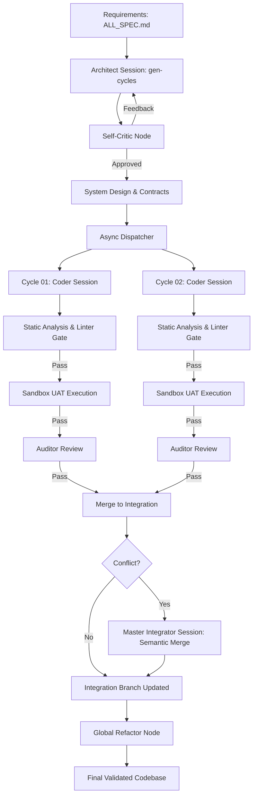

# NITPICKERS (NEXUS-CDD)

> An AI-Native Cycle-Based Contract-Driven Development Environment with Concurrent Execution and Zero-Trust Validation.

[](./LICENSE)
[](https://www.python.org/)
[](https://github.com/langchain-ai/langgraph)
[](https://jules.google.com)

## What is NITPICKERS?

NITPICKERS is a next-generation autonomous software development orchestrator. It evolves the sequential AC-CDD framework into a highly parallelised, "zero-trust" virtual engineering team. It doesn't just write code; it plans architectures, locks down interface contracts, simultaneously dispatches multiple AI coding agents, rigorously audits their output using static analysis, mathematically proves their logic in isolated execution sandboxes, and autonomously resolves Git merge conflicts via semantic reasoning.

## Key Features

*   **⚡ Massive Throughput (Concurrent Development)**
    *   Shatters sequential bottlenecks. After an initial architectural planning phase, the system dispatches multiple development cycles (`feature/cycle-XX`) in parallel, effectively deploying a virtual team of engineers to work simultaneously.
*   **🛡️ Zero-Trust Validation & Red Teaming**
    *   AI hallucinations are physically blocked. All generated code must pass strict, deterministic static analysis (`ruff`, `mypy` in strict mode) and pass rigorous self-critique checklists before any execution occurs.
*   **🔒 Evidence-Based Sandbox Execution**
    *   TDD is strictly enforced. Code is automatically synced to an isolated, secure **E2B Sandbox**. The system extracts real-world `pytest` tracebacks from failures and feeds them back into the AI for evidence-based fixing, guaranteeing code correctness before merging.
*   **🧠 Semantic Merge Resolution**
    *   Git conflicts don't stop the pipeline. A dedicated 'Master Integrator' AI session reads the conflict markers, understands the competing contexts, and intelligently synthesizes a unified solution that respects the DRY principle.

## Architecture Overview

NITPICKERS operates on a multi-layered LangGraph state machine. It begins with architectural generation and self-criticism to lock interface contracts. It then uses an asynchronous dispatcher to launch concurrent Coder sessions. Each session is gated by physical linters and remote sandbox execution before merging.



## Prerequisites

*   Python 3.12+
*   `uv` (Fast Python package installer)
*   Docker (for local isolated execution/sandboxing)
*   Valid API Keys:
    *   `JULES_API_KEY` (Primary reasoning model)
    *   `E2B_API_KEY` (Sandbox execution)
    *   `OPENROUTER_API_KEY` (Fast auditor/critic models)

## Installation & Setup

We recommend using `uv` for lightning-fast dependency management.

```bash
# 1. Clone the repository
git clone https://github.com/your-org/nitpickers.git
cd nitpickers

# 2. Sync dependencies
uv sync

# 3. Setup Environment Variables
cp .ac_cdd/.env.example .ac_cdd/.env
# Edit .ac_cdd/.env and add your API keys
```

## Usage

### 1. Initialize & Define Requirements
Edit `dev_documents/ALL_SPEC.md` to define your project specifications.

### 2. Generate Architecture (Planning Phase)
Run the Architect to generate the blueprint and lock contracts.
```bash
uv run ac-cdd gen-cycles
```

### 3. Dispatch Concurrent Development
Execute the parallel development workflow. The system will auto-audit, run sandbox tests, and auto-merge.
```bash
uv run ac-cdd run-cycle --id all
```

### 4. Finalize & Optimize
Trigger the global refactor, generate documentation, clean dependencies, and cut the final PR.
```bash
uv run ac-cdd finalize-session
```

## Development Workflow

*   **Run Linters:** `uv run ruff check .` and `uv run mypy .`
*   **Run Unit Tests:** `uv run pytest tests/`
*   **Run UAT Interactive Tutorial:** `uv run marimo edit tutorials/nitpickers_comprehensive_tutorial.py`

## Project Structure

```ascii
nitpickers/
 ├── src/                  # Core application source code
 ├── tests/                # Unit and Integration test suite
 ├── dev_src/              # Orchestrator core logic (LangGraph, nodes)
 └── dev_documents/        # Knowledge Base
     ├── ALL_SPEC.md       # Raw input requirements
     ├── USER_TEST_SCENARIO.md # Tutorial plan
     └── system_prompts/   # Generated Architecture and Prompts
         ├── SYSTEM_ARCHITECTURE.md
         └── CYCLEXX/      # Generated Cycle Specs & UATs
```

## License

This project is licensed under the **MIT License** — see the [LICENSE](./LICENSE) file for details.
