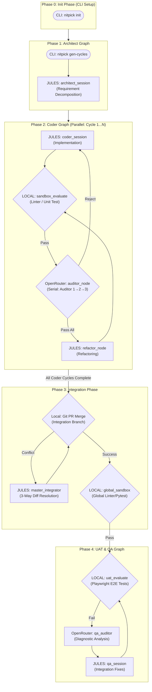

# NITPICKERS

An AI-native development environment based on a highly robust methodology designed to enforce absolute zero-trust validation of AI-generated code. NITPICKERS uses static analysis, dynamic testing in a secure sandbox, and automated red team auditing to ensure that generated code meets professional engineering standards.


## Key Features

- **Automated Mechanical Blockade:** Zero-trust validation. Pull requests are explicitly blocked until all static (Ruff, Mypy) and dynamic (Pytest) structural checks pass with a zero exit code, eliminating assumed success.
- **5-Phase Parallel & Sequential Architecture:** Seamlessly orchestrates requirement decomposition, parallel feature implementation, 3-Way Diff integration, and full-system E2E UI testing.
- **Multi-Modal Diagnostic Capture:** Automatically capture rich UI failure context, including high-resolution screenshots and DOM traces via Playwright, providing undeniable evidence of frontend regressions.
- **Self-Healing Loop with Stateless Auditor:** Utilize advanced Vision LLMs (via OpenRouter) strictly as outer-loop diagnosticians. They analyze error artifacts without project context fatigue and return structured JSON fix plans to the Worker agent.
- **Total Observability:** Fully integrated LangSmith tracing visualizes complex LangGraph node transitions, internal state mutations, and multi-modal API payloads.

## Architecture Overview

The system operates across 5 distinct phases to guarantee code quality from planning to final integration.



## Prerequisites

Ensure the following tools are available on your system:
- `uv` - The fastest Python package installer and resolver.
- `git` - Version control for your codebase.
- `Docker` - (Optional, depending on sandbox configuration).
- Valid API keys:
    - `JULES_API_KEY` (Gemini Pro/Worker)
    - `E2B_API_KEY` (Sandbox Execution)
    - `OPENROUTER_API_KEY` (Auditor/Vision Models)
- LangSmith Observability Configuration:
    - `LANGCHAIN_TRACING_V2=true`
    - `LANGCHAIN_API_KEY`
    - `LANGCHAIN_PROJECT`

## Installation & Setup (Docker Recommended)

The primary and recommended way to use NITPICKERS is via Docker. This ensures a clean, isolated environment and simplifies dependency management.

1. Clone the repository and navigate to the project directory:
   ```bash
   git clone <your-repository>
   cd <your-repository>
   ```

2. Configure your environment variables:
   ```bash
   cp .env.example .env
   # Edit .env and populate your JULES_API_KEY, E2B_API_KEY, OPENROUTER_API_KEY, and LangSmith variables.
   ```

3. Build the Docker container:
   ```bash
   docker-compose build
   ```

## Usage

Once your `.env` is configured and the image is built, you can run `nitpick` commands via Docker without any local setup errors.

### Generate Development Cycles (Phase 1)
Parse your raw architectural documents into structured specifications and UAT plans.
```bash
docker-compose run --rm nitpick nitpick gen-cycles
```

### Run Full Orchestrated Pipeline (Phase 2, 3 & 4)
Execute the complete orchestrated 5-phase pipeline, automatically managing parallel implementation and final integration.
```bash
docker-compose run --rm nitpick nitpick run-pipeline
```

### Run a Specific Cycle Manually
For debugging, execute a specific development cycle (e.g., `01`).
```bash
docker-compose run --rm nitpick nitpick run-cycle --id 01
```

### Interactive Tutorials (UAT Verification)
To experience the fully automated, multi-modal User Acceptance Testing (UAT) pipeline interactively, you can run our definitive Marimo tutorial locally (requires local `uv` installation).
```bash
uv run marimo edit tutorials/nitpickers_5_phase_architecture.py
```

## Development Workflow

-   **Run Linters & Type Checks:**
    ```bash
    uv run ruff check .
    uv run mypy .
    ```
-   **Run Unit & Integration Tests:**
    ```bash
    uv run pytest
    ```

## Project Structure

```text
/
├── dev_documents/          # Auto-generated specs, UATs, logs
│   ├── system_prompts/     # Cycle specific plans and documents
│   └── USER_TEST_SCENARIO.md
├── src/                    # The main implementation for NITPICKERS
│   ├── cli.py              # CLI entrypoint
│   ├── state.py            # Pydantic state models (CycleState, etc.)
│   ├── graph.py            # Main LangGraph declarations
│   ├── nodes/              # LangGraph node routing functions
│   └── services/           # Orchestration (workflow.py) & Diff Logic (conflict_manager.py)
├── tests/                  # Unit, Integration, and UAT tests
├── tutorials/              # Marimo-based interactive tutorials
├── pyproject.toml          # Project configuration (Dependencies & Linting)
└── README.md               # User documentation
```

## License

MIT License
