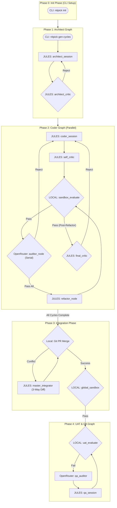

# NITPICKERS

An AI-native development environment based on a highly robust methodology designed to enforce absolute zero-trust validation of AI-generated code. NITPICKERS uses static analysis, dynamic testing in a secure sandbox, and automated red team auditing to ensure that generated code meets professional engineering standards.


## Key Features

- **Automated Mechanical Blockade:** Zero-trust validation. Pull requests are explicitly blocked until all static (Ruff, Mypy) and dynamic (Pytest) structural checks pass with a zero exit code.
- **5-Phase Parallel & Sequential Architecture:** Seamlessly orchestrates requirement decomposition, parallel feature implementation, 3-Way Diff integration, and full-system E2E UI testing.
- **Self-Healing Loop with Stateless Auditor:** Utilize advanced Vision LLMs strictly as outer-loop diagnosticians. They analyze error artifacts without project context fatigue and return structured JSON fix plans.
- **Intelligent 3-Way Diff Resolution:** Resolves complex Git merge conflicts dynamically by structurally comparing the Base, Branch A, and Branch B code states instead of raw conflict markers.
- **Multi-Modal Diagnostic Capture:** Automatically capture rich UI failure context, including high-resolution screenshots and DOM traces via Playwright for undeniable evidence of frontend regressions.

## Architecture Overview

The system operates across 5 distinct phases to guarantee code quality from planning to final integration.



## Prerequisites

Ensure the following tools are available on your system:
- `Python 3.12+`
- `uv` - The fastest Python package installer and resolver.
- `git` - Version control for your codebase.
- `Docker` - (Optional, depending on sandbox configuration).
- Valid API keys:
    - `JULES_API_KEY` (Gemini Pro/Worker)
    - `E2B_API_KEY` (Sandbox Execution)
    - `OPENROUTER_API_KEY` (Auditor/Vision Models)

## Installation & Setup

1. Clone the repository and navigate to the project directory:
   ```bash
   git clone <your-repository>
   cd <your-repository>
   ```

2. Sync the dependencies utilizing `uv`:
   ```bash
   uv sync
   ```

3. Configure your core environment variables:
   ```bash
   cp .env.example .env
   # Edit .env and populate your JULES_API_KEY, E2B_API_KEY, and OPENROUTER_API_KEY.
   ```

4. Quick Start (Docker Alias - Recommended):
   ```bash
   bash setup.sh
   source ~/.bashrc
   ```

## Usage

Once configured, you can use the `nitpick` command seamlessly to execute the pipeline.

### Initialize Project Requirements
For new or external projects, running `nitpick init` is the mandatory first step. It automatically scaffolds the required directory structure (`src/`, `tests/`, `dev_documents/`), initializes Git, and configures your environment.

```bash
nitpick init
```
After initialization, ensure `dev_documents/ALL_SPEC.md` and `dev_documents/USER_TEST_SCENARIO.md` are correctly filled before generating cycles.

### Generate Development Cycles (Phase 1)
Parse your raw architectural documents into structured specifications for Phase 2 implementation.
```bash
nitpick gen-cycles
```

### Run Full Orchestrated Pipeline (Phase 2, 3 & 4)
Execute the complete orchestrated 5-phase pipeline, handling parallel cycle implementation, 3-Way Diff integration, and UI acceptance tests.
```bash
nitpick run-pipeline
```

### Interactive Tutorials (UAT Verification)
To experience the fully automated multi-modal UAT pipeline interactively via Marimo (our definitive CI test):
```bash
uv run marimo edit tutorials/nitpickers_5_phase_architecture.py
```

## Development Workflow

-   **Run Linters & Type Checks:**
    ```bash
    uv run ruff check .
    uv run mypy .
    ```
-   **Run Unit & Integration Tests:**
    ```bash
    uv run pytest
    ```

## Project Structure

```text
/
├── dev_documents/          # Auto-generated specs, UATs, logs
│   ├── system_prompts/     # Cycle specific architecture & UAT docs
│   └── USER_TEST_SCENARIO.md
├── src/                    # The main implementation for NITPICKERS
│   ├── cli.py              # CLI entrypoint
│   ├── state.py            # Phase 2 Routing Extensions (CycleState)
│   ├── graph.py            # LangGraph routing construction
│   ├── nodes/              # Routers and Node logic
│   ├── domain_models/      # Strict Pydantic Contracts (e.g. ConflictPackage)
│   └── services/           # Orchestration (workflow.py) & Diff Logic (conflict_manager.py)
├── tests/                  # Unit, Integration, and UAT tests
├── pyproject.toml          # Project configuration (Dependencies & Linting)
└── README.md               # User documentation
```

## License

MIT License
