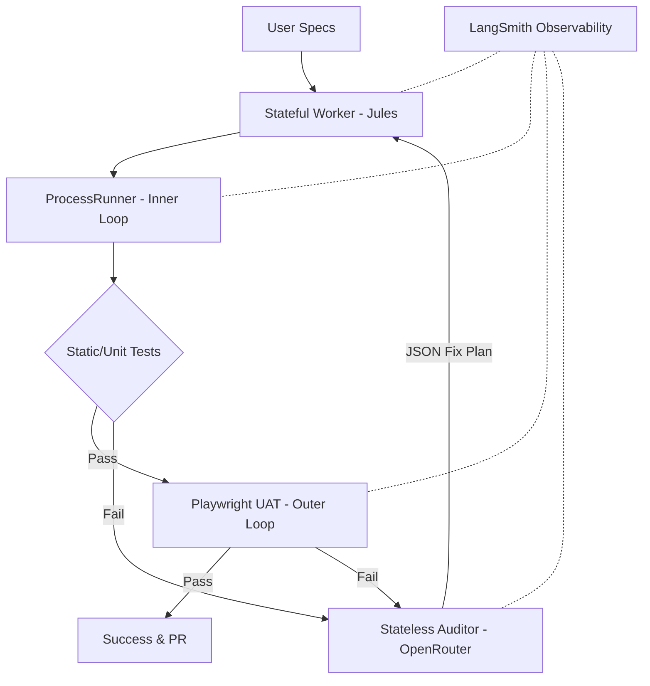

# NITPICKERS

An AI-native development environment featuring a robust, fully automated User Acceptance Testing (UAT) pipeline. NITPICKERS replaces assumed success with deterministic verification, acting as an impenetrable mechanical gatekeeper that strictly validates structural logic and Human-Centered Design compliance within a local sandboxed environment.


## Key Features

- **Mechanical Gatekeeping**: Automatically blocks code that fails strict linting (`ruff`), typing (`mypy`), or behavior constraints before any PR is generated.
- **Dynamic Multi-Modal UAT**: Employs Playwright in the Outer Loop to capture deterministic screenshots and DOM traces on UI failure, sending them to Vision LLMs.
- **Surgical Self-Healing**: Utilizing a Stateless Auditor (OpenRouter) to provide precise, Pydantic-validated JSON Fix Plans to correct errors without context fatigue.
- **Total Observability**: Deep integration with LangSmith tracks complex node routing, visualizes State dictionary mutations, and logs raw LLM inputs seamlessly.

## Architecture Overview

NITPICKERS operates on a strict **Worker, Auditor, and Observer** architectural pattern to eliminate infinite loops and context collapse.

- **The Stateful Worker (Jules)**: Maintains the core developmental context. It builds features, fabricates Pytest hooks, and handles the "Inner Loop" of structural execution.
- **The Stateless Auditor (OpenRouter)**: Invoked only upon failure in the "Outer Loop". It acts as a diagnostician, evaluating Playwright multi-modal artifacts without maintaining long-running state.
- **The Observability Layer (LangSmith)**: The "Panopticon" tracing every State vector mutation and Vision LLM interaction, turning debug traces into quantitative datasets.



## Prerequisites

- **Python 3.12+**
- **uv** (Fast Python package installer)
- Valid API Keys (`JULES_API_KEY`, `E2B_API_KEY`, `OPENROUTER_API_KEY`, `LANGCHAIN_API_KEY`)

## Installation & Setup

1. Clone the repository and navigate into it:
   ```bash
   git clone <your-repository>
   cd <your-repository>
   ```

2. Initialize the environment and install dependencies using `uv`:
   ```bash
   uv sync
   ```

3. Setup your environment variables:
   ```bash
   cp .env.example .env
   # Edit .env and ensure LANGCHAIN_TRACING_V2=true alongside your specific API keys
   ```

## Usage

NITPICKERS enforces a safe execution flow. Ensure your `.env` is fully populated before starting the execution pipeline.

### Quick Start Example

Generate the development architecture and plan:
```bash
uv run python src/cli.py generate 8
```

Run a specific cycle through the dynamic pipeline:
```bash
uv run python src/cli.py run 01
```

## Development Workflow

- **Testing**: Run the custom pytest hooks to natively parse specs and execute behavior validations:
  ```bash
  uv run pytest tests/
  ```
- **Linting & Typing**: Manually trigger the mechanical gatekeepers:
  ```bash
  uv run ruff check .
  uv run mypy .
  ```
- **Tutorial Verification**: Run the interactive UAT scenarios:
  ```bash
  uv run marimo test tutorials/automated_uat_pipeline.py
  ```

## Project Structure

```text
/
├── dev_documents/          # Auto-generated specs, UATs, and architecture designs
├── src/                    # The main framework implementation
│   ├── cli.py              # CLI entrypoint with Environment Gate
│   ├── domain_models/      # Strict Pydantic schemas (State, UAT, FixPlan)
│   ├── nodes/              # LangGraph orchestration nodes (Worker, Auditor)
│   └── services/           # ProcessRunner and dynamic Execution UseCases
├── tests/                  # Pytest hooks (conftest.py) and assertions
└── pyproject.toml          # Strict Ruff and Mypy configurations
```

## License

MIT License
