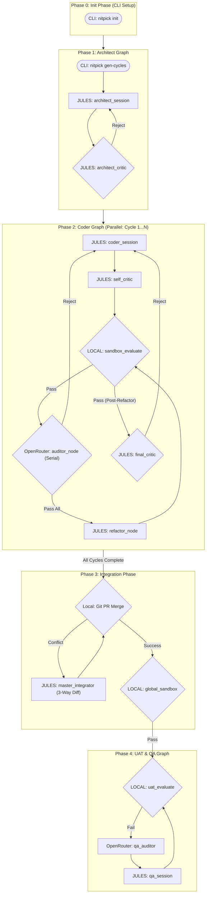

# System Architecture

## Summary
The NITPICKERS project is evolving into a highly robust, 5-Phase AI-native development environment. The objective is to enforce an absolute zero-trust validation mechanism for AI-generated code. This system architecture document outlines the comprehensive strategy for refactoring the existing LangGraph-based workflow into a structured, sequential, and parallelized pipeline. The refactoring introduces explicit phases: Initialisation, Architecture Planning, Coder Implementation, Integration, and User Acceptance Testing (UAT). By adopting this 5-Phase approach, the system enhances stability, explicitly defines responsibilities, and ensures that code modifications undergo rigorous static and dynamic analysis before being merged. Existing components will be reused extensively, whilst specific orchestration, state management, and routing logic will be safely extended.


## System Design Objectives
The primary design objective of this system is to establish a resilient and autonomous code generation pipeline that eliminates the risks associated with unchecked AI output. AI models are prone to hallucination, context fatigue, and subtle logical errors. To mitigate these risks, the system must enforce strict mechanical blockades. A pull request should only be considered successful if it passes all static linters (Ruff, Mypy) and dynamic tests (Pytest) with a zero exit code. This zero-trust validation is the cornerstone of the architecture. Furthermore, the architecture must guarantee that any modifications introduced by artificial intelligence agents are thoroughly vetted by deterministic, mechanical processes before human review is even considered. This means that our system must prioritize reproducibility and stability above all else. Every line of code generated must be capable of being compiled, statically analyzed, and dynamically executed within a completely isolated sandbox environment. The sandbox itself must be ephemeral, ensuring that tests do not inadvertently rely on lingering state from previous executions, which is a common source of flaky tests in automated pipelines.

Another critical objective is to improve the separation of concerns within the LangGraph workflows. Currently, the workflows might intertwine planning, coding, and testing in ways that complicate debugging and scaling. By explicitly dividing the process into five distinct phases, the system becomes highly modular. Each phase has a dedicated LangGraph or processing logic, allowing for granular observability and targeted improvements. For instance, the Coder Graph (Phase 2) focuses purely on implementation and iterative refinement, while the Integration Graph (Phase 3) handles the complexities of merging parallel changes and resolving conflicts using a 3-Way Diff approach. This separation ensures that the complex cognitive tasks assigned to the LLMs are narrowly scoped. Narrowly scoped tasks dramatically reduce the likelihood of context window saturation, a phenomenon where the LLM "forgets" initial instructions when overwhelmed with too much intervening information. By breaking the pipeline into discrete phases, we effectively reset the context window for each major architectural step, ensuring maximum precision and adherence to the original specifications.

Furthermore, the system aims to incorporate multi-modal diagnostics to automatically capture and resolve frontend regressions. Integrating Playwright for User Acceptance Testing (UAT) allows the pipeline to generate high-resolution screenshots and DOM traces when a test fails. A stateless Vision LLM can then act as an outer-loop diagnostician, analysing these visual artefacts without the burden of project context fatigue, and formulating precise fix plans. This self-healing loop significantly reduces the need for human intervention. The integration of Vision models represents a paradigm shift in automated testing. Traditional E2E tests often fail opaquely, leaving developers to guess the root cause based on cryptic selector errors. By capturing the exact visual state of the application at the moment of failure, and feeding that visual state directly into a highly capable diagnostic model, we bridge the gap between mechanical failure and semantic understanding. The system can literally "see" that a button is misaligned or a modal has failed to render, allowing it to propose CSS or React component fixes that would be impossible to deduce from standard error logs alone.

Scalability and extensibility are also paramount. The architecture must leverage modern software design patterns, such as Dependency Injection and the Repository Pattern, to prevent the emergence of tightly coupled logic or "God Classes." The domain models, defined using Pydantic, must be strictly typed and validated, guaranteeing that data flowing between agents and system components adheres to explicit contracts. This approach prevents interface drift and ensures that the system can gracefully incorporate future enhancements without destabilising existing features. The additive mindset dictates that we modify existing source code only when absolutely necessary, prioritising the creation of new, discrete modules that seamlessly interface with the established foundation. By strictly enforcing these patterns, we ensure that the codebase remains maintainable even as the complexity of the AI orchestration increases. This is particularly crucial in a multi-agent system where state mutations can quickly become untraceable if not governed by rigorous object-oriented principles and explicit data contracts.


## System Architecture
The system architecture is a highly orchestrated, multi-agent pipeline built upon LangGraph, transitioning to a definitive 5-Phase lifecycle. This structure ensures that code generation is not a monolithic process but a well-governed assembly line, where each phase acts as a strict checkpoint. The architecture explicitly enforces boundary management and separation of concerns. No single agent is responsible for the entire lifecycle; instead, specialised agents handle distinct tasks, passing strongly typed state objects between them. This prevents context contamination and allows for stateless, focused interventions. The overarching design philosophy is that complex AI operations must be bounded by deterministic safeguards. Each phase transition represents a critical boundary where the system state must be fully validated before execution is allowed to proceed. This effectively isolates failures, ensuring that a hallucination in the planning phase does not catastrophically impact the final integration phase.

**Phase 0: Init Phase (CLI Setup)**
This phase is the entry point for the user, primarily driven by the Command Line Interface (CLI). It handles the static setup of the environment. The `nitpick init` command scaffolds the required directory structure, generates template configurations (`.env.sample`, strict Ruff/Mypy settings), and prepares the project workspace. This phase operates strictly outside the AI agent loops, ensuring a deterministic and secure foundation before any generative tasks commence. This manual, deterministic setup is crucial because it establishes the ground rules for the entire AI pipeline. It ensures that the underlying repository is correctly configured to support the rigorous testing and linting standards that the subsequent phases will demand.

**Phase 1: Architect Graph**
Triggered by the `nitpick gen-cycles` command, this phase focuses on requirement decomposition. The Architect Agent analyses the overarching specifications (e.g., `ALL_SPEC.md`) and divides the work into discrete, manageable development cycles. A Red Team Self-Critic agent reviews these plans to ensure feasibility and completeness. The output of this phase is a set of explicitly defined cycle specifications (`SPEC.md`) and testing scenarios (`UAT.md`), which serve as immutable contracts for the subsequent phases. This phase is analogous to the traditional software engineering design phase, but executed autonomously. The strict separation of the Architect from the Coder ensures that the planning process is not overly influenced by implementation-level details, allowing for a more strategic decomposition of the overall objective.

**Phase 2: Coder Graph**
This phase is the engine of the system, capable of executing multiple cycles in parallel. Each cycle instantiates its own `CycleState` and navigates the Coder Graph. The graph orchestrates a continuous loop: the Coder Agent generates implementation and tests, a Self-Critic provides immediate feedback, and a Local Sandbox strictly evaluates the code against linters and unit tests. Crucially, a Serial Auditor chain (using external OpenRouter models) reviews the code. If all auditors approve, a final Refactor Node performs clean-up before the cycle is marked complete. This phase is isolated; it only interacts with its specific cycle branch, preventing cross-cycle interference. The parallelism introduced here is a massive leap forward in efficiency. By isolating each feature implementation into its own sandbox and Git branch, the system can concurrently tackle multiple requirements without the risk of code collisions or shared state corruption.

**Phase 3: Integration Phase**
Once all parallel cycles in Phase 2 succeed, the pipeline enters the Integration Phase. This is a sequential, synchronisation point. A standard Git merge is attempted to combine all cycle branches into an integration branch. If conflicts arise, the Master Integrator Agent intervenes, utilising a sophisticated 3-Way Diff approach (analysing the Base, Branch A, and Branch B) to resolve the discrepancies intelligently. Following a successful merge, a Global Sandbox performs a comprehensive static and dynamic analysis across the entire integrated codebase to ensure no regressions were introduced during merging. This phase represents the crucible of the system. It acknowledges that individually successful features can still interact unpredictably when combined. The Master Integrator's ability to semantically understand merge conflicts, rather than relying on brittle text-based algorithms, is a key differentiator of this architecture.

**Phase 4: UAT & QA Graph**
The final phase focuses on dynamic, end-to-end user acceptance testing. Playwright executes the predefined UAT scenarios against the integrated environment. If tests pass, the development pipeline concludes successfully. If failures occur, the QA Graph is triggered. A QA Auditor analyses multi-modal artefacts (screenshots, logs) to diagnose the issue, and a QA Session agent applies targeted fixes within the integration environment. This loop continues until all UAT scenarios are satisfied, ensuring the final deliverable is functionally flawless. This phase provides the ultimate guarantee of quality. By executing tests from the perspective of the end-user, the system validates not just the internal logic, but the actual observable behavior of the application, ensuring that the initial requirements defined in Phase 1 have been truly satisfied.

**Boundary Management Rules:**
1.  **State Isolation:** Each LangGraph must operate on its specific typed state (e.g., `CycleState`, `IntegrationState`). State objects must not be shared globally. This prevents unintended side effects and makes debugging significantly easier, as the state is always localized to the specific workflow being executed.
2.  **Stateless Auditing:** Auditor agents must not retain historical context of the implementation process. They receive discrete inputs (code diffs, test logs) and return structured feedback. This forces the auditors to evaluate the code objectively, based solely on its current merits, rather than being influenced by the history of how the code was written.
3.  **Sandbox Confinement:** All code execution, linting, and testing must occur strictly within the designated Sandbox Environment. Agents must never execute code directly within their own process space. This guarantees that the host system remains secure and that the test results are perfectly reproducible, free from the idiosyncrasies of the local developer environment.




## Design Architecture
The design architecture is fundamentally anchored in strong typing and explicit domain modelling using Pydantic. This ensures that the data contracts between the various LangGraph phases and external interfaces are immutable and verifiable. We will construct a robust foundation that leverages these models to orchestrate the complex workflow, ensuring seamless integration between existing components and the new 5-Phase requirements. The codebase relies heavily on Dependency Injection, allowing different services to interact without being tightly coupled. This approach guarantees that as the system scales and incorporates new capabilities, the underlying data structures remain predictable and easy to reason about. By enforcing strict type checking at runtime via Pydantic, we eliminate entire classes of errors related to malformed data or unexpected data types passing between the various AI agents and the deterministic execution environments. This rigid structure is absolutely essential when orchestrating complex, non-deterministic language models.

### File Structure Overview

```text
/
├── dev_documents/
│   ├── system_prompts/
│   │   ├── SYSTEM_ARCHITECTURE.md
│   │   ├── CYCLE01/
│   │   │   ├── SPEC.md
│   │   │   └── UAT.md
│   │   └── CYCLE02/
│   │       ├── SPEC.md
│   │       └── UAT.md
│   ├── ALL_SPEC.md
│   ├── USER_TEST_SCENARIO.md
│   └── required_envs.json
├── src/
│   ├── cli.py                 # Extends CLI entry points (run-pipeline)
│   ├── state.py               # Extends CycleState with routing flags
│   ├── graph.py               # Rewires graphs for the 5-Phase logic
│   ├── nodes/
│   │   ├── routers.py         # Defines conditional routing logic
│   │   └── ...                # Existing nodes (coder, architect, etc.)
│   ├── services/
│   │   ├── workflow.py        # Orchestrates parallel cycles and integration
│   │   ├── conflict_manager.py# Implements 3-Way Diff logic
│   │   ├── uat_usecase.py     # Refactored for independent Phase 4 execution
│   │   └── ...
│   └── domain_models/
│       ├── cycle_state.py     # Pydantic schemas for state tracking
│       └── diff_package.py    # New schema for 3-Way Diff payloads
├── tests/
│   ├── nitpick/
│   │   ├── integration/       # Integration tests for Phase transitions
│   │   └── unit/              # Unit tests for routing and diff logic
├── pyproject.toml             # Manages dependencies and linters
└── README.md                  # Project landing page
```

### Core Domain Pydantic Models

To support the refactored architecture, the system relies on carefully structured Pydantic domain models. These models dictate the shape of the data flowing through the LangGraph application. They act as the single source of truth for all data structures, replacing loose dictionaries with strongly typed, self-validating objects. This guarantees that every node in the graph receives exactly the data it expects, in the exact format it requires.

1.  **CycleState Extension:** The existing `CycleState` in `src/state.py` must be safely extended to support the sophisticated routing in Phase 2. We will add specific fields:
    *   `is_refactoring: bool`: A flag indicating whether the cycle has passed the auditor chain and is currently undergoing the final clean-up refactoring.
    *   `current_auditor_index: int`: Tracks the progression through the serial auditor chain (e.g., 1 to 3).
    *   `audit_attempt_count: int`: Monitors the number of attempts a specific auditor has made to request changes, preventing infinite loops.
    These fields must be added with default values to ensure backwards compatibility with existing state instantiations. They will be configured with strict validation to prevent unexpected types. The extension of this model is critical because it transforms the `CycleState` from a mere data vessel into a robust state machine, capable of precisely tracking the complex, multi-step lifecycle of a single development cycle as it moves back and forth between the coder, the sandbox, and the serial auditors.

2.  **ConflictPackage Schema:** To facilitate the advanced 3-Way Diff resolution in Phase 3, we require a new schema to encapsulate the conflict context. This avoids sending raw Git conflict markers to the LLM.
    *   `base_code: str`: The contents of the file at the common ancestor commit.
    *   `local_code: str`: The contents of the file in the current integration branch (Branch A).
    *   `remote_code: str`: The contents of the file from the incoming cycle branch (Branch B).
    *   `file_path: str`: The target file path.
    This schema guarantees that the `master_integrator_node` receives cleanly separated strings, significantly improving the LLM's ability to understand the intent of both branches and synthesise a coherent resolution. By providing the base code alongside the conflicting changes, we provide the LLM with the crucial context it needs to understand *why* the changes were made, enabling it to merge them far more effectively than a standard Git merge algorithm.

3.  **Integration Points:** The new routing functions in `src/nodes/routers.py` will explicitly consume the extended `CycleState`. For example, `route_sandbox_evaluate` will inspect `is_refactoring` to decide if the next step is an Auditor or the Final Critic. The `ConflictManager` service will be responsible for executing the underlying Git commands (`git show :1:file`, etc.) and hydrating the `ConflictPackage` schema before passing it to the Master Integrator agent. This cleanly separates the low-level Git operations from the high-level LLM prompting logic. This separation ensures that the complex string manipulation required to extract file contents from Git history is kept entirely separate from the language model orchestration, resulting in cleaner, more testable code.


## Implementation Plan

The implementation of this refactoring is strategically divided into exactly two valid sequential cycles. This decomposition ensures that the foundational graph changes are established before the complex integration and testing mechanisms are introduced. By tackling the architectural foundational first, we reduce risk and provide a stable base upon which the more complex integration and multi-modal UAT features can be built. This phased approach also allows for continuous verification; we can thoroughly test the Phase 2 Coder Graph in isolation before moving on to the complexities of merging multiple branches in Phase 3.

### CYCLE01: Foundation and Coder Graph Refactoring

This cycle focuses on implementing the core state modifications and rewiring the Phase 2 (Coder Graph) to support serial auditing and refactoring loops. The objective is to establish the isolated, robust implementation engine. We must ensure that the state machine driving the Coder Graph is absolutely bulletproof, capable of gracefully handling infinite loop scenarios and unexpected LLM outputs. This cycle builds the engine that will power all parallel development.

**Implementation Details:**
1.  **State Management Updates:** Modify `src/state.py` to extend the `CycleState` class. Introduce the `is_refactoring`, `current_auditor_index`, and `audit_attempt_count` fields with strict Pydantic definitions and default values. Ensure these additions do not break existing initialisation patterns across the application. This is the foundational data structure change required for all subsequent routing logic.
2.  **Router Logic Implementation:** Create the necessary routing functions in `src/nodes/routers.py`. Implement `route_sandbox_evaluate` to direct traffic based on the `is_refactoring` flag. Implement `route_auditor` to manage the serial progression of auditors and handle rejection limits using the newly added state fields. Implement `route_final_critic` to handle the ultimate approval or rejection of the cycle. These routers form the brain of the new Phase 2 graph.
3.  **Phase 2 Graph Rewiring:** Update `src/graph.py` to reconstruct `_create_coder_graph`. Remove obsolete nodes like `committee_manager` and decouple `uat_evaluate` from this phase. Introduce the new `refactor_node` and `final_critic_node`. Wire the graph using the newly created routing functions to enforce the specific sequence: Coder -> Self-Critic -> Sandbox -> (Serial Auditors) -> Refactor -> Sandbox -> Final Critic. This physically instantiates the new workflow logic defined in the architecture.
4.  **CLI and Orchestration Preparations:** Begin updates to `src/services/workflow.py` and `src/cli.py` to support the execution of multiple Phase 2 cycles in parallel using asynchronous task management, ensuring the system can wait for all cycles to complete before proceeding to integration. This lays the groundwork for the overarching pipeline execution that will be finalized in Cycle 02.

### CYCLE02: Integration Phase, 3-Way Diff, and UAT Separation

This cycle builds upon the foundation by implementing the critical Phase 3 (Integration Graph) and cleanly separating Phase 4 (UAT & QA Graph) into its own distinct lifecycle stage. It tackles the most difficult problem in automated code generation: safely combining the output of multiple, concurrent AI agents into a single, cohesive codebase without introducing regressions or losing work.

**Implementation Details:**
1.  **3-Way Diff Service Logic:** Refactor `src/services/conflict_manager.py`. Deprecate the logic that sends raw conflict markers to the LLM. Implement the `build_conflict_package` method to orchestrate Git commands (`git show :1:`, `:2:`, `:3:`) and populate the new `ConflictPackage` Pydantic schema. Update the prompts for the Master Integrator to consume this structured data format for cleaner conflict resolution. This fundamentally changes how the system understands and resolves merge conflicts.
2.  **Phase 3 Graph Construction:** Create the new `_create_integration_graph` in `src/graph.py`. This graph will sequentially execute `git_merge_node`, gracefully handle conflicts by routing to `master_integrator_node`, and finally execute the `global_sandbox_node` to verify the integrated codebase. This formalizes the integration process into a structured, trackable workflow.
3.  **UAT Phase Separation:** Refactor `src/services/uat_usecase.py`. Ensure it operates entirely independently of the Phase 2 implementation loop. Adjust its input state handling so it acts exclusively as the entry point for Phase 4, triggered only after a successful global integration. This enforces the strict phase boundaries demanded by the architecture.
4.  **Workflow Orchestration Finalisation:** Complete the updates in `src/services/workflow.py` and `src/cli.py` to orchestrate the entire 5-Phase pipeline. The `run_pipeline` command must now seamlessly transition from parallel cycle execution (Phase 2), to sequential integration (Phase 3), and finally to global UAT verification (Phase 4), handling failures appropriately at each transition point. This completes the end-to-end automation of the system.


## Test Strategy

To ensure absolute confidence in the refactored architecture, we must employ a rigorous testing strategy encompassing Unit, Integration, and End-to-End layers. Testing must enforce sandbox resilience and adhere strictly to zero-trust principles. We cannot rely on the assumption that external APIs will always be available or that the host system has specific dependencies installed. Therefore, mocking and containerization are central to our approach. Every phase must be testable in complete isolation, ensuring that failures are localized and easily diagnosable.

### CYCLE01 Test Strategy

The primary focus of CYCLE01 testing is to validate the complex routing logic and state mutations within the Phase 2 Coder Graph without requiring real LLM invocations. We must prove mathematically that the state machine behaves as expected under all possible edge conditions, including infinite loops, unexpected API responses, and complete sandbox failures.

**Unit Testing:**
*   **State Validators:** Write comprehensive tests for the extended `CycleState` Pydantic model to ensure the new fields (`is_refactoring`, etc.) reject invalid types and initialize correctly. This is the bedrock of our data integrity strategy. If the state is corrupt, the entire graph fails.
*   **Router Logic:** Thoroughly test the functions in `src/nodes/routers.py`. Use pytest parameterisation to simulate various `CycleState` combinations (e.g., failed sandbox, successful sandbox during refactoring, auditor rejections exceeding limits) and assert that the routers return the expected destination node strings. This validates the "brain" of our new workflow.
*   **Mocking External Calls:** All LLM agent nodes (Coder, Critic, Auditor) must be mocked. We are testing the pipeline's structure, not the intelligence of the models. By patching the agent invocation methods to return deterministic dictionaries representing state updates, we can verify that the graph transitions correctly through the entire loop. This guarantees that our tests are blazingly fast and perfectly reproducible.

**Integration Testing:**
*   **Graph Traversal:** Instantiate the `_create_coder_graph` and execute it with a mocked initial state. Verify that the system correctly loops through the auditor chain, increments the `current_auditor_index`, toggles the `is_refactoring` flag, and ultimately reaches the `END` node successfully. This proves that the individual components wired together actually form a coherent, functioning whole.

**DB Rollback Rule (If Applicable):**
Any state persistence testing must utilize Pytest fixtures that start a transaction before the test and roll it back immediately after, ensuring lightning-fast execution and a clean state for subsequent tests. This is absolutely non-negotiable for maintaining test suite performance and reliability. State leakage between tests is a primary cause of CI instability.

### CYCLE02 Test Strategy

Testing in CYCLE02 focuses on validating the Git integration mechanisms, the accuracy of the 3-Way Diff payload generation, and the overall orchestration of the 5-Phase pipeline. This is where we prove that the system can actually handle the real-world complexities of concurrent development and merge conflict resolution.

**Unit Testing:**
*   **Conflict Manager Logic:** Write unit tests for `build_conflict_package` in `src/services/conflict_manager.py`. You must mock the underlying `subprocess.run` calls that execute the Git commands. Assert that the service correctly parses the mocked stdout and constructs the `ConflictPackage` schema accurately. Do not attempt to run real Git operations on live files in unit tests. This ensures that our parsing logic is robust even against malformed Git output.
*   **Workflow Orchestration:** Test `src/services/workflow.py` to ensure it correctly awaits all parallel Phase 2 tasks before initiating Phase 3. Mock the graph execution calls to return success or failure and verify the workflow routes to the UAT phase or halts accordingly. This validates the high-level control flow that governs the entire application.

**Integration Testing:**
*   **3-Way Diff Pipeline:** Create an integration test that uses a temporary, isolated Git repository (created via `pyfakefs` or Python's `tempfile` module). Programmatically create a commit history that guarantees a merge conflict. Execute the Integration Graph against this temporary repository, mocking only the `master_integrator_node` to return a predefined resolved string. Assert that the graph successfully merges the conflict and verifies it against the mock global sandbox. This is the most critical test in the suite, proving that the system can autonomously resolve complex source control issues.

**End-to-End (E2E) Testing:**
*   **Marimo UAT Tutorials:** The ultimate validation is the successful execution of the `tutorials/nitpickers_5_phase_architecture.py` Marimo notebook in "Mock Mode" during the CI pipeline. This ensures that a user can step through the entire orchestrated sequence—from cycle generation to integration and QA—without encountering unhandled exceptions or routing failures. External network calls must be strictly mocked in this environment to prevent CI instability and unnecessary API costs. This serves as both our final integration test and our living, executable documentation.
