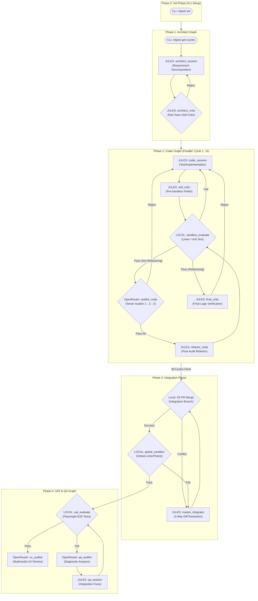

# NITPICKERS System Architecture

## Summary
This document defines the comprehensive architectural blueprint for refactoring the NITPICKERS AI-native development environment into a robust 5-Phase configuration. It outlines the structural design, data flow, component boundaries, and testing methodologies necessary to implement a highly parallelized, deeply integrated, and rigorously validated development pipeline.

## System Design Objectives
The primary objective of the NITPICKERS system is to establish an unyielding, zero-trust AI-driven development environment that guarantees the quality and reliability of generated code through rigorous verification and multi-stage execution workflows. As artificial intelligence models become increasingly capable of generating complex source code, the necessity for robust oversight mechanisms grows exponentially. The NITPICKERS project addresses this challenge by implementing a highly structured, 5-Phase Architecture designed to systematically decompose requirements, iteratively build features, integrate changes safely, and ultimately validate the complete system against user acceptance criteria.

First and foremost, the system is designed to entirely eliminate assumed success. Traditional automated coding tools often assume that if a script runs without immediate crashing, the implementation is correct. In contrast, this architecture enforces a mechanical blockade at multiple critical junctions. Pull requests generated by the automated agents are explicitly blocked until all static analysis checks (such as Ruff linting and Mypy strict type checking) and dynamic behavioral tests (via Pytest) pass with a zero exit code. This strict zero-trust validation approach means that no code is permitted to advance to the integration phase unless it has proven its structural and functional soundness within a secure, isolated sandbox environment.

Another core objective is to maximize the parallelization of independent tasks while maintaining deterministic, sequential oversight. By separating the implementation phase into distinct, parallel developer cycles (the Coder Graph), the system can concurrently work on non-overlapping features, vastly improving throughput. However, the review process within each cycle remains strictly serial. The introduction of the Auditor chain ensures that code is sequentially evaluated by multiple distinct "personas" or focus areas. This structure prevents the common issue of single-prompt fatigue, where a lone AI agent misses nuanced errors because it is attempting to evaluate too many dimensions simultaneously.

The integration strategy constitutes a critical objective in its own right. Merging code produced by parallel automated cycles inherently risks conflicts and logical regressions. To mitigate this, the Integration Phase employs a sophisticated 3-Way Diff conflict resolution mechanism. Instead of dumping raw conflict markers to the model, the system strategically provides the common ancestor (Base) alongside the divergent branches (Branch A and Branch B), empowering the Master Integrator agent to construct a unified resolution that honors the original intentions of all parallel efforts. Following this, a Global Sandbox run ensures that the integrated whole maintains the integrity of the individual parts.

Resilience and stateless operation are also foundational goals. The sandbox environments must operate without relying on persistent external state or sensitive credentials (such as production API keys) during evaluation. This mandates a testing strategy where all external API calls are strictly mocked, preventing infinite retry loops or unexpected billing surges if the generated code attempts unauthorized network access. Furthermore, the system must handle database or persistent state testing through transactional rollback mechanisms—specifically Pytest fixtures that initiate a transaction before a test and revert it immediately after—ensuring lightning-fast, side-effect-free test execution.

Finally, the system aims to provide total observability and diagnostic clarity. Through the integration of Playwright and vision-capable LLMs (such as those accessed via OpenRouter), the system automatically captures rich multi-modal failure context during User Acceptance Testing (UAT). If a dynamic E2E test fails, high-resolution screenshots and DOM states are captured and fed into stateless Auditor agents that diagnose the failure without suffering from project context exhaustion. This outer-loop diagnostic approach allows the system to self-heal by returning structured fix plans to the worker agents, continuously refining the application until it fully satisfies the user’s original specification. Together, these objectives create an ecosystem where AI acts not just as a generative tool, but as a disciplined, self-correcting engineering team.

## System Architecture

The overarching system architecture of NITPICKERS is defined by a sequential progression through five distinct phases, orchestrating various LangGraph components, autonomous agents, and isolated sandbox environments. This design enforces strict boundary management and clear separation of concerns, ensuring that no single component becomes a bottleneck or a monolithic point of failure. The architecture dictates that state mutability is tightly controlled within each phase, and transitions between phases are strictly gated by deterministic validation mechanisms.

The journey begins in Phase 0: Init Phase, a purely static, CLI-driven setup process. This phase is responsible for scaffolding the target project environment. It ensures that critical infrastructure files—such as strict linting configurations, typing stubs, and environment variable templates—are correctly established before any AI generation begins. This preemptive standardization guarantees that all subsequent code generated by the agents will be measured against a unified, uncompromising baseline. The execution environment relies on a "Sidecar" Docker container approach, dynamically mounting the target project directory to keep the internal tool logic pristine and isolated from the artifacts it produces.

Phase 1, the Architect Graph, represents the strategic planning layer. During this phase, the primary orchestrator ingests the raw requirement documents (e.g., ALL_SPEC.md) and systematically decomposes them into discrete, manageable development cycles. The output of this phase is a series of structured specification documents and User Acceptance Testing (UAT) plans. A critical rule enforced here is the separation of planning from execution; the Architect does not write functional code, and the subsequent implementation agents cannot alter the established high-level plan. This ensures focus and prevents scope creep during the generative cycles.

Phase 2, the Coder Graph, is the engine of implementation. Here, the architecture supports parallel execution of multiple development cycles. Each cycle operates on its own dedicated state (`CycleState`), featuring a continuous loop of implementation, sandbox evaluation, and auditing. The sandbox evaluation is a local, secure execution of linters and unit tests. If the code passes this static blockade, it is routed to a series of Auditor nodes. These auditors execute sequentially, each validating specific dimensions of the codebase. A newly introduced boolean flag, `is_refactoring`, dictates the flow. During the initial implementation passes, the code cycles through the standard auditors. Once all standard audits are passed, the flag toggles, directing the flow through a Refactor node for code polishing and finally a Self-Critic node to ensure long-term maintainability.

Phase 3 introduces the Integration Phase, a critical convergence point. Once all parallel cycles in Phase 2 report successful completion, the system attempts to merge the resultant branches into a unified integration branch. If standard Git merges encounter conflicts, the architecture routes the state to the Master Integrator node. This node utilizes a sophisticated 3-Way Diff resolution strategy, analyzing the base commit alongside the divergent branches to synthesize a cohesive resolution. Crucially, a Global Sandbox evaluation follows the merge. This system-wide test run ensures that the integration of individually sound features has not introduced systemic regressions or broken cross-component contracts.

Finally, Phase 4 embodies the UAT & QA Graph. This phase is exclusively dedicated to dynamic, End-to-End testing in a simulated production-like environment. Utilizing Playwright and other dynamic testing tools, the system executes the scenarios defined in the UAT plans. If a failure occurs, the architecture leverages multimodal diagnostic capture—taking screenshots and recording DOM traces—which are then analyzed by specialized Vision QA Auditors. These stateless auditors generate explicit fix plans, which are then fed back into the session for correction. This phase guarantees that the application not only passes internal structural checks but genuinely fulfills the user's interactive expectations.



## Design Architecture

The design architecture of the NITPICKERS system is deeply rooted in Domain-Driven Design principles, leveraging Python's strict type hinting and the Pydantic library to construct robust, immutable, and self-validating data structures. The core philosophy is that state is the single source of truth for the LangGraph workflows. By explicitly defining the shape, constraints, and validation rules of the state objects, we eliminate implicit assumptions and prevent malformed data from causing unpredictable pipeline failures. This strict adherence to schema definition ensures that the system components communicate via well-defined, strongly typed contracts.

At the heart of the design are the state management models, primarily `CycleState` and `IntegrationState`. The recent refactoring has necessitated extensions to these models to support the new 5-Phase workflow. Specifically, `CycleState` now incorporates crucial control flags: `is_refactoring` (a boolean to route the workflow post-initial implementation), `current_auditor_index` (an integer tracking progress through the serial audit chain), and `audit_attempt_count` (to prevent infinite loops in the case of repeated auditor rejections). These additions seamlessly integrate with the existing domain objects, transforming them from simple data carriers into sophisticated state machines that govern the lifecycle of a development cycle.

The file structure is organized to reflect these architectural principles, ensuring clear separation of concerns. The `src/` directory contains the core operational logic, divided logically into state definitions, graph routing, node implementations, and external service adapters. The `domain_models/` module houses the pure Pydantic schemas, abstracting the business rules away from the execution mechanics. The `services/` module encapsulates complex orchestration logic, such as the `conflict_manager.py` which handles the intricate 3-Way Diff integrations. This modular approach ensures that adding new features, such as new auditing nodes or modified routing logic, can be accomplished without disrupting the core state management infrastructure.

```text
/
├── dev_documents/
│   ├── system_prompts/
│   │   ├── SYSTEM_ARCHITECTURE.md
│   │   ├── CYCLE01/
│   │   │   ├── SPEC.md
│   │   │   └── UAT.md
│   │   ├── CYCLE02/ ... (up to CYCLE05)
│   └── USER_TEST_SCENARIO.md
├── src/
│   ├── state.py                  (Defines CycleState, IntegrationState)
│   ├── graph.py                  (Defines Phase 2, Phase 3, Phase 4 graphs)
│   ├── cli.py                    (CLI Entrypoints)
│   ├── nodes/
│   │   ├── routers.py            (Conditional edge routing logic)
│   │   └── actions.py            (Node execution handlers)
│   ├── domain_models/            (Pydantic schemas: AuditResult, FixPlanSchema, etc.)
│   └── services/
│       ├── workflow.py           (Orchestration for the 5-Phase pipeline)
│       └── conflict_manager.py   (3-Way Diff Integration logic)
├── tests/
│   ├── unit/
│   ├── integration/
│   └── uat/
└── pyproject.toml                (Dependency and strict linter configurations)
```

In terms of extension and backward compatibility, the new domain models are designed to be strictly additive. Existing node functions that consume `CycleState` will ignore the new control fields if they do not require them, thanks to Pydantic's predictable serialization. However, the new routing functions in `src/nodes/routers.py` actively monitor these fields to dynamically adjust the graph traversal path. This design guarantees that the system remains highly extensible. If a new phase or a new type of auditor is required in the future, the state schema can be extended, and the corresponding routing logic updated, without requiring a fundamental rewrite of the existing Coder or QA nodes.

Furthermore, all integration points with external systems (like LLM APIs or Git repositories) are mediated through service interfaces and strictly validated schemas. The `AuditResult` and `FixPlanSchema` ensure that when an OpenRouter auditor returns a response, it is immediately coerced into a predictable format before being injected into the state. This strict boundary management protects the internal workflow from upstream API hallucinations or formatting errors, embodying the zero-trust paradigm at the code level. The overall design architecture is built for maximum reliability, transparency, and scalability.

## Implementation Plan

### Cycle 01: State and Router Enhancements
The first cycle establishes the foundational state management models needed for Phase 2 routing. The primary goal is to refactor `src/state.py` to embed essential control flags into the `CycleState` Pydantic model. These include `is_refactoring`, `current_auditor_index`, and `audit_attempt_count`. In addition to defining the data structures, the routing logic in `src/nodes/routers.py` must be written. This logic will explicitly dictate how a `CycleState` travels from the `sandbox_evaluate` node to either the sequential auditor chain or directly to the final critic, depending on the current iteration parameters. This forms the absolute baseline upon which the parallel Coder iterations will run deterministically.

### Cycle 02: Integration Graph and 3-Way Diff
This cycle shifts focus to the new Phase 3. The `_create_integration_graph` function must be implemented in `src/graph.py` to string together the `git_merge_node`, `master_integrator_node`, and `global_sandbox_node`. More critically, the implementation requires building out the `ConflictManager` in `src/services/conflict_manager.py`. The implementation must utilize raw `git show` commands (targeting index 1, 2, and 3) to accurately capture the Common Ancestor (Base), the Local branch (A), and the Remote branch (B). This 3-way package is then fed into an OpenRouter LLM call using strict prompt templates to achieve semantic conflict resolution, guaranteeing that overlapping cycles are merged without feature erasure.

### Cycle 03: UAT Phase Separation
Cycle 03 explicitly decouples the User Acceptance Testing from Phase 2, isolating it into a standalone Phase 4. This involves excising the `uat_evaluate` logic from the Coder Graph and repositioning it into `_create_qa_graph`. The implementation must modify `src/services/uat_usecase.py` to accept an `IntegrationState` rather than a `CycleState`, ensuring that tests are executed against the fully merged, global repository. The implementation includes wiring the self-healing loop: if `uat_evaluate` fails, it must capture multimodal Playwright artifacts, pass them to a stateless `qa_auditor`, and route to `qa_session` for automated patching before looping back.

### Cycle 04: Orchestration and Workflow Adjustments
This cycle builds the high-level orchestration engine that oversees all phases. The `src/services/workflow.py` and `src/cli.py` entry points must be heavily refactored. The primary objective is implementing asynchronous execution using `asyncio.gather` to concurrently fire off multiple instances of the Phase 2 Coder Graph. The logic must strictly wait for all parallel sub-tasks to achieve a final success state or reach a terminal failure limit. Once parallel tasks are synced, the orchestrator must automatically funnel the resulting branch references sequentially into Phase 3 (Integration) and ultimately Phase 4 (UAT), forming a single cohesive CLI command (`nitpick run-pipeline`).

### Cycle 05: System Finalization and QA
The final cycle is dedicated to system observability, global error handling, and the creation of the UAT execution vehicle. The implementation involves adding comprehensive try/except catch-all blocks in the top-level `WorkflowService` to prevent catastrophic crashes, instead dumping a localized state snapshot to `dev_documents/` for post-mortem debugging. Additionally, this cycle implements the `tutorials/UAT_AND_TUTORIAL.py` Marimo notebook. This involves writing complex `pytest.MonkeyPatch` mechanisms to create a "Mock Mode" that simulates the entirety of the 5-Phase architecture—bypassing real API calls to Jules and OpenRouter—thereby allowing CI systems to instantly verify the routing integrity of the completed project.

## Test Strategy

### Cycle 01: State and Router Enhancements
The test strategy for Cycle 01 demands rigorous unit tests focused purely on Pydantic schema validation and router output determination. For `src/state.py`, tests will instantiate `CycleState` objects with invalid types to assert that standard `ValidationError` exceptions are correctly raised. For `src/nodes/routers.py`, exhaustive testing must cover all boolean and integer combinations. For example, Pytest will invoke `route_auditor` with `current_auditor_index` set to its maximum bound and assert that it correctly returns "pass_all", transitioning out of the serial loop. These tests must run completely locally without attempting real LLM calls. The DB Rollback Rule applies here if the test framework connects to a state-tracking database, ensuring zero contamination between distinct test runs.

### Cycle 02: Integration Graph and 3-Way Diff
Testing the 3-Way Diff mechanism requires complex integration test fixtures mimicking real-world Git conflicts. The unit tests must rely on `pytest-mock` to intercept `subprocess.run` calls, supplying pre-determined "Base", "Branch A", and "Branch B" text strings to verify the `ConflictManager` properly constructs the resolution prompt. Furthermore, the external LLM call to OpenRouter within the `master_integrator_node` must be strictly mocked, returning a known good code snippet. The integration test will verify that the node correctly receives this snippet and attempts to resolve the mocked file state. This strategy ensures the system can handle complex merges without executing potentially destructive local filesystem operations or incurring API billing during standard CI runs.

### Cycle 03: UAT Phase Separation
Validating the isolated Phase 4 UAT Graph involves simulating multimodal failure states. The unit tests for `uat_evaluate` must mock the Playwright execution entirely, synthesizing a failure response containing a mock path to a screenshot. The subsequent test for `qa_auditor` must ingest this mock screenshot path, mock the external OpenRouter Vision API request, and assert that the correct JSON "fix plan" is parsed. This verifies the structural integrity of the self-healing loop without requiring a headless browser to actually spin up. The integration test will stitch these mocks together, verifying the state cycles from `uat_evaluate` to `qa_auditor` to `qa_session` and successfully back to `uat_evaluate`, confirming the node routing works flawlessly under stress.

### Cycle 04: Orchestration and Workflow Adjustments
Testing the Orchestration layer is fundamentally an exercise in async isolation. Using `pytest-asyncio`, unit tests must construct mock asynchronous tasks representing the Phase 2 Coder graphs. These tests will assert that `asyncio.gather` within `WorkflowService` correctly launches all tasks concurrently and awaits their respective futures. A critical failure test must be written where one mock future raises a timeout exception; the orchestrator must be proven to catch this, halt the pipeline, and intentionally skip Phase 3 and Phase 4. This ensures that a single failed cycle does not silently corrupt the integration build. All actual LangGraph node invocations must be stubbed out to keep the test suite lightning-fast and perfectly deterministic.

### Cycle 05: System Finalization and QA
The test strategy for Cycle 05 culminates in the automated validation of the Marimo interactive tutorial. The primary test is to simply execute `uv run marimo test tutorials/UAT_AND_TUTORIAL.py` as an integration test step. Because the tutorial itself relies heavily on "Mock Mode" using `pytest.MonkeyPatch` overrides, its successful execution mathematically proves that the entire 5-Phase pipeline—from Architect planning through Coder implementation to Integration and UAT validation—can traverse its designated graph nodes successfully. If this top-level execution passes, it guarantees the structural soundness of the entire codebase and verifies that the `WorkflowService` orchestration flawlessly binds the individual domain architectures together into a cohesive product.
