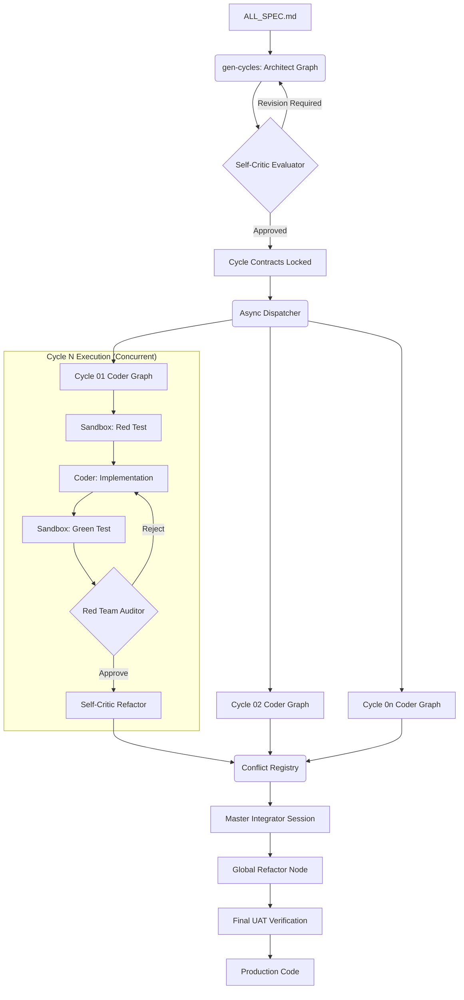

# System Architecture: NITPICKERS (NEXUS-CDD)

## Summary
NITPICKERS is an AI-native development environment based on the AC-CDD methodology. It upgrades the existing sequential framework into a robust, concurrent, and self-evolving architecture. By introducing strict zero-trust validation, parallel cycle execution, Red Teaming intra-cycle, and intelligent cascading conflict resolution, NITPICKERS ensures that AI-generated code meets human-level (or better) standards. The system acts as a virtual development team capable of executing, testing, and merging features autonomously.

## System Design Objectives
The primary objective of NITPICKERS is to eliminate the sequential bottleneck of the existing AC-CDD framework while enforcing a "Zero-Trust" policy on all AI-generated code. The constraints are to avoid zero-base rewrites and to maximize the reuse of existing LangGraph, Git, and file management assets.

**Goals:**
1. **Massive Throughput (Concurrent Development):** Enable 100% parallel execution of functional cycles by establishing strict interface locks (contracts) during the planning phase. Each cycle must run independently.
2. **Zero-Trust Validation:** Implement dual hard-gates for all generated code: static analysis (ruff, mypy) and dynamic execution (sandbox UAT via E2B). No code progresses without a "Green" status.
3. **Evolutionary Refactoring:** Treat Git merge conflicts as opportunities for architectural improvement. Instead of basic textual merges, use AI (Jules) to semantically resolve conflicts, eliminate redundancies, and enforce DRY principles.
4. **Agentic Test-Driven Development (TDD):** Enforce a strict Red-Green-Refactor loop. AI must write failing tests first, prove they fail in the sandbox, implement the feature, and then prove the tests pass.

**Success Criteria:**
- The system can concurrently execute multiple cycles (`run-cycle` in parallel).
- All generated code passes `ruff`, `mypy`, and dynamic tests within the E2B sandbox.
- Semantic merge conflicts are resolved autonomously without human intervention.
- The system does not rewrite the existing core but safely extends it with new LangGraph nodes and async dispatchers.

## System Architecture
NITPICKERS is orchestrated by LangGraph and built upon a strict Pydantic-based schema design. The architecture is an additive extension of the current AC-CDD framework.

### Components
1. **Workflow Orchestrator (Async Dispatcher):** Upgrades the current sequential loop in `workflow.py` to an asynchronous DAG scheduler. It orchestrates multiple Jules sessions simultaneously, respecting dependency graphs to prevent API rate limits.
2. **Architect & Self-Critic Evaluator:** During `gen-cycles`, a new evaluation node (Self-Critic) reviews the generated architecture (`SYSTEM_ARCHITECTURE.md` and `SPEC_cycleXX.md`) against a strict set of fixed prompts to identify vulnerabilities (e.g., N+1 problems, race conditions, security flaws).
3. **Coder & Auditor (Red Team):** In `run-cycle`, the Auditor role is enhanced. It uses fixed prompts to act as a Red Team, attacking the Coder's implementation. A Self-Critic node is also added post-audit to ensure refactoring opportunities are identified.
4. **Sandbox Executor (E2B):** Integrates E2B for dynamic UAT. It mounts the project, executes generated `pytest` scripts, and extracts artifacts (stdout, stderr, exit codes) to feed back into the LangGraph state.
5. **Conflict Registry & Master Integrator:** Replaces the standard `git merge` with a stateful Jules session. It tracks files with merge markers (`<<<<<<<`) and forces Jules to semantically resolve them while improving overall architecture.
6. **Global Refactor Node:** A final pass over the merged codebase to enforce DRY principles, remove dead code, and optimize the architecture.

### Data Flow
1. **Plan:** Requirements (`ALL_SPEC.md`) $\rightarrow$ Architect $\rightarrow$ Self-Critic $\rightarrow$ Cycle Contracts (`SPEC.md`, `UAT.md`).
2. **Execute (Concurrent):** Cycle Contracts $\rightarrow$ Async Dispatcher $\rightarrow$ Coder (Jules) $\rightarrow$ Sandbox (Red Test) $\rightarrow$ Coder $\rightarrow$ Sandbox (Green Test).
3. **Audit:** Implementation $\rightarrow$ Red Team Auditor $\rightarrow$ Self-Critic $\rightarrow$ Refactored Code.
4. **Merge:** Concurrent Branches $\rightarrow$ Conflict Registry $\rightarrow$ Master Integrator $\rightarrow$ Main Branch.
5. **Finalize:** Main Branch $\rightarrow$ Global Refactor $\rightarrow$ Final Sandbox Test $\rightarrow$ Production Ready.

### External System Interactions
- **LLM Providers (Google Jules, OpenRouter):** Core inference engines. API calls are managed with jittered backoff.
- **E2B Sandbox:** Remote execution environment for dynamic testing.
- **GitHub:** For PR creation, branch management, and status checks.

### Boundary Management & Separation of Concerns
- **Interface Locks:** Cycle contracts (interfaces, DTOs, API payloads) are immutable during concurrent execution. Any violation detected by static analysis immediately fails the cycle.
- **State Isolation:** Each LangGraph state (`CycleState`, `JulesSessionState`) is strictly typed and isolated. The Master Integrator is the only component allowed to mutate shared state across cycles.



## Design Architecture
The system enforces strict typing using Pydantic. Existing domain models are preserved, and new models are added to track concurrent states and conflict resolutions.

### File Structure
```text
/
├── pyproject.toml
├── README.md
├── dev_documents/
│   ├── ALL_SPEC.md
│   ├── USER_TEST_SCENARIO.md
│   └── system_prompts/
│       ├── SYSTEM_ARCHITECTURE.md
│       ├── CYCLE01/ ... CYCLE08/
│       └── ...
├── src/
│   ├── cli.py
│   ├── config.py
│   ├── graph.py               (Updated: Uses Node Registry pattern)
│   ├── nodes/                 (New: Modularized nodes to prevent merge conflicts)
│   │   ├── architect_critic.py
│   │   ├── sandbox_evaluator.py
│   │   ├── coder_critic.py
│   │   ├── master_integrator.py
│   │   └── global_refactor.py
│   ├── state.py               (Updated: Extended CycleState, added IntegrationState)
│   ├── services/
│   │   ├── e2b_executor.py       (New)
│   │   ├── conflict_manager.py   (New)
│   │   ├── async_dispatcher.py   (New)
│   │   └── ...
│   └── ...
└── tests/
```

### Core Domain Pydantic Models (Extensions)
- `CycleState`: Extended to include `sandbox_artifacts` (dict), `conflict_status` (enum), and `concurrent_dependencies` (list).
- `IntegrationState`: A global state managing the `master_integrator_session_id` and the complete `ConflictRegistry`.
- `ConflictRegistryItem`: A new Pydantic model tracking file paths, specific merge markers, and resolution attempts.
- `E2BExecutionResult`: Tracks stdout, stderr, exit code, and coverage from the sandbox.

### Integration Points
- **LangGraph Nodes:** The new Self-Critic, E2B Sandbox, and Conflict Resolution nodes will be registered in `graph.py` and `graph_nodes.py`, routing based on new `FlowStatus` enums (e.g., `UAT_FAILED`, `CONFLICT_DETECTED`).
- **GitManager:** The existing GitManager will be extended to intentionally preserve merge markers (`git merge --no-commit --no-ff`) and parse them for the Conflict Registry.

## Implementation Plan
The project is divided into exactly 8 cycles to ensure a safe, additive evolution.

1. **CYCLE01: Domain Models & State Management Extension.** Update `state.py`, `domain_models.py`, and `enums.py` to support concurrent tracking, sandbox artifacts, and conflict states. Move `ac_cdd_core` to `src`.
2. **CYCLE02: Architect Self-Critic Node Integration.** Implement the Self-Critic evaluation loop within the `gen-cycles` Architect graph to validate design specs against strict anti-pattern prompts.
3. **CYCLE03: Async Dispatcher & Concurrent Execution.** Modify `workflow.py` to replace sequential loops with `asyncio.gather` and DAG-based dependency scheduling with API rate limit backoffs.
4. **CYCLE04: E2B Sandbox Pipeline (Agentic TDD).** Implement `e2b_executor.py` and integrate it into the `uat_evaluate_node`. Enforce the strict Red-Green-Refactor testing loop.
5. **CYCLE05: Red Team Auditor & Intra-Cycle Refactor.** Enhance the existing auditor nodes with fixed verification prompts and add a post-audit Self-Critic refactoring node.
6. **CYCLE06: Conflict Extraction & Registry Management.** Build the `ConflictManager` to detect, extract, and track Git merge markers without failing the pipeline.
7. **CYCLE07: Stateful Master Integrator Session.** Implement the persistent Jules session designed specifically for semantic conflict resolution based on the Conflict Registry.
8. **CYCLE08: Global Refactor Node & Final Stabilization.** Create the final LangGraph node that reviews the entire merged codebase for DRY violations and dead code, followed by a full pre-commit pipeline run.

## Test Strategy
Each cycle is validated through a combination of static analysis and dynamic execution.

- **Unit Testing:** All new nodes and services (e.g., `e2b_executor.py`, `conflict_manager.py`) will be tested using `pytest` with extensive mocking of external API calls (Jules, E2B, Git). E.g., `unittest.mock.patch` will be used to simulate `git merge` output containing conflicts.
- **Integration Testing:** LangGraph state transitions will be tested by injecting mock inputs into the initial state and asserting the correct sequence of node executions and final state outputs.
- **E2E Testing (Sandbox):** The E2B pipeline will be tested by spinning up temporary, isolated sandbox environments, injecting known failing and passing `pytest` scripts, and asserting that the orchestrator correctly reads the exit codes and logs. Side effects on the local filesystem are mitigated by restricting file I/O to temporary directories.