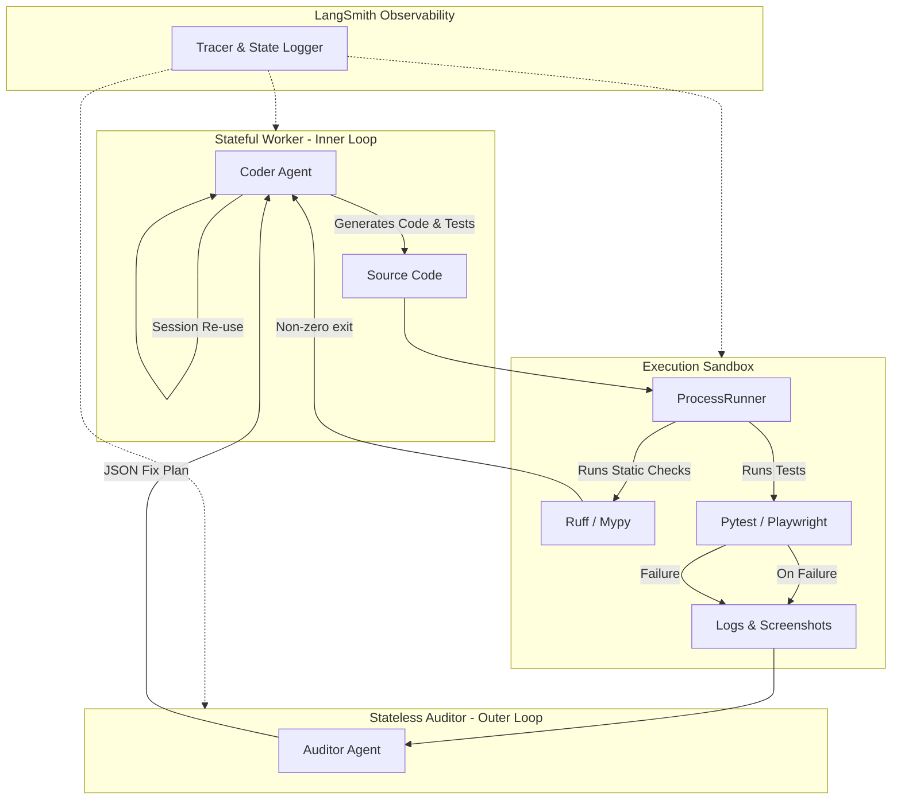

# System Architecture

## Summary
The NITPICKERS framework is fundamentally evolving its Quality Assurance capabilities. Currently, the User Acceptance Testing (UAT) relies on an "assumed success" model, leading to potential post-deployment failures and a degradation of user trust. Furthermore, the existing static LLM code review is insufficient for evaluating dynamic application states. This architecture document details the transition to a fully automated, multi-modal, and highly observable UAT pipeline. It outlines a strategy based on a strict separation of concerns, utilizing a Stateful Worker for inner-loop development, a Stateless Auditor for outer-loop diagnostics, and a comprehensive Observability Layer for tracing execution.

## System Design Objectives
The primary objective of this new architecture is to eliminate the "hallucination bottleneck" and the reliance on assumed success within the NITPICKERS framework. Currently, the pipeline operates with a critical blind spot during the Quality Assurance phase. The system depends heavily on static code reviews performed by Large Language Models, which, while proficient at identifying syntax errors, fundamentally lack the capacity to deterministically verify dynamic application states or complex, interactive user journeys. This limitation often results in critical runtime errors slipping through to the end user. To solve this, we are aiming to establish an impenetrable mechanical gatekeeper. This automated pipeline must not only verify backend structural logic but also ensure strict Human-Centered Design (HCD) compliance within a secure, local, sandboxed environment.

A core component of our strategy is the implementation of the "Worker, Auditor, and Observer" paradigm. The Stateful Worker, driven by the highly capable Jules agent using Gemini Pro, remains responsible for the "Inner Loop" of development. This involves orchestrating the flow, fabricating the underlying feature code, and meticulously generating the accompanying Pytest scripts. Because this worker maintains a long-running, stateful conversational session, it naturally accumulates a massive repository of context. However, it is also highly susceptible to context dilution. To mitigate this risk, our session management strategy mandates that the worker reuses its active session for applying rapid, surgical fixes, but spawns an entirely new session when advancing to a subsequent development cycle. This ensures the worker's cognitive load remains focused and uncluttered.

Simultaneously, we introduce the Stateless Auditor, a specialized component powered by OpenRouter. This auditor serves as the "Outer Loop" diagnostician and Human-Centered Design evaluator. Crucially, it is invoked on a strict, per-request basis. By operating statelessly, the auditor avoids the context fatigue that plagues the worker. When an End-to-End test fails within the sandbox, the auditor is isolated from the broader project history and fed only the specific artifacts generated by the failure—namely, the error logs, relevant code snippets, and visual artifacts like screenshots. Its singular objective is to diagnose the true root cause and output a highly structured, schema-compliant JSON "Fix Plan" that can be seamlessly consumed and executed by the worker.

Underpinning this entire framework is an unyielding Observability Layer, achieved through deep integration with LangSmith. The inherent "Black Box" nature of complex agentic workflows makes debugging infinite loops or hallucinated logic nearly impossible using standard console logs. By embedding LangSmith directly into the LangGraph orchestration layer, we gain near-zero cost implementation while achieving total visibility. This layer is responsible for visually tracing the complex node transitions between the coder, the sandbox evaluator, and the auditor. It records the exact mutations of the state dictionary between every execution, eliminating the need for excessive print debugging. Furthermore, it comprehensively logs the raw prompts, including base64 encoded images, sent to the Vision LLMs. This guarantees accountability, allowing us to definitively ascertain whether an HCD failure resulted from flawed LLM reasoning or simply a blank screenshot, ultimately transforming failed traces into valuable datasets for quantitative regression testing and prompt optimization. The ultimate goal is a deterministic pipeline where success is proven, not assumed.

## System Architecture
The system architecture for the NITPICKERS automated UAT pipeline is meticulously structured around a highly decoupled, modular framework consisting of three primary operational pillars: The Stateful Worker, The Stateless Auditor, and The Observability Layer. This architectural paradigm is strictly enforced to ensure a clear separation of concerns, preventing the complex, stateful requirements of session management from intertwining with the surgical, stateless demands of root cause diagnosis. By maintaining these rigid boundaries, the system achieves both resilience against LLM hallucination and absolute visibility over its internal execution flow.

The Stateful Worker functions as the core operational engine, occupying the "Inner Loop" of the development process. Powered by the primary agent model (Jules via Gemini Pro), the Worker is tasked with reading the parsed requirement specifications, fabricating the corresponding feature source code, and subsequently generating a comprehensive suite of Pytest scripts. Because the Worker manages long-running, interactive conversations and accumulates substantial repository context, it is deliberately insulated from the direct, dynamic execution of failing tests to prevent context dilution—often referred to as the "Lost in the Middle" phenomenon. The architecture enforces a rigorous session lifecycle: existing sessions are meticulously preserved and reused to apply the rapid, targeted fixes dictated by the Auditor, while entirely new, clean sessions are explicitly spawned when the system successfully transitions to a new development cycle, systematically flushing accumulated history.

Operating entirely outside the stateful context of the Worker is the Stateless Auditor. This distinct component serves as the "Outer Loop" diagnostician and Human-Centered Design evaluator. Invoked strictly on a per-request basis, the Auditor is triggered solely when a true End-to-End (E2E) User Acceptance Test fails within the secure execution sandbox. The boundary here is absolute: the Auditor retains no memory of previous development cycles or the overarching project history. Instead, it is fed only the highly specific artifacts generated by the immediate failure. These artifacts include the granular error log, the localized code snippet, and critical visual multi-modal payloads, such as full-page screenshots captured during the test execution. By enforcing this strict separation of concerns, the Auditor can leverage advanced external models via OpenRouter to act with surgical precision, diagnosing the root cause without the cognitive overhead of the entire project context. It communicates its findings back to the Worker strictly through a highly structured, strongly typed, schema-compliant JSON "Fix Plan."

The integration point between these two distinct pillars is mediated by the central `ProcessRunner`, which operates within a secure, local execution sandbox. The Worker generates the test suite, which is then mechanically executed by the `ProcessRunner`. If the structural unit tests or the mandatory static analysis tools (specifically Ruff for linting and Mypy for strict type checking) return a non-zero exit code, the pipeline is mechanically blocked. In this scenario, the standard error trace is routed directly back to the Worker's active session for immediate remediation, bypassing the Auditor entirely. Conversely, for behavioral E2E tests, the `pytest-playwright` plugin is integrated to automatically capture multi-modal artifacts upon UI failure. These specific artifacts are then piped to the Auditor, completing the evaluation and recovery loop.

Wrapping this entire operational structure is the Observability Layer, deeply integrated via LangSmith into the existing LangGraph orchestration. This layer acts as the system's panopticon, silently and automatically tracing every node transition, state mutation, and external API invocation. The fundamental architectural rule here is that no external call or significant internal graph transition may occur without being explicitly recorded by the tracing layer. This layer visualises the complex routing edges, instantly exposing any emergent infinite loops where the system might become stuck oscillating between the Coder, Sandbox Evaluator, and Auditor nodes. Furthermore, it records the exact, immutable diffs of the internal LangGraph state dictionary (such as the `uat_exit_code` or `current_fix_plan`) between executions, and meticulously logs the raw multi-modal prompts—including the base64 encoded images—sent to the Vision LLMs, ensuring total accountability.



## Design Architecture
The design architecture of the NITPICKERS Automated UAT Pipeline focuses heavily on leveraging the Pydantic library for robust schema definitions, enforcing strict domain invariants, and ensuring the safe extension of the existing system. The core underlying philosophy is a Schema-First approach, where every boundary crossing—particularly the critical handoffs between the Worker, the Sandbox execution environment, and the external Auditor API—is strictly governed by validated Pydantic models. This methodology eliminates ambiguity in data transfer and prevents malformed LLM outputs from causing cascading, unhandled failures within the orchestration logic.

The file structure is purposefully designed to seamlessly integrate with the existing modular layout of the NITPICKERS repository. We avoid massive, disruptive overhauls by securely injecting the new automated capabilities into clearly defined, isolated modules. The new components are carefully placed within their respective functional domains: new Pydantic definitions reside in `domain_models/` for data contracts, new business logic and LLM integrations are placed in `services/`, and all validation logic is secured within the `tests/` directory. This ensures the codebase remains navigable and maintainable.

At the core of the new domain design are several key Pydantic models that act as authoritative contracts. The primary addition is the `FixPlanSchema`. This model represents the surgical, highly structured output expected from the Stateless Auditor after it diagnoses a UI failure. It includes strictly typed fields for the target file path (`target_file`), a clear, concise description of the defect (`defect_description`), and a precise Git-merge style diff or abstract syntax tree transformation block required to resolve the issue (`git_diff_patch`). This schema enforces strict invariants: the file path must be structurally valid and point to a file within the repository scope, and the diff must be syntactically sound before being passed back to the Worker. This mechanism securely prevents the Auditor from proposing hallucinated or destructive repository changes.

Another critical component is the `UatExecutionState` model, which represents the dynamic state of the sandbox during the execution of a test suite. It encapsulates the overall process exit code, a collection of executed test results, standard output logs, standard error tracebacks, and critically, the absolute file paths to the captured multi-modal artifacts, such as the Playwright screenshots and DOM traces. This model is treated as immutable once instantiated for a given execution run, serving as the definitive, auditable record of the sandbox's reality. By passing this immutable, strongly typed state object between LangGraph nodes, we ensure that the system's complex routing decisions are based on absolute, verifiable data rather than assumed success placeholders.

The integration points between these models and the business logic are explicitly defined to guarantee stability. The `UatExecutionState` extends the existing general execution state, providing the specific fields required for behavioral validation. When the `uat_usecase.py` service initiates a test run via the `ProcessRunner`, the raw shell output is parsed and strictly validated against the `UatExecutionState` schema. If the execution fails, this validated state object is reliably passed to the `auditor_usecase.py`, which constructs the specific multi-modal prompt for the external OpenRouter model. The response from the external model is then immediately parsed and validated against the `FixPlanSchema`. Only if this validation succeeds is the fix plan routed back into the stateful session of the Worker. This bidirectional validation boundary completely isolates the internal LangGraph business logic from the unpredictable outputs of external LLMs. To enforce this, the use of Pydantic's `model_config = ConfigDict(extra="forbid")` is mandatory across all new models, ensuring they act as an unyielding schema contract that rejects unexpected data fields, thus guaranteeing backward compatibility and safe extensibility.

```text
/
├── dev_documents/
│   ├── system_prompts/
│   │   ├── SYSTEM_ARCHITECTURE.md
│   │   ├── CYCLE01/
│   │   ├── CYCLE02/
│   │   ├── CYCLE03/
│   │   ├── CYCLE04/
│   │   ├── CYCLE05/
│   │   └── CYCLE06/
│   └── ALL_SPEC.md
├── src/
│   ├── cli.py
│   ├── domain_models/
│   │   ├── auditor_schema.py (NEW)
│   │   ├── fix_plan_schema.py (NEW)
│   │   └── uat_execution_state.py (NEW)
│   ├── nodes/
│   │   ├── routers.py
│   │   └── sandbox_evaluator.py
│   ├── services/
│   │   ├── auditor_usecase.py (NEW)
│   │   ├── uat_usecase.py
│   │   └── workflow.py
│   └── process_runner.py
├── tests/
│   ├── conftest.py
│   └── uat/
└── pyproject.toml
```

## Implementation Plan

### CYCLE01: Phase 0 Setup (Environment & Observability Gate)
The objective of this cycle is to establish the foundational observability gate before any complex execution begins. We will modify the `src/cli.py` and `src/services/workflow.py` files to implement an interception point immediately following the cycle generation phase. This routine will actively scan the `os.environ` to confirm the presence of required LangSmith variables (`LANGCHAIN_TRACING_V2=true`, etc.) and any necessary API keys implicitly requested in the specification. If these variables are absent, the system will execute a hard stop, preventing execution and issuing a clear prompt to the user to configure their `.env` file. This guarantees that all subsequent pipeline executions are fully traced and verifiable, preventing the system from running "blind." We will also establish the basic Pydantic configuration schemas to validate these environment variables. This initial phase is paramount because it replaces the assumption of a correctly configured local environment with a deterministic check, thereby ensuring that when failures do occur in later cycles, the diagnostic tracing infrastructure is guaranteed to be online and capturing the necessary multi-modal state data required for automated debugging.

### CYCLE02: Phase 1 Docs-as-Tests
This cycle focuses on eliminating the translation gap between human requirements and machine-executable tests. We will implement custom Pytest hooks within `tests/conftest.py`. Specifically, the `pytest_collect_file` hook will be overridden to natively parse the `ALL_SPEC.md` and `README.md` documents. A custom parser will extract designated markdown code blocks tagged with `uat-scenario` and dynamically yield them as native Pytest items. This allows the system to directly execute documentation as code, enforcing a rigid Test-Driven Development flow. We will define the `MarkdownTestBlock` schema to ensure only valid code payloads are passed to the Pytest runner, isolating the execution context to prevent test contamination. By making the documentation intrinsically linked to the test suite, we guarantee that the LLM-generated code perfectly aligns with the original user specifications without relying on an intermediary, error-prone translation step, fundamentally strengthening the structural integrity of the pipeline.

### CYCLE03: Phase 1 Backend Verification
The focus of this cycle is establishing the "Mechanical Blockade" for structural integrity. We will update the LangGraph evaluation nodes (`src/nodes/sandbox_evaluator.py`) to utilize the `ProcessRunner` for executing static analysis tools (`uv run ruff check .` and `uv run mypy .`) alongside the core unit tests (`uv run pytest`). The critical implementation step is modifying the graph routing logic: if the `ProcessRunner` detects a non-zero exit code from any of these tools, the pipeline must deterministically halt progression towards a Pull Request. Instead, the standard error trace will be packaged into a structured schema and routed directly back to the active session of the Jules Coder agent for immediate, context-aware remediation. This cycle definitively ends the era of "assumed success" for structural code, ensuring that no unlinted, untyped, or logically flawed Python code is ever permitted to advance to the behavioral testing phase, let alone production.

### CYCLE04: Phase 2 Playwright Multi-Modal Capture
This cycle transitions the pipeline into behavioral reality testing by integrating the `pytest-playwright` plugin. We will modify `tests/conftest.py` to implement the `pytest_runtest_makereport` hook. This hook will dynamically intercept failing Playwright tests. Upon failure detection, the hook will instruct the active browser context to capture a high-resolution screenshot and extract the DOM trace, saving these artifacts to a standardized local directory. We will introduce the `MultiModalArtifact` Pydantic schema to strictly track the absolute file paths of these generated assets. This cycle ensures that every UI failure produces tangible, undeniable visual evidence, completely replacing abstract error logs with actionable, multi-modal context. This context is absolutely critical for diagnosing complex Human-Centered Design issues that traditional unit tests cannot catch, providing the foundation for the visual LLM diagnostic phase.

### CYCLE05: Phase 2 Dynamic Execution in uat_usecase.py
This cycle completely overhauls the `src/services/uat_usecase.py` module, removing the existing hardcoded bypass (`# Assume UAT passes for now`). We will instantiate the `ProcessRunner` to asynchronously execute the full Pytest suite, including the Playwright behavioral tests. Upon completion, the module will parse the exit code. If the exit code is non-zero, the module will actively scan the artifact directory for the screenshots generated in CYCLE04. It will then instantiate the `UatExecutionState` model, populating it with the logs and visual artifacts. Finally, we will update the LangGraph routing logic in `src/nodes/routers.py` to correctly read this exit code, branching to the submission phase on success, or definitively routing to the Auditor node upon failure. This cycle acts as the central nervous system of the execution sandbox, coordinating the external shell commands and formally defining the boundary conditions for success and failure within the automated UAT pipeline.

### CYCLE06: Phase 3 Auditor Validation & Recovery
The final cycle implements the Stateless Auditor. We will create `src/services/auditor_usecase.py`, which will consume the `UatExecutionState` from the previous cycle. This service will construct a highly specific, adversarial prompt (defined in a new template file) and encode the screenshot artifacts via base64. It will then invoke the OpenRouter API, ensuring the call is explicitly wrapped in LangSmith tracing contexts. The critical step is parsing the LLM's response and strictly validating it against the `FixPlanSchema`. Only a fully validated JSON plan will be injected into the graph state, which the router will then direct back to the Coder agent for application, completing the fully observable, self-healing automated pipeline. This effectively replaces manual human review with an untiring, multi-modal diagnostic engine capable of autonomous remediation.

## Test Strategy

### CYCLE01
The testing strategy for CYCLE01 involves rigorous unit testing of the configuration parsing logic. We will write isolated tests using `unittest.mock.patch.dict` to simulate various environment variable states, ensuring the system correctly raises hard stop exceptions when LangSmith variables or API keys are missing, and successfully passes when they are present. Integration testing will involve simulating a CLI execution flow to guarantee the mechanical blockade correctly halts the process before any graph nodes are instantiated, confirming the environment gate is impenetrable. We must ensure that missing variables provide clear, actionable feedback to the user, directing them exactly to the missing configuration values in the `.env` file, thus proving the reliability of the Phase 0 setup gate.

### CYCLE02
For CYCLE02, we will focus on unit testing the markdown parsing logic within `conftest.py`. We will provide mocked markdown strings containing valid and invalid `uat-scenario` blocks, verifying the parser correctly extracts the code and handles syntax errors gracefully. Integration testing will involve running Pytest on a temporary directory containing a mocked `ALL_SPEC.md` file, asserting that Pytest correctly discovers the dynamic items, executes them, and integrates the results seamlessly into the standard test summary report without requiring external runner scripts. The tests must also verify that when a markdown-embedded test fails, the traceback correctly points back to the originating markdown line, preserving the developer experience and ensuring the "Docs-as-Tests" paradigm is functionally robust.

### CYCLE03
The test strategy for CYCLE03 demands thorough unit testing of the graph routing logic. We will mock the `ProcessRunner` to return explicit non-zero exit codes simulating Ruff or Mypy failures. We will then assert that the `sandbox_evaluator` node correctly packages the stderr trace into the expected schema and updates the state dictionary to force a routing transition back to the Coder node. Integration tests will simulate a real failure by introducing a syntax error, ensuring the live pipeline refuses to generate a Pull Request and accurately executes the recovery loop. We must also verify that when the code is flawless and all static checks return an exit code of zero, the gatekeeper transparently allows the state to proceed to the next node without interference.

### CYCLE04
CYCLE04 testing will isolate the custom Pytest reporting hook. We will mock a failing Playwright `page` object and verify that the hook successfully calls the screenshot and trace generation methods without raising secondary exceptions. We will assert that the `MultiModalArtifact` schema correctly validates the resulting file paths. Integration testing will involve executing a deliberately failing headless browser test, ensuring the system successfully writes a `.png` file to the designated artifact directory and that the standard test runner completes without hanging. A critical assertion here is ensuring that if the Playwright context crashes completely before taking a screenshot, the hook gracefully handles the timeout and still logs the original failure without deadlocking the test suite.

### CYCLE05
Testing CYCLE05 involves mocking the file system and `ProcessRunner` to validate the state generation logic in `uat_usecase.py`. We will simulate a failure by providing a non-zero exit code and mocked artifact paths, asserting that the `UatExecutionState` is populated correctly. We will then test the router node to ensure it correctly reads the `uat_exit_code` and transitions to the Auditor node. Integration tests will run a failing UAT suite, confirming the full pipeline successfully captures the state, updates the graph dictionary, and branches correctly based on dynamic execution results. This ensures the mechanical blockade is not just theoretical but actively controlling the flow of the LangGraph application based on real-world execution state.

### CYCLE06
The testing strategy for CYCLE06 relies heavily on mocking the external OpenRouter API. We will simulate various LLM responses, including perfectly formatted `FixPlanSchema` JSON and malformed hallucinations. We will assert that `auditor_usecase.py` correctly parses the valid JSON and safely handles validation errors. We will also test the base64 encoding of image paths. Integration testing will involve simulating a complete self-healing loop within the LangGraph orchestrator, verifying that the validated fix plan is successfully routed back to the Coder node and that the entire sequence is visibly traced in the LangSmith test environment. This ensures that the outer loop diagnostician is robust, strictly schema-compliant, and fully observable, fulfilling the core objectives of the automated UAT architecture.
