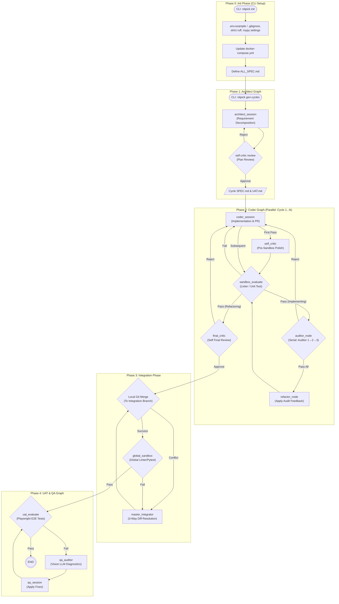

# NITPICKERS System Architecture

## Summary
The NITPICKERS system is an AI-native development environment designed to enforce absolute zero-trust validation of AI-generated code. The current architecture employs LangGraph to orchestrate a workflow of code generation, static analysis, dynamic sandbox testing, and AI-driven auditing. This document defines the evolution of the current system into a highly robust, structured "5-Phase Architecture" to enhance stability, explicitly separate concerns, and provide a clear, trackable path from requirement definition to full-system integration and User Acceptance Testing (UAT).

## System Design Objectives
The primary objective of this architecture evolution is to mitigate infinite loops and context fatigue common in complex AI agent workflows by strictly segregating responsibilities.

1. **Deterministic Execution:** The system must move deterministically through predefined phases. Instead of a single monolithic graph attempting to solve all problems, the process is divided into Initialization, Planning (Architect), Parallel Implementation (Coder), Integration, and Validation (QA/UAT).
2. **Explicit State Management:** LangGraph state must explicitly track the progress within loops, specifically the `current_auditor_index` and `is_refactoring` flags, to prevent endless auditing cycles and ensure a controlled transition between initial implementation and post-audit polishing.
3. **Zero-Trust Validation (Mechanical Blockade):** The core principle remains: no code proceeds without passing strict local linting (Ruff, Mypy) and comprehensive unit tests within an isolated Sandbox environment.
4. **Resilient Integration:** Transitioning from parallel feature development to a unified codebase requires a robust 3-Way Diff approach. The Master Integrator LLM must only resolve conflicts, leaving standard Git merges to handle non-conflicting changes.
5. **Multi-Modal Verification:** The final phase must utilize Vision LLMs to diagnose UI/E2E test failures (via Playwright screenshots), acting as a stateless red team to provide structured remediation plans.

These objectives ensure the system can autonomously build, verify, and seamlessly integrate complex features while minimizing API costs and hallucination risks.

## System Architecture
The system orchestrates five independent phases, leveraging different LangGraph instances tailored to specific tasks. The boundaries between these phases are strictly managed by a central Orchestrator (CLI/WorkflowService).



**Boundary Management & Separation of Concerns:**
- **State Isolation:** Each LangGraph execution (Architect, Coder, Integration, QA) maintains its own Pydantic state. Global variables are strictly prohibited.
- **Service Decoupling:** Use-case classes (e.g., `ConflictManager`, `UatUsecase`) contain the business logic, while Graph Nodes act only as light wrappers that invoke these services and update the state.
- **LLM Specialization:** Different LLMs are used based on the task (e.g., JULES for code generation, OpenRouter Vision models for UI diagnosis) to optimize cost and capability.

## Design Architecture

The core of the system is modeled using strict Pydantic models. This ensures type safety, automatic validation, and clear contracts between different modules and LangGraph nodes.

### File Structure Overview

```text
src/
├── state.py                # Core Domain Pydantic Models (CycleState, IntegrationState)
├── graph.py                # LangGraph Declarations (Phase 1-4)
├── cli.py                  # Entrypoints (run-pipeline)
├── nodes/                  # Graph Nodes and Routers
│   ├── routers.py          # Conditional edge routing logic
│   ├── coder.py            # Coder phase nodes
│   ├── master_integrator.py # Integration nodes
│   └── qa.py               # QA/UAT nodes
├── services/               # Core Business Logic Use Cases
│   ├── workflow.py         # Orchestration across phases
│   ├── conflict_manager.py # 3-Way Diff construction and resolution
│   ├── uat_usecase.py      # E2E testing execution
│   └── sandbox/            # E2B Environment Management
```

### Core Domain Pydantic Models (`src/state.py`)
To support the 5-Phase architecture, the existing domain models will be extended:

1.  **`CycleState` (Extending Existing):**
    -   `is_refactoring: bool = False`: Flag to route successful sandbox runs to the Final Critic instead of the Auditor chain.
    -   `current_auditor_index: int = 1`: Tracks the serial auditor progression (1 to 3).
    -   `audit_attempt_count: int = 0`: Prevents infinite loops by capping rejection iterations from a single auditor.
2.  **`IntegrationState` (New):**
    -   Tracks the state of Phase 3, containing the list of branches to merge, conflict status, and global sandbox results.

Integration Point: These new fields are additive. Existing nodes that do not require knowledge of refactoring or specific auditors will continue to function seamlessly, while new routing functions (`routers.py`) will leverage these fields to dictate flow.

## Implementation Plan

The implementation is logically decomposed into 5 distinct sequential cycles to ensure stable, iterative progress.

1.  **CYCLE01: Core State & Scenario Definition**
    -   **Scope:** Update `src/state.py` to include the necessary state variables (`is_refactoring`, `current_auditor_index`, etc.). Define the comprehensive UAT and tutorial strategy in `dev_documents/USER_TEST_SCENARIO.md`.
2.  **CYCLE02: The Coder Graph (Serial Auditing)**
    -   **Scope:** Implement the new routing logic in `src/nodes/routers.py` (`route_sandbox_evaluate`, `route_auditor`, `route_final_critic`). Refactor `_create_coder_graph` in `src/graph.py` to establish the serial auditor loop and the refactoring bypass.
3.  **CYCLE03: The Integration Graph (3-Way Diff)**
    -   **Scope:** Overhaul `src/services/conflict_manager.py` to extract Base, Local, and Remote file versions using Git. Implement `_create_integration_graph` in `src/graph.py` to handle Phase 3.
4.  **CYCLE04: UAT Decoupling & QA Graph**
    -   **Scope:** Isolate UAT logic in `src/services/uat_usecase.py` from Phase 2. Implement the dedicated Phase 4 QA graph (`_create_qa_graph`) that triggers only after a successful integration phase.
5.  **CYCLE05: Workflow Orchestration (Pipeline CLI)**
    -   **Scope:** Update `src/services/workflow.py` and `src/cli.py` to wire the phases together. The CLI will orchestrate parallel Coder graphs, wait for completion, and sequentially trigger the Integration and QA graphs.

## Test Strategy

The testing philosophy adheres strictly to the Zero-Trust mandate, ensuring robustness without relying on external system availability during automated CI/CD.

1.  **Unit Testing:**
    -   Every Pydantic model and routing function must have explicit unit tests verifying state transitions and validation rules.
    -   **Mocking:** All interactions with external services (LLM APIs, Git CLI operations in isolation) MUST be mocked using `unittest.mock` or `pytest-mock`.
2.  **Integration Testing:**
    -   Graph traversal must be tested using LangGraph's checkpointer to ensure state mutations propagate correctly across nodes.
    -   **DB/State Rollback Rule:** Any test modifying a local git repository or filesystem state must use Pytest fixtures to initialize a temporary workspace (`tmp_path`) or utilize transactions/checkpoints that are cleanly rolled back post-test, guaranteeing zero side-effects.
3.  **End-to-End (E2E) Verification (UAT):**
    -   The final validation involves executing the interactive Marimo tutorial (`tutorials/UAT_AND_TUTORIAL.py`).
    -   This tutorial will demonstrate both a "Mock Mode" (validating flow logic without API costs) and a "Real Mode" (full execution using live Sandbox and OpenRouter APIs).