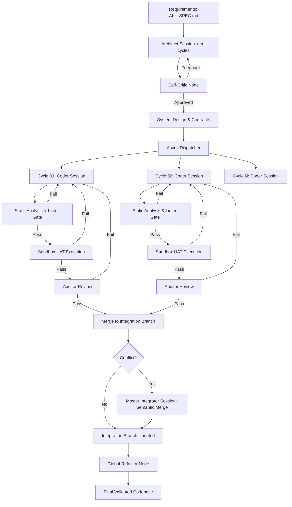

# System Architecture: NITPICKERS (NEXUS-CDD)

## 1. Summary
The NITPICKERS (NEXUS-CDD) project is a comprehensive evolution of the existing Autonomous Contract-Driven Development (AC-CDD) framework. This new architecture introduces true Concurrent Development and Zero-Trust Validation into the AI-native development lifecycle. The system is designed to act as a virtual development team, automating the entire software engineering process from requirements definition to deployment-ready, fully tested code. By breaking down the sequential bottlenecks of traditional AI coding assistants, NITPICKERS parallelises development cycles while enforcing rigorous quality gates through static analysis, dynamic testing in an isolated sandbox, and semantic merge resolution via a dedicated Red Team integration node. The architecture heavily reuses existing robust LangGraph states, Git operation modules, and Pydantic-based domain schemas, extending them safely to support asynchronous task dispatching and stateful multi-agent workflows without rewriting the core foundation.

## 2. System Design Objectives
The primary objective of the NITPICKERS architecture is to achieve massive throughput and unparalleled code quality through a combination of concurrent execution and zero-trust validation. In traditional AI-assisted development, a significant bottleneck arises from the sequential nature of task execution. When an AI agent implements a feature, the entire system often waits for that implementation to be completed, reviewed, and fixed before moving on to the next task. This sequential dependency graph limits the overall velocity of the project. NITPICKERS aims to completely shatter this bottleneck by introducing a highly parallelised, contract-driven concurrent development model. By explicitly defining the interfaces and contracts for multiple development cycles upfront during the architectural phase, the system enables multiple AI agents (specifically, Jules sessions) to work simultaneously on different components of the system without stepping on each other's toes. This approach is akin to having a team of expert engineers working in perfect harmony, strictly adhering to predetermined blueprints.

Another critical objective is to institute a zero-trust validation paradigm. Large Language Models (LLMs), despite their advanced capabilities, are prone to hallucinations, logical errors, and deviations from best practices. Relying solely on AI self-review or superficial checks is insufficient for building production-ready software. Therefore, NITPICKERS establishes strict, physical quality gates that every piece of generated code must pass before it can be merged. These gates are not merely prompt-based reviews; they encompass deterministic static analysis tools (like Ruff and MyPy running in strict mode) and dynamic, execution-based testing within an isolated, secure sandbox environment (E2B). This means that code is not accepted based on an AI's assertion of correctness, but rather on verifiable, empirical evidence that it compiles, type-checks, and successfully passes its required User Acceptance Tests (UATs).

Furthermore, the system is designed to be evolutionary and self-healing. When parallel development efforts converge, merge conflicts are inevitable. Instead of treating these conflicts as fatal errors requiring human intervention, NITPICKERS views them as opportunities for architectural refinement. By feeding the conflicting code and its surrounding context into a specialized, stateful integration AI session, the system can perform semantic conflict resolution. This involves not just mechanically combining lines of code, but deeply understanding the intent behind both sets of changes and refactoring them into a cohesive, elegant solution that respects the DRY (Don't Repeat Yourself) principle.

The architectural constraints dictate that these advanced capabilities must be built upon the existing AC-CDD foundation without resorting to a zero-base rewrite. The current LangGraph workflows, Git managers, and Pydantic models represent significant investments in stability and edge-case handling. Consequently, all new features—such as the asynchronous dispatcher, the Self-Critic nodes, and the Global Refactor node—must be implemented as modular extensions. They must hook into the existing state machines and data flows gracefully, preserving backward compatibility where necessary and ensuring that the underlying stability of the platform is never compromised. The ultimate success criterion for NITPICKERS is its ability to autonomously execute a multi-cycle project, correctly implementing parallel features, passing all rigorous physical quality gates, resolving any semantic conflicts, and producing a final codebase that is robust, clean, and demonstrably correct without human intervention. This ambitious goal requires meticulous attention to detail, robust error handling, and a deeply integrated testing strategy at every layer of the architecture.

## 3. System Architecture
The NITPICKERS system architecture is a sophisticated orchestration of AI agents, deterministic validation tools, and secure execution environments, all tied together by a robust state machine. At its core, the architecture leverages LangGraph to manage the complex, non-linear workflows required for autonomous software development. The system transitions from a sequential execution model to an asynchronous, concurrent model, driven by a newly introduced asynchronous dispatcher. This dispatcher is responsible for orchestrating multiple development cycles in parallel, significantly reducing the overall time-to-completion for complex projects.

Crucially, the architecture enforces strict boundaries and separation of concerns. The `ac_cdd_core` module remains the heart of the system, housing the domain models, interface definitions, and core orchestration logic. We introduce new nodes within the LangGraph definitions to handle Self-Critic evaluations, UAT Sandbox integrations, and Semantic Merge resolutions. These new components interact with the existing system exclusively through well-defined Pydantic schemas, ensuring that the internal state remains consistent and predictable.

The boundary management rules are absolute: AI agents are never permitted to execute code directly on the host machine. All code execution, whether it be running linters, unit tests, or full UAT suites, is strictly confined within an ephemeral E2B sandbox environment. This isolation protects the host infrastructure and guarantees a reproducible, clean execution context for every test run. The communication between the local orchestrator and the E2B sandbox is mediated through dedicated service classes, abstracting the complexities of remote execution and file synchronisation away from the core logic.

Furthermore, separation of concerns is maintained by distinctly segregating the roles of the various AI sessions. The Architect session is solely responsible for system design and cycle planning; it does not write implementation code. The Coder sessions are focused entirely on implementing their assigned cycles according to the strict contracts defined by the Architect. The Auditor sessions act as independent reviewers, evaluating the Coder's output against the requirements and coding standards. Finally, the Master Integrator session is exclusively tasked with semantic merge conflict resolution and global refactoring. This clear delineation of responsibilities prevents the AI models from becoming confused or context-heavy, allowing them to perform their specific tasks with maximum efficiency and accuracy.



## 4. Design Architecture
The design architecture of NITPICKERS builds upon the existing foundation of the AC-CDD framework, heavily utilising Pydantic for strict domain modelling and validation. We will extend the existing directory structure and class definitions to accommodate the new concurrent and validation-heavy workflows. The primary focus is on extending the `CycleState` and associated schemas to track parallel execution statuses, sandbox execution artifacts, and merge conflict registries.

### File Structure Overview
```ascii
.
├── dev_documents/
│   ├── ALL_SPEC.md
│   ├── USER_TEST_SCENARIO.md
│   └── system_prompts/
│       ├── SYSTEM_ARCHITECTURE.md
│       ├── CYCLE01/
│       │   ├── SPEC.md
│       │   └── UAT.md
│       └── ... (CYCLE02 to CYCLE08)
├── src/
│   ├── cli.py
│   ├── config.py
│   ├── domain_models.py
│   ├── enums.py
│   ├── graph.py
│   ├── graph_nodes.py
│   ├── jules_session_graph.py
│   ├── jules_session_nodes.py
│   ├── sandbox.py
│   ├── service_container.py
│   ├── state.py
│   └── validators.py
├── tests/
└── pyproject.toml
```

### Core Domain Pydantic Models Structure and Typing
The domain models are strictly defined using Pydantic to ensure type safety and runtime validation. We will extend the existing `CycleState` to include comprehensive tracking of execution artifacts and conflict resolution states.

1.  **Extended CycleState**: We will introduce fields to store sandbox execution results (stdout, stderr, exit codes), linter validation statuses, and detailed Red Team feedback.
2.  **ConflictRegistry Schema**: A new schema will be created to track merge conflicts. It will record the files involved, the specific Git conflict markers, the context from the conflicting branches, and the resolution status.
3.  **SandboxArtifact Schema**: This model will encapsulate the results of an E2B sandbox run, including code coverage metrics, test suite outputs, and any generated log files.
4.  **Integration Points**: The new schema objects will directly extend the existing `CycleState` and `ProjectManifest` domain objects. The `AsyncDispatcher` will utilise these models to monitor the progress of concurrent cycles, while the `MasterIntegrator` will rely on the `ConflictRegistry` to perform its semantic merge tasks. Existing functions that consume these states will be updated to handle the new extended fields gracefully, ensuring backward compatibility while unlocking the new capabilities.

## 5. Implementation Plan

### CYCLE 01: Planning & Self-Critic Setup
The first cycle focuses on enhancing the initial architectural planning phase by integrating the Self-Critic Node. This cycle is critical because a flawed architectural blueprint will cascade errors throughout the concurrent development process. We will modify the `gen-cycles` pipeline within the LangGraph architecture to include a rigorous self-evaluation step. The implementation will require extending the `Architect` node to pass its generated specifications (like `SYSTEM_ARCHITECTURE.md` and cycle-specific `SPEC.md` files) to a newly created `SelfCritic` node. This new node will utilise a pre-defined, static prompt checklist to evaluate the architecture for common anti-patterns such as N+1 query problems, race conditions, scalability bottlenecks, and security vulnerabilities like missing validations. The `SelfCritic` will operate within the exact same Jules session as the `Architect` to maintain full context without the overhead of spinning up a new session. If vulnerabilities or inconsistencies are detected, the feedback loop will force the `Architect` to revise and regenerate the specifications until they pass the strict criteria. This cycle guarantees that before any actual coding begins, the system has a mathematically solid, logically verified blueprint that locks down interfaces and acts as an unbreakable contract for subsequent concurrent development.

### CYCLE 02: Concurrent Dispatcher & Workflow Modification
Cycle 02 is the engine of the massive throughput objective. It entails completely rewriting the synchronous loop in `workflow.py` to support asynchronous, parallel execution of development cycles. We will implement an `AsyncDispatcher` using Python's `asyncio.gather` and sophisticated task queues to launch multiple Jules sessions simultaneously. This cycle will tackle the complexities of managing concurrent state within LangGraph, ensuring that the isolated progress of Cycle 01 does not inadvertently interfere with Cycle 02. We will also implement a topological Directed Acyclic Graph (DAG) scheduler that understands dependencies between cycles; if Cycle B depends on a schema defined in Cycle A, the dispatcher will smartly delay Cycle B until Cycle A completes its interfaces. Furthermore, because concurrent requests will heavily load the external API providers (like OpenRouter or Google Jules), robust network-layer safety nets must be built. This includes handling HTTP 429 Too Many Requests errors with exponential backoff and jitter strategies to prevent cascading failures. The successful completion of this cycle will transform the system from a single-threaded sequential worker into a highly parallelised autonomous development team.

### CYCLE 03: Red Teaming Intra-cycle & Linter Enforcement
This cycle introduces the first layer of the Zero-Trust Validation mechanism: the intra-cycle Red Teaming and rigorous static analysis. We will implement a pre-audit refactoring node and a strict linter gate that every piece of generated code must pass before it reaches the more expensive execution testing. Using `ruff` and `mypy` in strict mode, we will enforce mechanical correctness. If the linters fail, the specific error outputs will be fed back into the Jules session for immediate correction. Following the mechanical checks, we will integrate a `CoderCritic` node. Similar to the architect's self-critic, this node will evaluate the implemented code against a strict checklist of coding standards and potential logical flaws defined in `CODER_CRITIC_INSTRUCTION.md`. This step forces the AI to reflect on its own implementation, checking for hardcoded values, proper separation of concerns, and adherence to the interface contracts defined in Cycle 01. By catching syntax errors, type mismatches, and obvious logical flaws early, this cycle dramatically reduces the failure rate in the subsequent, more complex dynamic testing phases.

### CYCLE 04: Sandbox UAT Verification Setup
Cycle 04 focuses on building the dynamic execution pipeline using the E2B sandbox environment. This is the second, more rigorous layer of the Zero-Trust Validation. We will fully activate the `uat_evaluate_node` within the LangGraph workflow. The implementation involves syncing the AI-generated source code and test scripts from the local host into the isolated E2B container workspace. We will build the logic to programmatically construct execution commands (like `pytest -v --tb=short`) and run them securely within the sandbox. Crucially, this cycle will implement the extraction of execution artifacts. The system must reliably capture standard output, standard error, process exit codes, and code coverage reports from the E2B container and map them back into the LangGraph `CycleState`. These artifacts provide the indisputable, physical proof of whether the code actually works. If the sandbox execution fails, the raw traceback will be parsed and formatted into a highly specific, actionable prompt that is sent back to the Jules Coder session for debugging. This cycle ensures that AI hallucinations regarding code correctness are definitively caught and corrected based on real-world execution data.

### CYCLE 05: Agentic TDD Flow Implementation
Building directly upon the sandbox setup of Cycle 04, Cycle 05 mandates strict Test-Driven Development (TDD) for the AI agents. Before Jules is allowed to write the core business logic, it must first generate the test scripts based on the `UAT.md` specifications and run them against stubbed functions (e.g., functions containing only `pass` or `raise NotImplementedError()`). The system must verify that these initial tests fail (the 'Red' phase). If the tests pass against stubbed code, the system will flag the assertions as too weak or invalid and force the AI to rewrite the tests. Only after the 'Red' phase is cryptographically proven in the E2B sandbox will the AI proceed to implement the actual logic to make the tests pass (the 'Green' phase). This cycle implements the state machine logic to enforce this 'Red-Green-Refactor' sequence, ensuring that the tests are meaningful and that the resulting code accurately fulfills the requirements defined in the UAT specifications. This is a critical step in establishing genuine trust in the autonomous development process.

### CYCLE 06: Cascading Merge Resolutions
Cycle 06 tackles the inevitable challenge of concurrent development: merge conflicts. Instead of failing the process when branches collide, we will implement a sophisticated Semantic Merge strategy. When a standard `git merge` encounters conflicts, the system will intercept the abort sequence. It will identify all files containing Git conflict markers (`<<<<<<<`, `=======`, `>>>>>>>`) and package them into a `ConflictRegistry`. A dedicated, stateful `MasterIntegrator` Jules session will be established. This session will receive the conflicting files along with the context of both competing branches (their specifications and intended changes). The AI will be instructed to perform a semantic resolution—understanding the intent of both changes and merging them intelligently, perhaps extracting common logic into utility functions to maintain the DRY principle. We will also implement a strict parser to verify that the returned code is completely free of any residual conflict markers before accepting the resolution. This cycle transforms version control conflicts from a manual roadblock into an autonomous, value-adding refactoring step.

### CYCLE 07: Global Refactor Node
After all concurrent cycles have been successfully merged into the integration branch, Cycle 07 executes a comprehensive, system-wide refactoring pass. During parallel development, individual agents might create redundant helper functions or slightly varying implementations of similar logic due to their isolated contexts (silos). The `GlobalRefactor` node analyzes the entire assembled AST (Abstract Syntax Tree) of the project against the `SYSTEM_ARCHITECTURE.md`. It actively searches for opportunities to consolidate duplicate code, optimize data structures, remove circular dependencies, and purge dead code. The goal is to elevate the codebase from a collection of functional, isolated parts into a cohesive, elegant, and globally optimized whole. Following this structural refactoring, the code must pass through the complete validation pipeline once more (Self-Critic, Linter Gate, Sandbox UAT, and Auditor Review) to ensure that the global optimizations did not inadvertently break any established functionality.

### CYCLE 08: Refinement, Dependency Cleanup, and System Stabilization
The final cycle is dedicated to polishing the project for production release. It involves generating the definitive user documentation, comprehensive tutorials (using Marimo notebooks), and the final `README.md`. The system will also perform a thorough dependency audit, cleaning up the `pyproject.toml` file to remove any temporary or development-only packages that are no longer required for the production build. Final end-to-end integration tests will be run to ensure total system stability. This cycle ensures the repository is clean, well-documented, perfectly configured, and ready for deployment or handoff to human maintainers. The culmination of this cycle is the automated generation of the final Pull Request from the integration branch to the main branch, signaling the complete and successful execution of the NITPICKERS autonomous development process.

## 6. Test Strategy

### CYCLE 01: Planning & Self-Critic Setup
The testing strategy for Cycle 01 focuses on verifying the logic and output of the new Self-Critic node within the LangGraph orchestrator. We will employ comprehensive Unit Testing using `pytest` to mock the responses from the Jules AI model. The goal is to ensure that the node correctly parses the generated `SYSTEM_ARCHITECTURE.md` and `SPEC.md` files and applies the static checklist of anti-patterns. We will simulate scenarios where the initial architecture contains deliberate flaws (e.g., a missing security validation or an undefined interface contract) and assert that the Self-Critic node correctly identifies these issues and generates the appropriate feedback loop to force a revision. Integration Testing will involve running the `gen-cycles` pipeline end-to-end using a lightweight, mocked LLM provider to verify that the state transitions correctly between the Architect and the Self-Critic nodes and that the final output specifications are locked and immutable before the process concludes. The crucial metric here is the system's ability to automatically reject subpar architectural designs without human intervention.

### CYCLE 02: Concurrent Dispatcher & Workflow Modification
Testing the asynchronous dispatcher requires robust, concurrency-aware testing methodologies. Unit Tests will focus on the `AsyncDispatcher` class, using `pytest.mark.asyncio` to verify that task queues correctly spawn multiple asynchronous routines. We will heavily mock the actual Jules session execution to simulate varying completion times, ensuring that the dispatcher handles out-of-order completions gracefully. We will introduce simulated failures (e.g., HTTP 429 timeouts) to assert that the backoff and retry mechanisms function correctly and do not crash the entire orchestrator. Integration Testing will involve launching the entire concurrent workflow using mocked services. We must assert that the DAG scheduler correctly respects dependencies—verifying that dependent cycles are held in queue until their prerequisite cycles report a 'completed' status. The primary success criterion is demonstrating that `N` independent tasks are dispatched and resolved concurrently without race conditions or shared state corruption within the LangGraph engine.

### CYCLE 03: Red Teaming Intra-cycle & Linter Enforcement
The testing strategy for Cycle 03 is highly deterministic, focusing on the strict enforcement of code quality rules. Unit Tests will be written for the newly implemented Linter Gate node. We will provide the node with samples of perfectly formatted code and assert that it passes smoothly. Conversely, we will provide code with deliberate syntax errors, type hint violations, and `ruff` complexity failures, asserting that the node correctly traps these errors and formats the traceback into the expected feedback schema for the Jules session. Integration Testing will simulate the full feedback loop: the Coder node generates flawed code, the Linter Gate catches it, the Coder Critic node identifies logical gaps, and the system autonomously iterates until the code passes all checks. We will utilize temporary directories for file I/O during these tests to prevent any side effects on the actual host filesystem, ensuring that the test environment remains pristine.

### CYCLE 04: Sandbox UAT Verification Setup
Testing the Sandbox UAT integration involves verifying the critical communication bridge between the local orchestrator and the remote E2B execution environment. Unit Tests will mock the `e2b-code-interpreter` SDK, ensuring that our `SandboxRunner` class correctly formats the payload, handles network timeouts, and correctly parses the returned stdout, stderr, and exit codes. Integration Testing is paramount here; we must perform actual, albeit minimal, executions against a real E2B sandbox (or a robust local mock container) to verify that the file synchronization works flawlessly. We will push a simple Python script and a `pytest` file into the sandbox, trigger the execution, and assert that the LangGraph `CycleState` accurately reflects the test results. We will explicitly test the failure path: if a test fails in the sandbox, the system must accurately capture the traceback and route it back to the fixing loop. Isolation is key; we must guarantee that no executed code can escape the sandbox or affect the host machine.

### CYCLE 05: Agentic TDD Flow Implementation
The testing strategy for the Agentic TDD flow focuses on enforcing the strict Red-Green-Refactor sequence. Unit Tests will verify the state machine logic that governs this flow. We must mock the sandbox execution results to simulate the following sequence: first, we return a 'Pass' for the initial tests against stubbed code, asserting that the system rejects this outcome and demands stricter tests. Next, we simulate a 'Fail' (Red) for the proper tests, asserting that the system proceeds to the implementation phase. Finally, we simulate a 'Pass' (Green) after the logic is implemented. Integration Testing will run a simplified end-to-end cycle, providing a basic UAT specification and monitoring the state transitions to guarantee that the system never bypasses the mandatory 'Red' phase before writing production code. This ensures the integrity of the Test-Driven Development methodology within the autonomous environment.

### CYCLE 06: Cascading Merge Resolutions
Testing semantic merge resolution is complex and requires carefully constructed scenarios. Unit Tests will focus on the conflict detection and parsing logic. We will generate files with various Git merge conflict markers (`<<<<<<<`, `=======`, `>>>>>>>`) and assert that our parser correctly identifies the files, extracts the conflicting blocks, and builds the `ConflictRegistry` accurately. We will also test the fail-safe parser to ensure it strictly rejects any code returned by the Jules session that still contains unresolved markers. Integration Testing will simulate a real Git conflict scenario: we will create two branches with divergent changes to the same file, attempt a merge, and trigger the `MasterIntegrator` node. Using a mocked LLM, we will provide a resolved file and assert that the system correctly commits the resolution and proceeds with the workflow, demonstrating that conflicts are handled smoothly and autonomously without halting the pipeline.

### CYCLE 07: Global Refactor Node
The testing strategy for the Global Refactor node focuses on its ability to detect and resolve system-wide inefficiencies without breaking existing functionality. Unit Tests will involve providing the node with constructed ASTs or source files that contain deliberate redundancies (e.g., two identical helper functions in different files) and asserting that the node correctly identifies them and suggests a consolidation plan. Integration Testing will run the Global Refactor node over a complete, successfully merged project state. The critical aspect of this test is ensuring that after the refactoring transformations are applied, the entire project is immediately funneled back through the rigorous testing pipeline (Linters and Sandbox UATs). We must assert that the UATs still pass, proving that the refactoring was purely structural and did not alter the external behavior of the system, thereby guaranteeing the safety of the global optimization process.

### CYCLE 08: Refinement, Dependency Cleanup, and System Stabilization
Testing the final stabilization cycle ensures the project is perfectly polished for delivery. Unit Tests will verify the logic responsible for generating the final `README.md` and Marimo tutorial notebooks, asserting that they correctly parse the `SYSTEM_ARCHITECTURE.md` and UAT scenarios. We will also test the dependency audit scripts, providing a dummy `pyproject.toml` and asserting that unnecessary dependencies are accurately identified and removed. Integration Testing will focus on the final validation step: executing the generated Marimo tutorials in a simulated environment to ensure they are reproducible and error-free. The final assertion will be verifying that the automated Pull Request generation logic executes correctly, pointing from the integration branch to the main branch with a comprehensive, well-formatted summary of the entire automated development process. This guarantees a clean, professional handoff of the finalized codebase.
