# NITPICKERS System Architecture

## Summary
The NITPICKERS system is undergoing a massive architectural evolution, transforming from a straightforward sequential AI agent script into an enterprise-grade, highly robust "5-Phase Architecture." This ambitious undertaking has been designed from the ground up to establish unyielding stability, strict role separation among specialized AI models, and an ironclad zero-trust validation mechanism. Rather than hoping the language models generate perfectly functional code on their first attempt, this architecture assumes fallibility. It relies on a rigorous system of checks and balances where every line of generated code must survive a gauntlet of static linters, dynamic unit tests, and multi-modal user acceptance tests before it is ever considered viable.

By compartmentalizing the software development lifecycle into five distinct LangGraph phases—Initialization, Architecture, Coding, Integration, and Quality Assurance—we drastically reduce the cognitive load on any single AI model. The system intelligently leverages high-capacity reasoning models (like Jules) for deep implementation logic while utilizing specialized, stateless vision models (via OpenRouter) exclusively for diagnostic analysis and red-teaming. This comprehensive document serves as the absolute blueprint for this transformation, detailing exactly how the `CycleState` within `src/state.py` will be extended to track complex looping constructs, how `src/graph.py` will be rewired to support these new phases, and how `src/services/conflict_manager.py` will intelligently synthesize code using a sophisticated 3-Way Diff mechanism.

## System Design Objectives
The primary objective of this new architecture is to establish an unyielding, mechanical blockade against sub-standard, hallucinated, or functionally broken AI-generated code. This translates directly to the following specific, non-negotiable goals and constraints that govern the entire system's design philosophy:

1. **Absolute Zero-Trust Validation:** Under this architecture, pull requests and branch integrations are explicitly and mercilessly blocked unless all automated checks pass. It is not enough for an LLM to declare that it has fixed a bug; the code must be structurally sound according to strict Python standards. This means that static analysis tools like `Ruff` and `Mypy` must exit with a zero error code, and dynamic testing frameworks like `Pytest` must report complete success. Success in this system must be empirically proven within an isolated, deterministic execution environment, not assumed based on conversational confidence.
2. **Deterministic and Stable State Management:** The state of the workflow is the single source of truth. We must enhance the existing `CycleState` and `CommitteeState` models within `src/state.py` to robustly handle complex, multi-stage serial looping constructs. This specifically involves meticulously tracking iterations during the new auditing phase. Variables such as `audit_attempt_count`, `current_auditor_index`, and boolean flags like `is_refactoring` must be managed with absolute precision to prevent the catastrophic failure mode of infinite retry loops, where an AI repeatedly attempts and fails the same task without recognizing its lack of progress.
3. **Strictly Role-Separated Diagnostics:** A crucial objective is to prevent "context window fatigue" and hallucination in the primary coding agent. To achieve this, we will strictly utilize external, specialized Auditor models (such as Vision LLMs accessed via OpenRouter) exclusively as stateless diagnosticians outside the main implementation loop. These auditors must be spun up freshly for each diagnostic task, analyze the specific error logs and visual artifacts without any prior knowledge of the conversational history, and return highly structured, objective feedback for the Coder agent to implement.
4. **Intelligent and Automated Conflict Resolution:** Code integration in parallel workflows is inherently messy. We will completely overhaul the Git conflict management system within `src/services/conflict_manager.py`. Instead of naively feeding raw, confusing Git conflict markers (`<<<<<<<`, `=======`, `>>>>>>>`) directly into an LLM prompt, we will implement a sophisticated 3-Way Diff mechanism. This system will utilize underlying Git commands to extract the clean `Base` (common ancestor), the `Local` (Branch A), and the `Remote` (Branch B) versions of the file. By providing the AI with this clear, historical context, we maximize the probability of synthesizing a genuinely intelligent and functionally correct logic merge.
5. **Multi-Modal Evidence Capture and Validation:** For applications involving user interfaces, text-based error logs are insufficient. We must incorporate robust End-to-End UI testing directly into the final Quality Assurance (QA) loop. This involves leveraging tools like Playwright to automatically execute the application, capture high-resolution screenshots of the failure state, and extract the relevant DOM tree structures. These multi-modal artifacts provide undeniable, objective evidence of frontend regressions, allowing the specialized `ux_auditor` to pinpoint visual defects that standard unit tests cannot detect.

**Fundamental Architectural Constraints & Guidelines:**
- **Boundary Management:** This is an additive, evolutionary update. Existing core functions and classes must not be aggressively rewritten or destroyed. Instead, new behaviors must be appended cleanly or routed conditionally. The `Pydantic` models act as strict contracts; any new data fields must be defined carefully to ensure backward compatibility.
- **Separation of Concerns:** Each LangGraph defined in the system must be entirely self-contained and responsible for exactly one phase of the pipeline. State variables must not bleed improperly between the isolated Coder phase and the centralized Integration phase.
- **Idempotency Guarantee:** The system must be designed such that re-running a specific phase with the exact same input state yields deterministic success, assuming the underlying codebase and tests remain unchanged.

## System Architecture
The overall system is chronologically divided into five distinct, sequentially enforced phases. Each phase acts as a rigid gateway, ensuring that its specific set of responsibilities is thoroughly completed and validated before passing the baton to the next phase in the pipeline. This approach prevents cascading failures and ensures that bugs are caught as early as possible in the lifecycle.

```mermaid
flowchart TD
    %% Phase0: Init Phase (CLI Setup)
    subgraph Phase0 ["Phase 0: Init Phase (CLI Setup)"]
        direction TB
        InitCmd([CLI: nitpick init])
    end

    %% Phase1: Architect Graph
    subgraph Phase1 ["Phase 1: Architect Graph"]
        direction TB
        InitCmd2([CLI: nitpick gen-cycles])
        ArchSession["JULES: architect_session\n(Requirement Decomposition)"]
        ArchCritic{"JULES: architect_critic\n(Red Team Self-Critic)"}
        InitCmd2 --> ArchSession
        ArchSession --> ArchCritic
        ArchCritic -- "Reject" --> ArchSession
    end

    %% Phase2: Coder Graph (Parallel: Cycle 1...N)
    subgraph Phase2 ["Phase 2: Coder Graph (Parallel: Cycle 1...N)"]
        direction TB
        CoderSession["JULES: coder_session\n(Test/Implementation)"]
        SelfCritic["JULES: self_critic\n(Pre-Sandbox Polish)"]
        SandboxEval{"LOCAL: sandbox_evaluate\n(Linter / Unit Test)"}
        AuditorNode{"OpenRouter: auditor_node\n(Serial: Auditor 1→2→3)"}
        RefactorNode["JULES: refactor_node\n(Post-Audit Refactor)"]
        FinalCritic["JULES: final_critic\n(Final Logic Verification)"]

        CoderSession --> SelfCritic
        SelfCritic --> SandboxEval
        SandboxEval -- "Pass" --> AuditorNode
        AuditorNode -- "Reject" --> CoderSession
        AuditorNode -- "Pass All" --> RefactorNode
        RefactorNode --> SandboxEval
        SandboxEval -- "Pass (Post-Refactor)" --> FinalCritic
        FinalCritic -- "Reject" --> CoderSession
    end

    %% Phase3: Integration Phase
    subgraph Phase3 ["Phase 3: Integration Phase"]
        direction TB
        MergeTry{"Local: Git PR Merge\n(Integration Branch)"}
        MasterIntegrator["JULES: master_integrator\n(3-Way Diff Resolution)"]
        GlobalSandbox{"LOCAL: global_sandbox\n(Global Linter/Pytest)"}
    end

    %% Phase4: UAT & QA Graph
    subgraph Phase4 ["Phase 4: UAT & QA Graph"]
        direction TB
        UatEval{"LOCAL: uat_evaluate\n(Playwright E2E Tests)"}
        UxAuditor["OpenRouter: ux_auditor\n(Multimodal UX Review)"]
        QaAuditor["OpenRouter: qa_auditor\n(Diagnostic Analysis)"]
        QaSession["JULES: qa_session\n(Integration Fixes)"]
    end

    %% Inter-Phase Connections
    Phase0 --> Phase1
    Phase1 --> Phase2
    Phase2 -- "All Coder Cycles Complete" --> MergeTry

    MergeTry -- "Conflict" --> MasterIntegrator
    MasterIntegrator --> MergeTry
    MergeTry -- "Success" --> GlobalSandbox

    GlobalSandbox -- "Pass" --> UatEval

    UatEval -- "Fail" --> QaAuditor
    UatEval -- "Pass" --> UxAuditor
    QaAuditor --> QaSession
    QaSession --> UatEval
```



### In-Depth Component Breakdown and Rules
- **Phase 0 (Init):** This phase is responsible for the CLI-driven static setup. It ensures that critical files like `.env`, `.gitignore`, and base directories exist before any AI processes begin, establishing a clean, secure boundary.
- **Phase 1 (Architect):** This phase is strictly responsible for planning. It decomposes the massive, raw requirement specifications from `ALL_SPEC.md` into highly focused, manageable `SPEC.md` documents tailored for individual, parallel execution cycles. It employs a Red Team Self-Critic node to ensure the proposed architecture is actually viable before implementation begins.
- **Phase 2 (Coder Graph):** This is the engine room. It executes multiple development cycles in parallel. The most critical architectural addition here is the serial auditing loop. The code must pass through `Auditor 1`, then `Auditor 2`, then `Auditor 3` consecutively. Only if all three independent checks pass does the system route to the new `refactor_node`. This node is strictly designed to polish the code, remove debugging artifacts, and optimize logic before the final sandbox validation. The entire phase is governed by strict Pydantic state tracking to ensure no infinite loops occur during failed audits.
- **Phase 3 (Integration Graph):** Once all parallel Phase 2 branches have successfully completed and passed their isolated tests, Phase 3 attempts to weave them together. It relies on the enhanced `ConflictManager` to construct precise 3-Way Diff packages. If a Git conflict arises, the `master_integrator_node` uses these packages to smoothly and intelligently merge the overlapping logic. Following any merge, a `global_sandbox_node` must run the entire project test suite to ensure the combined code hasn't introduced regression bugs.
- **Phase 4 (UAT & QA Graph):** This is the final safety net before deployment. Operating entirely post-integration, this phase spins up full UI automation scripts using Playwright. If an interface element is broken or missing, the test fails, capturing screenshots and logs. The external `qa_auditor` analyzes these multi-modal artifacts to diagnose the issue, passing a structured fix plan back to a specialized `qa_session` node to remediate the defect before looping back for re-validation.

## Design Architecture

The stability of the NITPICKERS framework is fundamentally anchored in its relentless use of Pydantic domain models. These models act as immutable, strictly typed contracts that guarantee data consistency and state integrity across the vast, asynchronous network of LangGraph nodes. To successfully achieve the complex routing required by the 5-Phase architecture, we must intelligently extend the existing schema objects. This extension must be executed with surgical precision to ensure backward compatibility with older, serialized states while enabling the new, advanced loop control mechanisms. We will rely heavily on `CycleState`, `CommitteeState`, and the newly formalized `IntegrationState` definitions located within `src/state.py`.

### Comprehensive File Structure Overview
The following ASCII tree represents the necessary file structure to support this architectural design. The newly created or significantly modified files are critical for orchestrating the multi-phase execution and managing the complex state transitions.

```text
/
├── dev_documents/
│   ├── system_prompts/
│   │   ├── SYSTEM_ARCHITECTURE.md       # This master blueprint document
│   │   ├── CYCLE01/
│   │   │   ├── SPEC.md                  # Detailed requirements for Phase 2 refactoring
│   │   │   └── UAT.md                   # Automated test scenarios for Phase 2
│   │   └── CYCLE02/
│   │       ├── SPEC.md                  # Detailed requirements for Phase 3/4 orchestration
│   │       └── UAT.md                   # Automated test scenarios for orchestration
│   ├── USER_TEST_SCENARIO.md            # The master tutorial strategy
│   └── required_envs.json               # Strictly verified list of required API secrets
├── src/
│   ├── cli.py                           # The entrypoint, updated for parallel/serial phase execution
│   ├── graph.py                         # Graph definitions (_create_coder_graph updated, _create_integration_graph added)
│   ├── state.py                         # The Pydantic state definitions (CommitteeState, IntegrationState)
│   ├── nodes/
│   │   └── routers.py                   # The brain of the conditional edges (route_sandbox_evaluate, etc.)
│   └── services/
│       ├── conflict_manager.py          # Enhanced to support the sophisticated 3-Way Diff Git extraction
│       ├── uat_usecase.py               # Decoupled to serve strictly as the Phase 4 runner
│       └── workflow.py                  # The central orchestrator that manages asyncio.gather and sequential phases
└── tutorials/
    └── UAT_AND_TUTORIAL.py              # The executable Marimo notebook proving the entire system works
```

### Core Domain Pydantic Models Integration

The `src/state.py` file defines the foundational `CycleState` class. This is not a simple dictionary; it is a heavily composed Pydantic model that inherits from numerous, highly specific sub-states like `CommitteeState`, `TestState`, and `AuditState`. This composition ensures that each domain has its own encapsulated data boundaries. To properly route the LangGraph edges during the rigorous Phase 2 auditing loop, we must explicitly utilize the fields defined within `CommitteeState`.

**Extending `CommitteeState` (in `src/state.py`)**
To fully support Phase 2's serial auditing and the conditional refactoring logic without mutating global flags unsafely, we leverage and formalize the existing extensions within the `CommitteeState` sub-model:
- `is_refactoring: bool`: This boolean flag is critical. It defaults to `False`. It explicitly denotes whether the cycle has successfully passed the grueling 3-stage Auditor phase and is currently undergoing its final post-audit polish. If this flag is `True`, the `sandbox_evaluate_node` success path will bypass the auditors entirely and route directly to the `final_critic_node` for final approval.
- `current_auditor_index: int`: This integer tracks the precise step within the serial auditing chain. It defaults to `1` and increments upon each successful approval. The routing logic relies on this index to determine if it should route to `"next_auditor"` or, if the index exceeds the defined maximum (e.g., > 3), route to the `"pass_all"` state.
- `audit_attempt_count: int`: This integer is the ultimate safeguard against infinite loops. It defaults to `0` and increments every time an auditor issues a rejection. If this count exceeds a predefined threshold (e.g., 2 consecutive rejections from the same auditor stage), the system forces a hard fallback to the `"reject"` state, demanding human intervention or a complete pivot, rather than endlessly burning expensive API tokens.

**Extending `IntegrationState`**
For Phase 3 (Integration), the standard `CycleState` is insufficient because Phase 3 must aggregate the results of *multiple* parallel cycles. Therefore, we define an `IntegrationState`. This state acts as the centralized context bucket for the `master_integrator_node`. It must reliably track:
- `branches_to_merge`: A comprehensive list of the isolated feature branches generated successfully by Phase 2.
- `unresolved_conflicts`: A structured list of `ConflictRegistryItem` objects that pinpoint exactly which files contain unresolvable Git markers.
- `master_integrator_session_id`: A persistent identifier ensuring the LLM context remains stable during complex, multi-turn conflict resolution sessions.

## Implementation Plan

To guarantee a safe, stable, and highly verifiable enhancement process, this massive architectural overhaul is meticulously decomposed into exactly 2 sequential execution cycles. Each cycle delivers a fully functional, testable subset of the overall 5-Phase vision.

### CYCLE01: The Coder Graph Refactoring
**Goal:** The primary objective of CYCLE01 is to implement the stringent State Loop controls and thoroughly refactor the Coder Graph (`Phase 2`). This establishes the mechanical blockade and serial auditing pipeline required for zero-trust code generation.

**Detailed Step-by-Step Implementation:**
- **State Preparation:** The implementation must first focus on `src/state.py`. Ensure that the `CommitteeState` correctly initializes and exposes the `is_refactoring`, `current_auditor_index`, and `audit_attempt_count` variables. Verify that these variables do not violate any existing Pydantic `frozen=True` constraints by utilizing appropriate setter methods or allowing mutation where strictly necessary within the node logic.
- **Graph Rewiring:** Next, overhaul the `_create_coder_graph` function located in `src/graph.py`. You must instantiate and add the new `refactor_node`, `final_critic_node`, and ensure the `auditor_node` is positioned correctly. Replace the old, simplistic edges with the new, robust conditional routing structure.
- **Router Logic:** The true intelligence of this cycle lies in `src/nodes/routers.py`. You must implement the critical conditional routing functions.
    - `route_sandbox_evaluate` must intelligently check the `is_refactoring` flag to determine if it should transition to the `auditor` or the `final_critic`.
    - `route_auditor` must strictly evaluate the incoming audit result. On rejection, it must increment the attempt count and enforce the infinite-loop fail-safe. On approval, it must increment the auditor index and trigger `"pass_all"` only when all three independent reviews are complete.

### CYCLE02: Integration, QA, and Complete Pipeline Orchestration
**Goal:** The primary objective of CYCLE02 is to implement the Phase 3 Integration Graph, construct the intelligent 3-Way Diff resolution system, decouple the Phase 4 QA Graph, and finalize the central CLI orchestrator that manages the entire lifecycle.

**Detailed Step-by-Step Implementation:**
- **3-Way Diff Mechanism:** Enhance the `build_conflict_package` method located within `src/services/conflict_manager.py`. It must securely utilize the `ProcessRunner` to execute underlying Git commands (`git show :1`, `:2`, `:3`) to extract the exact source code for the Base, Local, and Remote versions of any conflicted file. It will then weave these raw strings into a highly structured prompt designed to guide the `Master Integrator` LLM toward a flawless resolution.
- **Integration Graph Construction:** Implement the `_create_integration_graph` function in `src/graph.py`. This graph must handle the tight looping logic between the `git_merge_node` (which attempts the physical merge) and the `master_integrator_node` (which resolves the conflicts). It must conclude with the `global_sandbox_node` to verify the merge didn't break the build.
- **UAT Decoupling:** Refactor `src/services/uat_usecase.py` to entirely decouple it from the Phase 2 operations. It must be adapted to serve strictly as the entry point for Phase 4, running only against the globally integrated codebase.
- **Master Orchestration:** Finally, update the `run_pipeline` logic within `src/cli.py` and `src/services/workflow.py`. The orchestrator must launch the necessary Coder cycles asynchronously using `asyncio.gather`. It must explicitly await the completion of all parallel tasks before sequentially invoking Phase 3 (Integration), and upon success, sequentially invoking Phase 4 (QA).

## Test Strategy

Testing an architecture of this complexity requires a strategy that is both highly rigorous and exceedingly cautious. We must prevent the local Sandbox environment from accidentally making real, unmocked network calls to external SaaS APIs (like OpenAI, Anthropic, or E2B). Failing to mock these calls properly will inevitably crash continuous integration environments due to missing secrets, or worse, incur massive, uncontrolled financial costs during automated infinite-loop testing. Therefore, we strictly enforce a Zero-Trust Mocking Policy for all external boundaries.

### The Absolute DB Rollback Rule
Any integration testing that requires the setup of a database, persistent file state, or temporary mock repositories MUST rigidly utilize Pytest fixtures designed for transactional integrity. These fixtures must establish the state before the test begins, and mathematically guarantee a rollback or complete teardown after the test concludes, regardless of success or failure. This ensures lightning-fast, highly reliable state resets across thousands of test runs without relying on slow, brittle external CLI cleanup commands.

### CYCLE01 Test Strategy: State and Routing Validation
- **Deep Unit Testing:** The absolute focus must be on `src/nodes/routers.py`. Use parameterized Pytest functions (`@pytest.mark.parametrize`) to exhaustively verify the boundary conditions of the routing logic. You must inject mocked `CycleState` objects with every possible combination of `is_refactoring` (True/False), `audit_attempt_count` (0, 1, 2, 3), and `current_auditor_index` (1, 2, 3, 4). Assert unequivocally that each permutation resolves to the mathematically correct LangGraph edge string (e.g., `"reject"`, `"next_auditor"`, `"pass_all"`).
- **Graph Integration Testing:** Test the entire `_create_coder_graph` traversal path. To do this safely, you must comprehensively mock the internal LLM response functions within `JulesClient` and `OpenRouter`. Force the mock nodes to return specific, deterministic rejections to prove that the `audit_attempt_count` iteration limits trigger the fallback correctly. Conversely, force a sequence of three pristine approvals to guarantee the state engine correctly bypasses the auditors and routes cleanly to the `refactor_node`.

### CYCLE02 Test Strategy: Conflict Resolution and Orchestration Validation
- **Conflict Unit Testing:** Rigorously test the `ConflictManager.build_conflict_package` logic. Instead of mocking the subprocess calls, provide a temporary, isolated Git repository fixture that contains an intentional, hardcoded 3-way merge conflict. Assert that the resulting output prompt accurately contains the distinct text blocks for the Base ancestor, the Branch A modification, and the Branch B modification.
- **End-to-End Orchestration Testing:** Execute the entire CLI command chain (simulating `nitpick run-pipeline`) directly from within a strictly controlled `UAT_AND_TUTORIAL.py` Marimo notebook. Ensure the orchestration framework accurately spins up multiple asynchronous Python tasks representing the Coder cycles. Assert that the system explicitly pauses and waits for these tasks to finish before firing the Integration Graph. The test must handle fake, injected conflicts securely, proving the system can resolve them, run the global sandbox, and complete the pipeline without ever transmitting a single byte to a real API endpoint.
