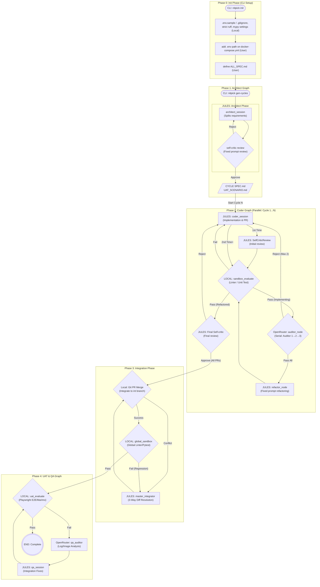

# System Architecture: Nitpickers 5-Phase Refactoring

## Summary

The Nitpickers project is an AI-native code development environment aiming to bring automated code generation, reviewing, integrating, and User Acceptance Testing (UAT). Currently, the architecture operates efficiently but needs strengthening to handle broader software development life-cycles via a clearer role distribution and stability. This architectural upgrade implements a "5-Phase" structure, extending the `LangGraph` workflow to effectively modularise the entire development cycle: initialization, requirements decomposition (Architect), parallel feature creation and iterative reviewing (Coder and Auditor), code integration via 3-Way Diff (Integrator), and finally, automated UAT validations (QA). This additive design strictly leverages existing modules, adapting routing functions and extending our state Pydantic models for seamless capability improvements without discarding current operational strengths.

## System Design Objectives

The core objectives of the 5-Phase Architecture refactoring are defined below, centring on modularity, scalability, and stability, aiming to create a truly autonomous, resilient AI-driven software development environment.

First and foremost, the primary goal is to establish Clear Phase Boundaries and Separation of Concerns. In a complex AI system, allowing a single agent or a loosely defined group of agents to handle multiple distinct stages of software development—such as planning, coding, testing, and integration—often leads to a "God Class" anti-pattern. This results in agents becoming overwhelmed by context and conflicting instructions. By isolating responsibilities to specific, specialized agents within distinct phases, we ensure that an Architect focuses solely on design and requirement splitting, a Coder strictly implements code without worrying about global branch integration, and an Auditor focuses entirely on reviewing without attempting to modify the overall schema. Each phase is designed to have explicit, well-defined inputs, deterministic outputs, and rigid validation steps. This strict boundary management is essential for maintaining control over the LangGraph routing and preventing cascading failures across the system.

Secondly, the architecture aims to implement Sequential Red Teaming, referred to as Serial Auditing. Rather than utilizing parallel and often overwhelming feedback loops where multiple critics bombard the coder with simultaneously conflicting advice, we establish a sequential, step-by-step auditing mechanism (e.g., Auditor 1 followed by Auditor 2, and then Auditor 3). If any node in this sequence rejects a solution, the loop redirects immediately to the Coder for remediation before proceeding to the next auditor. This serial approach prevents redundant, confusing reviews on fundamentally flawed code, ensuring that the coder receives clear, actionable feedback at each stage.

Thirdly, Refactoring Safety is a critical objective. It is not enough for code to merely pass functional sandbox testing (such as basic linters and unit tests). We must ensure long-term maintainability. Therefore, we introduce an explicit "Refactoring Loop." Once the code successfully passes the initial sandbox evaluation and the rigorous serial auditor chain, a final pass is made specifically dedicated to refactoring. This step guarantees that the code meets high-quality maintainability standards before it is ever considered for integration into the main codebase.

Fourthly, we target Robust 3-Way Diff Integration. Moving away from rudimentary PR merges that often fail when dealing with complex conflicts, we transition to an intelligent, AI-assisted 3-Way Diff resolution mechanism. Instead of simply throwing full files laden with raw Git conflict markers at the Language Model, the system will intelligently isolate the `Base` (common ancestor), `Branch A` (local changes), and `Branch B` (remote changes) into distinct, clear sections. This sophisticated approach vastly improves the LLM’s ability to understand the context of the conflict and generate an accurate, unified resolution.

Fifthly, the separation of Automated Quality Assurance (QA) and User Acceptance Testing (UAT) is paramount. We must physically separate the UAT execution from the individual Coder graphs. UAT and QA audits must happen *after* all cycles are fully integrated into a unified branch. This ensures that the End-to-End (E2E) tests are validating the true, final state of the software as a complete system, rather than testing disjointed, isolated feature branches that may behave differently when combined.

Finally, Zero-Side-Effect Sandbox Resilience is a non-negotiable objective. We must enforce strict mocking strategies across the board. For any development cycle that introduces external integrations (such as Stripe, SendGrid, or AWS), the testing environment must mock these APIs. This is crucial because the Sandbox environment, during its autonomous evaluation phase, will not possess real production API keys. If tests attempt real network calls to SaaS providers without valid credentials, the pipeline will inevitably fail, causing an infinite retry loop that drains resources and halts progress. Mocking guarantees resilience and deterministic testing.

## System Architecture

The new 5-Phase Architecture represents an additive, evolutionary step forward for the Nitpickers system. Rather than rewriting the entire orchestration layer from scratch and discarding the robust mechanisms already in place, we carefully introduce new `LangGraph` definitions and thoughtfully modify the existing State models. This ensures a smooth transition while significantly enhancing the system's capabilities and structural integrity.

### Boundary Management & Separation of Concerns

The architecture is strictly divided into five distinct phases, each with a specific mandate and rigid boundaries to prevent cross-contamination of responsibilities.

**Phase 0 (Init)** represents the static CLI initialization phase. This is the foundational step where the deterministic base of the project is created, including essential files like the `.env` configuration and the `.gitignore` file. Crucially, there is absolutely no LLM interaction during this phase. It relies entirely on predetermined templates and user inputs to set up the local environment, ensuring a safe, predictable starting point for the autonomous agents.

**Phase 1 (Architect)** is dedicated to requirements analysis and system design. During this phase, the Architect agent reads the raw specifications provided by the user, decomposes the requirements into manageable cycles, designs the overarching architecture, and outputs static `.md` documents (such as SPEC.md and UAT.md). A strict boundary rule is enforced here: no source code modifications are allowed. The Architect's sole job is to plan and document, leaving the actual implementation to the subsequent phases.

**Phase 2 (Coder)** is the core implementation loop where the actual development happens. This phase operates in complete isolation on its own dedicated feature branch (e.g., `Cycle N`). It strictly writes code and unit tests based on the Architect's specifications. The execution loop within this phase is highly structured, involving the `coder_session`, `sandbox_evaluate`, `auditor_node`, `refactor_node`, and `final_critic_node`. It communicates only success or failure back to the main orchestrator, maintaining a clean interface with the rest of the system.

**Phase 3 (Integration)** is responsible for merging all the individual Cycle branches into a unified `int` (integration) branch. If a standard Git merge command fails due to textual conflicts, the `master_integrator_node` steps in, utilizing the advanced 3-Way Diff logic to resolve the issues. The rigid boundary here is that the Integrator does *not* write new features or alter business logic; its exclusive mandate is to resolve conflicts and ensure the codebase compiles cleanly as a unified whole.

**Phase 4 (UAT & QA)** operates strictly on the integrated `int` branch after Phase 3 has successfully concluded. It validates the complete system against the scenarios defined in the `USER_TEST_SCENARIO.md` document. If an End-to-End test fails, the `qa_session` is triggered to apply fixes. However, the boundary dictates that it may only fix integration bugs to make the tests pass; it is not allowed to rewrite core domain logic or introduce new features.

### Architecture Diagram

The following Mermaid diagram illustrates the data flow, component interactions, and strict sequential progression of the 5-Phase Architecture.



## Design Architecture

The underlying design architecture relies heavily on robust data structures to maintain state across the distributed, asynchronous nodes of the LangGraph system. To achieve this, the domain objects must be safely extended to track the newly introduced states and routing flags. We will utilize rigorous Pydantic models configured with `strict=True` to guarantee data integrity, prevent accidental type coercion, and ensure that the state passed between LangGraph nodes is always valid and predictable.

The file structure is designed to clearly separate state definitions, graph routing logic, node implementations, and the core services that support them. This ASCII tree illustrates the critical areas of modification and addition:

```ascii
src/
├── state.py                  # Extends CycleState with new loop trackers; adds IntegrationState and QaState
├── graph.py                  # Defines the new Phase 2, 3, 4 LangGraphs and orchestrates edge connections
├── nodes/
│   ├── routers.py            # Implements new route_sandbox_evaluate, route_auditor, route_final_critic
│   └── integration_nodes.py  # New nodes for git_merge, master_integrator, global_sandbox
└── services/
    ├── conflict_manager.py   # Enhanced to support advanced 3-Way Diff package building via Git commands
    ├── uat_usecase.py        # Disconnected from Phase 2, attached exclusively to Phase 4
    └── workflow.py           # Master orchestrator for parallel execution and sequential integration
```

### Core Domain Pydantic Models

The most significant changes in the design architecture occur within the `src/state.py` file, where the core domain models are defined. We must extend the existing `CycleState` model. Because this is an additive architectural evolution, we will meticulously preserve all existing fields to ensure backward compatibility with current implementations, while introducing new fields to govern the serial auditing and refactoring loops.

The `CycleState` will be updated to include several critical properties. First, `is_refactoring: bool = Field(default=False)` will act as a flag indicating whether the current execution state has transitioned from standard implementation into the dedicated refactoring loop. Second, `current_auditor_index: int = Field(default=1)` will strictly track which auditor in the serial chain (from 1 to 3) is currently responsible for reviewing the code. Third, `audit_attempt_count: int = Field(default=0)` is a safety mechanism designed to prevent infinite loops; it counts the number of times a specific auditor has rejected the code, allowing the system to cap attempts at a maximum of 2 before forcing a fallback or escalation.

Furthermore, to support the new Phase 3 Integration logic, we will establish a brand new `IntegrationState` model. This model will track the progress of merging feature branches into the `int` branch, holding data regarding merge status, a list of currently conflicting files, and the specialized `3-Way Diff` packages constructed for the LLM to analyze. Finally, a `QaState` model will be introduced for Phase 4 to represent the state of the final End-to-End test run, encapsulating test logs, captured screenshots, and the ultimate validation status of the integrated application. These explicitly typed models ensure that every node in the graph receives exactly the data it needs to perform its specific function, and nothing more.

## Implementation Plan

The refactoring of the Nitpickers system into the 5-Phase Architecture will be executed methodically, strictly divided across 2 sequential implementation cycles. This phased approach guarantees system stability, allowing for incremental verification and testing of the new LangGraph structures before moving on to the complex integration mechanics.

### CYCLE01: The Coder Graph Evolution (Phases 1 & 2)

The primary goal of CYCLE01 is to establish the robust, serial Coder Phase. This cycle focuses heavily on modifying the state management and the routing logic that governs how the AI agents iterate over code generation and review. The implementation will begin by carefully modifying the `CycleState` Pydantic model within `src/state.py`. We will introduce the crucial tracking variables: `is_refactoring` (a boolean flag to indicate the transition into the cleanup phase), `current_auditor_index` (an integer to manage the sequential progression through Auditors 1, 2, and 3), and `audit_attempt_count` (an integer to safeguard against infinite rejection loops by capping retry attempts). These fields must be defined with strict type hinting and sensible default values to ensure immediate backward compatibility with any existing state payloads.

Once the state model is fortified, the implementation shifts to redefining the graph topology in `src/graph.py`. The `_create_coder_graph` function will undergo a significant overhaul. We will systematically remove the legacy `committee_manager` node, which previously handled parallel, often chaotic reviews, and completely excise the premature `uat_evaluate` node from this phase, reserving it strictly for Phase 4. In their place, we will construct the new sequential pipeline. This involves wiring the edges from the `START` node to the `coder_session`, then routing to the `sandbox_evaluate` node (with conditional logic to pass through an initial `self_critic` on the very first iteration).

The most complex part of this cycle lies in implementing the pure routing functions within `src/nodes/routers.py`. The developer must write `route_sandbox_evaluate` to intelligently direct the flow based on the linter results and the `is_refactoring` flag. If the sandbox fails, it must route back to the coder. If it passes, it must check the flag to determine whether to proceed to the `auditor_node` or the `final_critic_node`. Furthermore, `route_auditor` must be implemented to manage the serial progression, incrementing the `current_auditor_index` upon approval, or incrementing the `audit_attempt_count` upon rejection, routing back to the coder or forward to the `refactor_node` as appropriate. This cycle culminates in a fully functioning, highly disciplined Coder loop that produces thoroughly reviewed, refactored code ready for integration.

### CYCLE02: Integration & UAT Automation (Phases 3 & 4)

CYCLE02 builds upon the stable foundation laid by CYCLE01, focusing entirely on the complex task of integrating multiple parallel feature branches and automating the final, holistic User Acceptance Testing. This cycle introduces the completely new Phase 3 (`_create_integration_graph`) and refines Phase 4 (`_create_qa_graph`), connecting the entire pipeline from end to end. The implementation begins in `src/graph.py` by scaffolding the new `_create_integration_graph`. This requires creating and wiring three new critical nodes: `git_merge_node` (to attempt standard Git merges), `master_integrator_node` (the AI agent responsible for resolving complex text conflicts), and `global_sandbox_node` (to verify the structural integrity of the newly merged codebase).

A major technical undertaking in this cycle is the enhancement of the `ConflictManager` service located in `src/services/conflict_manager.py`. The existing logic, which likely passes raw file contents with standard Git conflict markers (e.g., `<<<<<<< HEAD`) to the LLM, must be completely rewritten. The new implementation will utilize the `subprocess.run` utility (or the project's preferred `ProcessRunner`) to execute sophisticated Git commands. Specifically, it must run `git show :1:{file}` to extract the common base ancestor code, `git show :2:{file}` to extract the local Branch A modifications, and `git show :3:{file}` to extract the remote Branch B modifications. The `ConflictManager` will then programmatically construct a highly structured 3-Way Diff prompt, presenting these three distinct code blocks to the `master_integrator_node`, dramatically improving the AI's ability to synthesize a correct resolution.

Following the integration logic, the implementation must address the UAT Phase. The `uat_usecase.py` service must be modified to ensure it is entirely disconnected from the Coder Phase. It must be refactored to accept the newly defined `QaState` and trigger exclusively during the Phase 4 `_create_qa_graph`. Finally, the master orchestration logic within `src/services/workflow.py` must be updated to manage this new sequence. It must possess the logic to launch multiple Coder phases in parallel, actively wait for all of them to reach the `END` state, and only then sequentially trigger the Integration Graph for each branch, followed by a final execution of the QA Graph upon total integration success. This completes the autonomous 5-Phase Architecture.

## Test Strategy

To guarantee the reliability, determinism, and speed of the new architecture, we must enforce a strict testing strategy that relies heavily on isolation and mocking. The system must never rely on live external APIs (such as OpenRouter or Jules) during unit and integration testing, as missing credentials will cause Sandbox timeouts and infinite retry loops, crippling the CI pipeline.

### CYCLE01 Test Strategy

The testing strategy for CYCLE01 focuses intensely on validating the mathematical correctness of the LangGraph routing logic and the precise mutation of the `CycleState` object, ensuring the sequential flow operates flawlessly without ever invoking an actual Language Model. The primary unit testing effort will target `tests/unit/test_routers.py`. Here, developers must instantiate pure, isolated `CycleState` objects and manually populate them with hardcoded values representing various edge cases—for example, setting `is_refactoring=True` and `sandbox_status="passed"`, or simulating an auditor rejection by setting the appropriate feedback strings. These states are then passed into the newly written router functions (`route_sandbox_evaluate`, `route_auditor`, `route_final_critic`). The assertions must rigorously verify that the string returned by the router exactly matches the expected next node name in the LangGraph topology. Every boundary condition, especially `audit_attempt_count` reaching its maximum threshold and `current_auditor_index` exceeding the total number of auditors, must be covered.

For integration testing, the focus shifts to `_create_coder_graph` in `src/graph.py`. The strategy demands the instantiation of the full LangGraph, but with a critical caveat: all nodes that interact with external services or perform heavy computations must be mocked. Developers will use `unittest.mock.patch` to intercept the execution functions for `coder_session`, `auditor_node`, and `refactor_node`. These mocked functions will be programmed to immediately return modified state dictionaries—such as a mock `auditor_node` that instantly returns an "Approve" result and increments the index. By running the graph with a starting `CycleState`, the tests can assert that the sequence of nodes visited (the execution trace) perfectly matches the intended path (Coder -> Sandbox -> Auditor 1 -> Auditor 2 -> Auditor 3 -> Refactor -> Sandbox -> Final Critic -> END). A strict side-effect rule is enforced: no real filesystem writes are permitted; all temporary file I/O must utilize the `pytest` `tmp_path` fixture to ensure lightning-fast, isolated execution. Any testing requiring database or persistent state setup MUST utilize Pytest fixtures that start a transaction before the test and roll it back after, ensuring lightning-fast state resets without relying on heavy external CLI cleanup commands.

### CYCLE02 Test Strategy

The testing strategy for CYCLE02 is designed to meticulously verify the complex string manipulations required for the 3-Way Diff integration and to ensure the master orchestrator correctly sequences the new graphs. The unit testing effort will be concentrated on `src/services/conflict_manager.py`, specifically targeting the `build_conflict_package` method. Because this method relies on interacting with the Git binary, we must use `@patch` or `pytest.MonkeyPatch` on `subprocess.run` (or `ProcessRunner.run_command`). The mocked subprocess must be configured to return distinct, predetermined strings when simulating the three `git show` commands (e.g., returning "Base Code Version 1" for `:1`, "Branch A Update" for `:2`, and "Branch B Update" for `:3`). The test will then assert that the final prompt string generated by `build_conflict_package` successfully and cleanly incorporates all three distinct blocks within the specified Markdown structure, proving the logic works without requiring a complex, fragile, real-world Git repository setup.

Integration testing for CYCLE02 involves running both `_create_integration_graph` and `_create_qa_graph` in a fully mocked environment. For the Integration Graph, the test must provide a simulated `IntegrationState` representing a hard conflict. The actual execution nodes (`git_merge_node`, `master_integrator_node`) must be mocked to return predetermined state mutations. The assertion will verify that the execution trace correctly hits `git_merge_node`, detects the conflict, routes to `master_integrator_node`, and successfully loops back to retry the `git_merge_node` before reaching the `global_sandbox_node` and terminating at `END`. For the QA Graph, the test will pass a state simulating a test failure. The assertion must verify the trace hits `uat_evaluate`, routes to the `qa_auditor` for diagnosis, passes to the `qa_session` for remediation, and loops back to `uat_evaluate` for a final, successful pass. Crucially, these integration tests must ensure no real UI testing tools (like Playwright) or external API calls are actually executed during the test suite run. Any testing requiring database or persistent state setup MUST utilize Pytest fixtures that start a transaction before the test and roll it back after, ensuring lightning-fast state resets without relying on heavy external CLI cleanup commands.