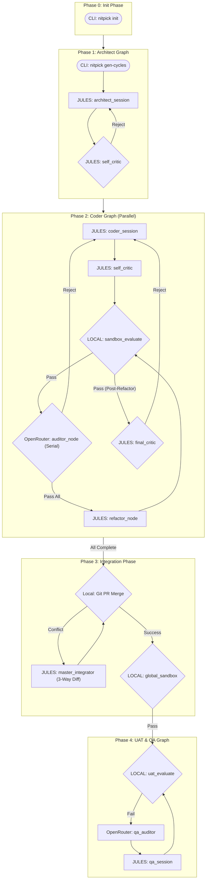

# System Architecture: NITPICKERS 5-Phase Framework

## Summary
The NITPICKERS framework provides an AI-native development environment enforcing absolute zero-trust validation of AI-generated code. By utilizing static analysis, dynamic sandboxing, and automated red team auditing, the framework ensures high-quality professional software engineering outputs. This document details the architectural redesign transitioning the system into a rigorous 5-phase methodology.

## System Design Objectives
The primary objective of the NITPICKERS system architecture redesign is to implement a robust, highly stable, and zero-trust validation framework for AI-generated code. This framework is explicitly structured around a 5-phase methodology that meticulously separates concerns and enforces rigorous quality checks at every stage of the development lifecycle. The initial phase, Phase 0 or the Init Phase, serves to establish a static baseline through a Command Line Interface setup. This ensures that the environment is perfectly primed with necessary configurations, dot env files, and project boundaries before any autonomous code generation commences. The second phase, Phase 1 or the Architect Graph, focuses exclusively on decomposing complex requirements into manageable, logically isolated development cycles. This phase employs a self-critic review mechanism driven by a fixed prompt to guarantee that the decomposition strategy is sound, feasible, and aligned with the overall project goals. By doing so, the architecture prevents the AI from becoming overwhelmed by monolithic tasks, thereby significantly reducing the likelihood of context fatigue and compounding errors. The third phase, Phase 2 or the Coder Graph, introduces parallel implementation capabilities alongside a serial auditing mechanism. This is a critical objective: to enable concurrent feature development while maintaining a strict, multi-layered review process. The serial auditors systematically inspect the generated code, while the refactoring loop ensures that any identified deficiencies are addressed systematically before the code progresses. This phase is designed to mandate absolute zero-trust validation, ensuring that pull requests are explicitly blocked until all static analysis tools, such as Ruff and Mypy, and dynamic testing frameworks, such as Pytest, pass with a zero exit code, eliminating any possibility of assumed success. Phase 3, the Integration Phase, aims to resolve the complexities of merging parallel development branches through a sophisticated 3-Way Diff integration strategy. Instead of presenting the AI with raw conflict markers, the system isolates the base code, the local branch modifications, and the remote branch modifications, providing the LLM with a clear, unambiguous context for resolving conflicts safely. Following successful integration, a global sandbox evaluation ensures that the merged codebase remains structurally sound and functionally correct. Finally, Phase 4, the UAT and QA Graph, is dedicated to full-system End-to-End User Interface testing within a consolidated environment. This phase leverages Playwright to automatically capture rich, multi-modal diagnostic data, including high-resolution screenshots and Document Object Model traces, providing undeniable visual and structural evidence of frontend regressions. A stateless auditor, utilizing advanced Vision LLMs, acts as an outer-loop diagnostician, analyzing error artifacts without the burden of project context fatigue, and returning structured JSON fix plans to the worker agent for automated remediation. These overarching objectives are designed to enforce a mechanical blockade against subpar code, ensuring that the final output not only meets but exceeds professional engineering standards, delivering a secure, scalable, and highly maintainable application architecture. The system aims to completely eliminate the common pitfalls of AI-driven development by enforcing strict boundaries, comprehensive testing, and multi-modal observability.

Furthermore, the architecture must guarantee total observability across all phases of execution. By fully integrating LangSmith tracing, the system will provide developers with the ability to visualize complex LangGraph node transitions, monitor internal state mutations in real-time, and inspect the precise payloads exchanged with various multi-modal Application Programming Interfaces. This level of transparency is absolutely essential for debugging complex asynchronous workflows and for continuously refining the AI prompts and routing logic. The design also dictates a strong emphasis on sandbox resilience and environmental isolation. By encapsulating the dynamic execution of generated code within an E2B sandbox environment, the system prevents any potentially malicious or poorly constructed code from affecting the host system. This isolation is crucial for maintaining the integrity of the development environment and for safely evaluating untrusted outputs. Ultimately, the system design objectives converge on a single, unified goal: to construct an AI-native development environment that operates with the discipline, rigor, and meticulous attention to detail expected from a seasoned, professional software engineering team, thereby fostering trust and confidence in the automated software creation process.

## System Architecture
The system architecture of the NITPICKERS framework is fundamentally structured as a sophisticated, five-phase orchestration pipeline utilizing LangGraph to manage complex state transitions and conditional routing logic. This architecture ensures a highly organized flow of data and control, moving from initial requirements parsing to final multi-modal verification. The foundation of this architecture is built upon an unwavering commitment to strict boundary management and the separation of concerns. The framework explicitly prohibits any single component from assuming multiple, conflicting responsibilities. For instance, the entity responsible for generating code, designated as the Coder Graph, is strictly isolated from the entity responsible for auditing that code, designated as the Auditor Node. This separation prevents inherent biases and ensures that all evaluations are conducted objectively by independent, stateless agents.

Explicit rules on boundary management require that internal state mutations are carefully controlled through strongly typed Pydantic models. The `CycleState` dictionary explicitly manages flags such as `is_refactoring`, `current_auditor_index`, and `audit_attempt_count`. The `is_refactoring` boolean flag is pivotal in determining the routing logic post-sandbox evaluation; it dictates whether the code requires further implementation refinement via the Auditor Node or whether it is ready for a final structural polish via the Final Critic Node. The `current_auditor_index` integer strictly enforces a serial, multi-stage review process, ensuring that the code is sequentially evaluated by up to three distinct auditor profiles before progressing. The `audit_attempt_count` integer acts as a critical failsafe, imposing a hard limit on the number of revision iterations to prevent infinite loops and ensure termination.

The architecture mandates that the Integration Phase, Phase 3, operates independently of the parallel Coder Phase. The Git Merge Node initiates standard merging procedures, but upon encountering conflicts, control is unconditionally delegated to the Master Integrator Node. This node executes a highly specialized 3-Way Diff resolution protocol, which isolates the common base code from the divergent branch modifications, thereby providing the LLM with precise context. Following conflict resolution, a Global Sandbox Node executes a comprehensive suite of static and dynamic tests across the entire integrated project to guarantee that the merge has not introduced any regressions.

Phase 4, the UAT and QA Graph, acts as the ultimate gatekeeper. It relies on a multi-modal diagnostic pipeline where the UAT Evaluate Node executes Playwright scripts within the target project. If visual or functional anomalies are detected, the QA Auditor Node, equipped with advanced Vision LLM capabilities, analyzes the resultant screenshots and Document Object Model traces. The Auditor operates completely outside the context of the underlying source code, focusing entirely on the behavioral symptoms. It then constructs a structured remediation plan that is dispatched to the QA Session Node for implementation. This strict separation ensures that diagnostic efforts are not compromised by code-level preconceptions.

The entire 5-phase execution flow is centrally orchestrated by the Workflow Service, which coordinates the asynchronous parallel execution of multiple development cycles and synchronizes their completion before initiating the integration phase.



## Design Architecture
The design architecture of the NITPICKERS framework is deeply rooted in domain-driven design principles, utilizing strict Pydantic models to define the shape, constraints, and validation logic of all data structures transitioning between LangGraph nodes. The file structure is organized to ensure logical grouping of related components, promoting maintainability and clear dependency management.

```text
src/
├── state.py                 # Core domain Pydantic state models
├── graph.py                 # LangGraph graph orchestration definitions
├── cli.py                   # Command Line Interface entry points
├── config.py                # System-wide configuration settings
├── nodes/
│   ├── routers.py           # Conditional routing logic functions
│   ├── architect.py         # Architect node implementations
│   ├── coder.py             # Coder node implementations
│   ├── auditor.py           # Auditor node implementations
│   └── integration.py       # Integration node implementations
└── services/
    ├── conflict_manager.py  # 3-Way Diff resolution service
    ├── workflow.py          # Orchestration service for phases
    └── uat_usecase.py       # User Acceptance Testing service
```

The core domain Pydantic models, located in `src/state.py`, act as the absolute source of truth for the application's internal state. These models must be configured with `ConfigDict(extra='forbid', strict=True, arbitrary_types_allowed=True, frozen=True)` to enforce contract testing, prevent interface drift, and ensure immutability throughout the graph's execution cycle. The `CycleState` model is arguably the most critical component, encapsulating the entire context of a specific development cycle. It must declare strictly typed fields to manage the refactoring lifecycle. The `is_refactoring` field is defined as a standard Python boolean, initializing to false to signify the primary implementation phase. The `current_auditor_index` is defined as a standard Python integer, initializing to one, to track the progression through the serial auditing chain. The `audit_attempt_count` is defined as an integer, initializing to zero, to monitor revision cycles.

Clear integration points are established to dictate how these new schema objects extend the existing domain objects. The existing state dictionaries must be systematically refactored into these rigid Pydantic classes. For example, any node previously accessing untyped dictionary keys must be updated to reference the strongly typed attributes of the `CycleState` object. This transition guarantees that all state mutations are validated dynamically at runtime, preventing the propagation of malformed data through the pipeline. By ensuring strict backwards-compatibility mappings, the existing logic safely integrates the new cycle flags.

The `conflict_manager.py` service defines a sophisticated abstraction layer for handling Git integration complexities. It must declare methods that interact with the underlying operating system securely via the `ProcessRunner` to extract the base, local, and remote file variants required for the 3-Way Diff process. This service interacts directly with the Integration Graph, receiving conflict metadata and returning the synthesized resolution payload.

The `routers.py` module encapsulates the conditional branching logic that drives the LangGraph execution. Functions such as `route_sandbox_evaluate` and `route_auditor` are meticulously designed to inspect the current state of the `CycleState` model and return precise string identifiers that correspond to the subsequent node in the pipeline. This design pattern centralizes the control flow logic, making it easily testable and highly extensible. The strict typing enforced by Pydantic ensures that these routing functions always receive properly formed state objects, eliminating a massive class of potential runtime errors and simplifying unit test assertions. By mandating these robust architectural patterns, the system guarantees long-term stability and facilitates safe, incremental enhancements.

## Implementation Plan

### CYCLE01
The implementation plan is strategically decomposed into precisely two sequential development cycles: `CYCLE01` and `CYCLE02`. This division ensures a controlled, manageable approach to refactoring the entire LangGraph workflow.

The primary objective of `CYCLE01` is to establish the fundamental building blocks of the 5-phase architecture by overhauling the state management layer and completely rewiring Phase 2, the Coder Graph. This cycle will exclusively focus on the internal structural modifications required to support the new serial auditing and refactoring loops, without altering the external integration or UAT phases.

The first step in `CYCLE01` involves modifying `src/state.py` to upgrade the existing state representations into robust, strictly typed Pydantic models. We will introduce the crucial fields required for flow control: `is_refactoring` (boolean, initial value false), `current_auditor_index` (integer, initial value one), and `audit_attempt_count` (integer, initial value zero). These additions are absolutely essential for managing the state transitions within the new Coder Graph design. We must ensure that these models are immutable and forbid extra attributes to maintain strict schema compliance.

Following the state modifications, the next step involves implementing the new routing logic in `src/nodes/routers.py`. We will construct the `route_sandbox_evaluate` function, which must dynamically inspect the `sandbox_status` and `is_refactoring` flags to determine whether the graph should proceed to the auditor node, the final critic node, or return to the coder session. Concurrently, we will build the `route_auditor` function to manage the serial progression through the auditor chain, carefully incrementing the `current_auditor_index` and monitoring the `audit_attempt_count` to prevent infinite loops. We will also implement the `route_final_critic` function to handle the final approval gate.

The most substantial portion of `CYCLE01` will be the meticulous rewiring of the `_create_coder_graph` function within `src/graph.py`. We will systematically remove deprecated nodes such as `committee_manager` and `uat_evaluate` from this specific graph. We will introduce the new nodes, including the `self_critic`, the serial `auditor_node`, the `refactor_node`, and the `final_critic_node`. The edges and conditional edges will be mapped exactly according to the provided system specifications, ensuring that the `coder_session` correctly routes to the `sandbox_evaluate`, which in turn utilizes the newly created routing functions to navigate the serial auditing and refactoring loops.

This cycle establishes the critical inner loop of the development process. By completing `CYCLE01`, the system will possess the capability to autonomously generate code, subject it to multi-stage serial review, and iteratively refine it based on deterministic state flags, all while adhering to the strictest principles of Pydantic validation and LangGraph orchestration.

### CYCLE02
The primary objective of `CYCLE02` is to finalize the 5-phase architecture by implementing Phase 3, the Integration Graph, developing the advanced 3-Way Diff resolution service, and cleanly decoupling Phase 4, the UAT and QA Graph. This cycle builds directly upon the robust state management foundation established in `CYCLE01`.

The initial focus of `CYCLE02` will be the development of the 3-Way Diff logic within `src/services/conflict_manager.py`. We will refactor the `build_conflict_package` method to utilize asynchronous subprocess execution for retrieving the precise state of conflicting files. This involves executing Git commands to isolate the base ancestor version (`git show :1:{file_path}`), the local branch version (`git show :2:{file_path}`), and the remote branch version (`git show :3:{file_path}`). This isolated data will then be constructed into a structured, highly contextualized prompt designed specifically for the Master Integrator LLM, ensuring it possesses all necessary information to resolve the conflict safely without being confused by raw conflict markers.

Subsequently, we will construct the entirely new `_create_integration_graph` within `src/graph.py`. This graph will act as Phase 3 of the pipeline. We will define the `git_merge_node` to handle standard merging attempts. A conditional routing mechanism will be implemented to detect conflicts and redirect execution to the `master_integrator_node`, which will utilize the newly enhanced conflict manager service. Upon successful integration, the graph will unconditionally route to the `global_sandbox_node` to perform a comprehensive, system-wide execution of linters and unit tests, ensuring the integrity of the merged codebase.

The final major implementation step in `CYCLE02` is the strict separation of the User Acceptance Testing phase. We will modify `src/services/uat_usecase.py` to ensure it operates exclusively as Phase 4, executing only after the Integration Graph has successfully concluded. We will remove any residual triggers from the Coder Phase and adjust the state intake mechanisms to handle the finalized project state. Furthermore, we will update the primary orchestration logic within `src/cli.py` and `src/services/workflow.py` to seamlessly sequentially execute Phase 2 (Parallel Coder Graphs), Phase 3 (Integration Graph), and finally Phase 4 (UAT Graph). This ensures the complete end-to-end realization of the 5-phase zero-trust validation architecture.

## Test Strategy

### CYCLE01
The testing strategy for `CYCLE01` is heavily focused on comprehensive unit testing of the state management models and the newly constructed LangGraph routing logic. We must ensure that the foundational components operate flawlessly in isolation before they are integrated into the broader workflow.

For the unit tests targeting the Pydantic models in `src/state.py`, we will employ `pytest` to verify the exact initialization values and strict typing constraints of the `CycleState` object. We will write explicit test cases asserting that `is_refactoring` defaults to false, `current_auditor_index` defaults to one, and `audit_attempt_count` defaults to zero. Furthermore, we will intentionally attempt to assign invalid data types to these fields to confirm that Pydantic correctly raises validation errors, thereby proving the robustness of our data contracts.

The unit testing of the routing functions in `src/nodes/routers.py` will require a meticulous approach to state manipulation. We will instantiate mock `CycleState` objects with various combinations of values to simulate different execution scenarios. For example, to test `route_sandbox_evaluate`, we will create a state where `sandbox_status` is "failed" and assert that the function returns "failed". We will create a state where status is passed and `is_refactoring` is false, asserting a return value of "auditor". Crucially, to test `route_auditor`, we must write tests that verify the incrementation logic of `audit_attempt_count` and `current_auditor_index`, ensuring that the function correctly returns "pass_all" when the maximum auditor threshold is exceeded.

To test the newly rewired `_create_coder_graph` in `src/graph.py`, we will leverage LangGraph's built-in testing utilities. We will construct a dummy state and execute the compiled graph in a highly controlled environment, using mock functions for the actual node operations to prevent unintended side effects or external API calls. We will trace the execution path to ensure that the conditional edges correctly route the flow through the serial auditor chain and into the refactoring loop.

**DB Rollback Rule Compliance:** Any testing within this cycle that requires persistent state or mock database interactions must strictly adhere to the DB Rollback Rule. We will utilize `pytest` fixtures that initiate a transaction block before the test execution and explicitly roll it back during the teardown phase. This guarantees lightning-fast state resets, completely isolating each test execution and eliminating any reliance on heavy, external CLI cleanup commands, thus ensuring a pristine environment for every single assertion. All external API requests, particularly to the LLM providers, must be completely mocked using `respx` or `pytest-mock` to prevent network latency and sandbox contamination.

### CYCLE02
The testing strategy for `CYCLE02` shifts focus towards integration testing and the validation of complex interaction patterns, particularly concerning Git operations and multi-phase orchestration.

The unit testing of the `conflict_manager.py` service will necessitate the use of advanced mocking techniques to simulate Git repository states without modifying the actual file system. We will utilize `unittest.mock.patch` to intercept calls to the `ProcessRunner.run_command` method. By injecting specific mock return values representing the base, local, and remote file contents, we can verify that the `build_conflict_package` method correctly synthesizes these disparate components into the exact required prompt structure. We will meticulously assert that the generated prompt contains the expected delimiter tags and the injected code blocks, ensuring absolute precision in the data provided to the Master Integrator.

The integration testing of the new `_create_integration_graph` will involve simulating conflict scenarios. We will construct a mock environment where the `git_merge_node` intentionally returns a "conflict" status, and we will assert that the execution correctly routes to the `master_integrator_node`. We will further verify that a successful resolution subsequently routes to the `global_sandbox_node`. These tests are crucial for guaranteeing that the conflict resolution pathway is reliable and completely automated.

Testing the orchestration updates in `src/cli.py` and `src/services/workflow.py` will require end-to-end simulation of the 5-phase pipeline. We will execute the primary workflow function using a mock configuration that stubs out the actual time-consuming node executions. We will trace the execution order to definitively prove that Phase 2 executes concurrently, Phase 3 executes sequentially only after Phase 2 completes, and Phase 4 executes only upon the successful termination of Phase 3.

**DB Rollback Rule Compliance:** As with CYCLE01, any tests interacting with persistent storage, such as tracking integration state or workflow progress, must rigorously apply the DB Rollback Rule. The `pytest` fixtures will guarantee that database transactions are rolled back immediately after the test concludes, preventing test pollution and ensuring the repeatability of the test suite. All external API calls, especially those invoking the Master Integrator or QA Auditor Vision models, must be rigorously mocked. We will implement structural tests to guarantee that these mocks are functioning correctly, ensuring that our Continuous Integration pipeline remains completely isolated from external service dependencies, thereby maintaining the highest levels of sandbox resilience and pipeline stability.