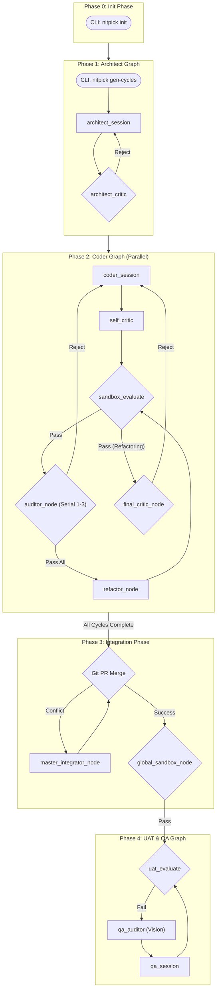

# System Architecture

## Summary
The NITPICKERS project is undergoing a structural evolution to adopt a robust "5-Phase Architecture" workflow. This transition aims to improve the stability, predictability, and safety of the AI-native development environment by enforcing rigorous quality gates and a zero-trust validation approach. The primary goal is to shift from a loosely coupled agentic system into a strictly orchestrated pipeline. This pipeline guarantees that generated code is thoroughly tested, logically reviewed by distinct specialised agents, and securely integrated using sophisticated three-way merge strategies. By doing so, we minimise regression risks and ensure that the final product adheres to professional software engineering standards.

## System Design Objectives
The primary objective of this architectural redesign is to implement a highly resilient and deterministic 5-Phase pipeline within the LangGraph framework. This system must be capable of orchestrating complex AI-driven code generation tasks while strictly enforcing zero-trust validation at every boundary. A critical aspect of this design is the additive mindset: we must preserve the existing core infrastructure and extend it safely rather than rewriting it. This means leveraging the current state management systems, such as the `CycleState` and `CommitteeState` Pydantic models, and enhancing them with new attributes to support serial auditing and refactoring loops.

Another fundamental objective is to eliminate the assumption of success in AI-generated code. The system must intrinsically distrust the output of the Coder agent. To achieve this, we are introducing a multi-layered verification strategy that combines static analysis, dynamic sandbox testing, and red-team auditing. If the static quality gates (like Ruff and Mypy) or the unit tests fail, the workflow must mechanically block progression and initiate a self-healing cycle. The system design must guarantee that only code passing these objective mechanical checks is allowed to proceed to the higher-order reasoning phases. This mechanism forms an impenetrable barrier against syntax errors, structural flaws, and type mismatches. Furthermore, by isolating these mechanical failures from the reasoning LLMs, we conserve valuable token context and prevent the models from spiraling into unrecoverable states attempting to fix basic linting errors that a strict toolchain could automatically flag and resolve.

Furthermore, the design must clearly separate the roles of different Large Language Models (LLMs) to avoid context fatigue and maintain focused objectives. The Worker agent (Jules) will handle requirement decomposition, implementation, and integration. In contrast, the Auditor agents (powered by distinct models like OpenRouter Vision) will act solely as stateless diagnosticians. They will evaluate the code and multi-modal artifacts (such as screenshots and DOM traces) generated during the user acceptance testing (UAT) phase, returning structured feedback without carrying the historical baggage of the implementation process. This separation of concerns is vital for maintaining objective quality control. The auditor's singular purpose is to act as a disinterested third party, identifying logical gaps or visual regressions that the primary implementer, blinded by its own generative context, might easily overlook.

Scalability and parallelisation are also key objectives. The system must support the concurrent execution of multiple development cycles (Phase 2) to accelerate feature delivery. However, this parallelism necessitates a robust integration strategy (Phase 3). Therefore, the design must incorporate an intelligent Master Integrator node capable of resolving complex Git merge conflicts using a 3-way diff methodology, ensuring that concurrent modifications do not result in logical regressions. By dynamically orchestrating these concurrent execution graphs via the AsyncDispatcher, the overarching workflow transforms from a slow, monolithic process into a rapid, multi-threaded engine capable of digesting and synthesizing extensive project blueprints efficiently and securely.

Finally, the system must provide comprehensive observability. Every transition, state mutation, and API payload within the LangGraph orchestrator must be fully traceable using tools like LangSmith. This transparency is crucial for debugging the intricate interactions between multiple autonomous agents and verifying that the pipeline operates exactly as designed. The entire system architecture must be predictable, reproducible, and verifiable, instilling absolute confidence in the automated development process. Observability transforms what would otherwise be a black-box AI operation into a deterministic, auditable software delivery pipeline.

## System Architecture
The system architecture of the NITPICKERS project is built upon a directed acyclic graph (DAG) paradigm powered by LangGraph. This architecture orchestrates a sequence of specialised agents across five distinct phases, ensuring a controlled progression from requirement gathering to fully validated code deployment. It enforces strict boundary management and clear separation of concerns at every step of the development lifecycle, preventing cross-contamination of states or conflicting LLM directives. By strictly defining the inputs and outputs of each phase via robust Pydantic schemas, the architecture inherently rejects unverified payloads.

The pipeline initiates with Phase 0 (Init Phase), a static CLI setup that provisions the necessary directories, template files, and environment configurations. This phase ensures that the target project is correctly scaffolded and ready for AI intervention. Following this, Phase 1 (Architect Graph) is responsible for requirement decomposition. The Architect session analyses the user specifications and systematically breaks them down into manageable, independent development cycles. A crucial component here is the self-critic review, which acts as the first quality gate, ensuring the architectural plan is sound before any implementation begins. The output of this phase forms the immutable baseline for all subsequent parallel processes, establishing a common grounding context.

Phase 2 (Coder Graph) represents the core implementation engine. It operates concurrently, allowing multiple cycles to be executed in parallel. This phase introduces a sophisticated serial auditing loop. The Coder agent generates the initial implementation and associated tests. This code is immediately subjected to the `sandbox_evaluate` node, which runs static analysis and unit tests in an isolated, secure environment (e.g., E2B). Only upon passing these mechanical checks does the code advance to the `auditor_node`. Here, a series of stateless Auditor agents sequentially review the implementation. If an Auditor rejects the code, the cycle loops back to the Coder. If the code passes all Auditors, it enters a `refactor_node` for final polishing, followed by a final self-critic verification. The boundaries are enforced meticulously: the Coder never self-certifies finality without external consensus.

Phase 3 (Integration Phase) activates once all parallel Coder cycles have successfully concluded. Its mandate is to safely merge the disparate feature branches into a unified integration branch. The system attempts a standard Git merge. If conflicts arise, the flow routes to the `master_integrator_node`. This sophisticated agent resolves conflicts by analysing a 3-way diff package comprising the base code, local changes, and remote changes. After successful integration, the `global_sandbox_node` executes a comprehensive suite of tests against the entire unified codebase to ensure that the integration did not introduce systemic regressions. This acts as the penultimate quality gate before any user-facing evaluation.

Finally, Phase 4 (UAT & QA Graph) conducts the ultimate validation. The `uat_evaluate` node executes end-to-end tests, typically involving Playwright for UI interactions. If a failure occurs, the system captures rich multi-modal artifacts, including screenshots and DOM snapshots. These artifacts are dispatched to the `qa_auditor`, an advanced Vision LLM that diagnoses the frontend issue. The auditor formulates a structured fix plan, which is then executed by the `qa_session` node within the integration environment.

**Boundary Management and Separation of Concerns:** The architecture mandates strict boundaries. The Coder must never evaluate its own final output; this is strictly the domain of the Auditors and the Sandbox. State mutations are tightly controlled via the Pydantic-based `CycleState`, preventing unintended cross-contamination between parallel cycles. The execution environments are physically separated: local processing handles graph routing and Git operations, while untrusted code execution is strictly confined to the E2B remote sandbox. This separation ensures that even malicious or highly erroneous AI-generated code cannot compromise the host system.



## Design Architecture

The structural integrity of the pipeline is maintained through strict, Pydantic-based domain models. We adhere to an additive mindset, meaning we will augment existing models rather than discarding them, ensuring backward compatibility and minimizing systemic disruption. The system relies heavily on `CycleState` as the central nervous system for routing logic.

```text
src/
├── state.py
├── graph.py
├── nodes/
│   ├── routers.py
│   └── ...
├── services/
│   ├── conflict_manager.py
│   ├── uat_usecase.py
│   └── workflow.py
└── domain_models/
    ├── execution.py
    └── uat_execution_state.py
```

### Core Domain Pydantic Models Structure and Typing

The primary modifications will occur within `src/state.py`. The `CycleState` model, which acts as the unified state object passed between LangGraph nodes, will be extended to support the new serial auditing and integration requirements.

**Integration Points and Extensions:**
1.  **CommitteeState Extension**: The existing `CommitteeState` (a sub-model of `CycleState`) must be carefully extended. We will integrate new fields: `is_refactoring: bool` (defaulting to False) to track the transition from the auditor loop to the final critic phase; `current_auditor_index: int` (defaulting to 1) to manage the progression through the serial auditors (1 through 3); and `audit_attempt_count: int` (defaulting to 0) to prevent infinite loops by capping the number of rejections a single auditor can issue. These additions must respect the strict validation and immutability rules defined by the Pydantic configuration (`ConfigDict(extra="forbid")`).
2.  **IntegrationState Introduction**: To support the Phase 3 integration process, a dedicated `IntegrationState` model must be solidified within `src/state.py`. This model will manage the context required by the `master_integrator_node`, including `branches_to_merge: list[str]` and a collection of unresolved conflicts tracked via `ConflictRegistryItem` schemas defined in `src/domain_models/execution.py`.
3.  **UATState Refinement**: The existing `UATState` will continue to orchestrate Phase 4. It will be explicitly coupled with the `UatExecutionState` from the domain models to strictly type the multi-modal artifacts (screenshots, traces) collected during the Playwright evaluation, ensuring the Vision Auditor receives predictably structured payloads.

The implementation of `src/nodes/routers.py` will depend fundamentally on these state extensions. Functions like `route_auditor` will inspect `state.committee.current_auditor_index` and `state.committee.audit_attempt_count` to deterministically route the graph either back to the Coder, forward to the next Auditor, or ultimately to the `pass_all` transition. The design strictly forbids bypassing these state variables, ensuring that the Pydantic schema remains the undeniable single source of truth for the workflow's progression.

## Implementation Plan

### CYCLE01: State Management and Coder Graph Refactoring
Cycle 01 focuses entirely on establishing the foundational routing infrastructure. The objective is to implement the Phase 0 static setup considerations, refine the Phase 1 generation boundaries, and meticulously overhaul Phase 2 (The Coder Graph) to support serial auditing. This cycle is critical because it introduces the necessary state variables that control the deterministic flow of the LangGraph execution. We will primarily target `src/state.py`, `src/graph.py`, and `src/nodes/routers.py`.

The first crucial step is to expand the `CommitteeState` within `src/state.py`. We must introduce the `is_refactoring`, `current_auditor_index`, and `audit_attempt_count` fields as strongly typed integers and booleans with appropriate default values. These fields are the linchpins for the new routing logic. Simultaneously, we must ensure that all corresponding `CycleState` properties (if used as aliases) correctly map to these internal `CommitteeState` attributes to preserve backward compatibility across the broader system.

Following the state modification, the focus shifts to `src/graph.py`. The `_create_coder_graph` method must be fundamentally rewired. We will dismantle the existing parallel committee structures or legacy UAT triggers located within this specific graph definition. In their place, we will construct a strictly serial sequence. The workflow will progress from the `coder_session` to the `sandbox_evaluate` node. From the sandbox, conditional logic will determine if the flow should proceed to the `auditor_node` (if it is a primary implementation pass) or to the `final_critic_node` (if the `is_refactoring` flag has been set to True). This rewiring requires precise manipulation of the LangGraph API to ensure no logical dead-ends exist.

The final component of Cycle 01 is the implementation of the routing logic within `src/nodes/routers.py`. We must rigorously define the `route_sandbox_evaluate`, `route_auditor`, and `route_final_critic` functions. The `route_auditor` function, in particular, will be complex. It must evaluate the current audit attempt count; if it exceeds the maximum threshold, it must forcefully trigger a fallback or pivot strategy. If an auditor approves, the index must increment. Once the index surpasses the total number of defined auditors (e.g., 3), the router must yield a "pass_all" directive, instructing the graph to transition into the refactoring phase. This cycle effectively transforms the Coder phase into a highly disciplined, multi-stage gauntlet that guarantees code quality before integration.

### CYCLE02: Integration Orchestration and Multi-Modal UAT Validation
Cycle 02 builds upon the successful implementation of the Coder Graph by focusing on the culmination of the development process: Phase 3 (Integration Graph) and Phase 4 (QA Graph & UAT). The objective here is to orchestrate the merging of parallel efforts and to establish a robust, vision-assisted automated testing framework for the final unified product. This cycle requires extensive modification to `src/services/conflict_manager.py`, `src/services/uat_usecase.py`, and the main orchestration logic within `src/services/workflow.py`.

The initial effort will concentrate on `src/services/conflict_manager.py`. We must implement the sophisticated 3-Way Diff logic for the Master Integrator. The `build_conflict_package` method will be refactored to utilize system Git commands dynamically. It must fetch the common ancestor base code, the local branch modifications, and the remote branch modifications. These three distinct representations must be meticulously assembled into a structured prompt payload. This ensures that the LLM resolving the conflict has the complete historical context necessary to make informed decisions rather than simply overwriting one set of changes with another.

Concurrently, we will refine `src/services/uat_usecase.py`. The UAT evaluation logic must be explicitly decoupled from the earlier Phase 2 Coder Graph operations. It must be redesigned to function exclusively as a Phase 4 validator. The `execute` method will be updated to systematically scan the designated local artifacts directory following a Pytest/Playwright failure. It must securely gather screenshots, DOM traces, and test logs, validating their paths to prevent directory traversal vulnerabilities, before wrapping them into the strictly typed `MultiModalArtifact` schema defined in the system's domain models.

The final integration point resides in `src/services/workflow.py`. The `run_full_pipeline` method must be significantly enhanced to orchestrate the entire 5-phase lifecycle flawlessly. It will begin by executing the Coder cycles concurrently using `asyncio.gather` via the `AsyncDispatcher`. Following the successful completion of all parallel tasks, it must instantiate and invoke the `IntegrationState` through the `_create_integration_graph`. Upon successful integration and global sandbox validation, the pipeline will transition to the `_create_qa_graph`, executing the definitive end-to-end tests. This cycle ensures that the system can autonomously navigate from isolated feature development to a completely verified, production-ready integrated state.

## Test Strategy

### CYCLE01: Unit, Integration, and E2E Testing
The testing strategy for Cycle 01 is predominantly focused on Unit and Integration testing, as the changes fundamentally alter internal state management and local graph routing mechanics. We must ensure that the newly defined states transition predictably without causing infinite loops or premature graph terminations.

Unit Testing (Min 300 words): We will construct exhaustive unit tests targeting `src/state.py` and `src/nodes/routers.py`. Utilizing the `pytest` framework, we will instantiate isolated instances of `CycleState` with varying configurations of `CommitteeState`. For instance, we will programmatically set the `audit_attempt_count` to its maximum threshold and invoke the `route_auditor` function, explicitly asserting that it returns the expected "reject" or fallback string. Crucially, these unit tests must adhere strictly to the system's Zero-Mock Policy for internal logic; we will not mock the state objects themselves. Instead, we will construct genuine instances. We will also test the Pydantic field validators to ensure that invalid assignments (e.g., assigning a negative index to the auditor) immediately raise the appropriate validation errors, guaranteeing structural integrity. We will further assert that the default values logic initializes fresh instances exactly as expected.

Integration Testing (Min 300 words): The integration tests will focus on `src/graph.py`. We will utilize LangGraph's testing utilities to simulate the execution of the `_create_coder_graph` without invoking actual LLMs. We will achieve this by patching the underlying LLM invocation endpoints (using tools like `respx` to intercept external HTTP calls to OpenRouter or Google) while allowing the local node routing logic to execute naturally. We will simulate a scenario where the first auditor rejects the code, verifying that the LangGraph state correctly increments the attempt count and routes back to the coder node. Subsequently, we will simulate a scenario where all three serial auditors approve the code, asserting that the graph successfully transitions through the refactoring node and eventually terminates correctly. We will observe the compiled graph's edges and conditional routers to ensure no node is orphaned during these simulated traversals.

E2E Testing (Min 400 words): For the broader End-to-End validation of Cycle 01, we will rely on a strictly controlled mock environment. The DB Rollback Rule is paramount here: any test requiring a persistent state setup must utilize Pytest fixtures that initiate a transaction before the test and roll it back afterward, ensuring lightning-fast state resets without relying on heavy external CLI cleanup commands. We will execute the `nitpick run-cycle` CLI command against a dummy project workspace. The objective is to observe the CLI output and trace logs to confirm that the serial auditing loops are being instantiated and that the LangSmith tracing context accurately reflects the new state variables. We will ensure that the execution does not produce any unintended side effects on the host file system by confining the operation to isolated, temporary directories managed by Pytest fixtures. By asserting against the CLI output and exit codes, we can confirm the orchestrator correctly halted or completed the pipeline according to our predetermined mocked success/failure logic.

### CYCLE02: Unit, Integration, and E2E Testing
The testing strategy for Cycle 02 shifts towards verifying complex file operations, external API integration handling (specifically multi-modal payloads), and the overarching pipeline orchestration. We must guarantee that the 3-Way Diff generation is perfectly accurate and that the final UAT pipeline captures visual regressions correctly.

Unit Testing (Min 300 words): The primary unit testing target is `src/services/conflict_manager.py`. We will simulate complex Git conflict scenarios utilizing isolated temporary repositories initialized via Pytest fixtures. We will deliberately create conflicting commits on a single file across two branches. We will then invoke the `build_conflict_package` method and strictly verify that the generated prompt package contains the exact, unadulterated string representations of the Base, Local, and Remote file versions. We will not use `unittest.mock` to bypass the Git operations; instead, we will execute genuine, isolated Git commands within the temporary fixture directory to validate the actual integration logic against real file system states. For UAT use case testing, we will construct localized mock artifact files (screenshots and traces) to ensure the artifact scanning methods identify and wrap them correctly into models without false positives or traversing unpermitted directories.

Integration Testing (Min 300 words): Integration testing will concentrate on `src/services/uat_usecase.py` and `src/services/workflow.py`. For the UAT use case, we will simulate a Playwright execution failure by creating dummy artifact files (e.g., `.png` and `.zip` files) within the configured artifacts directory. We will assert that the `_scan_artifacts` method correctly parses these files and populates the `MultiModalArtifact` Pydantic schemas without encountering directory traversal errors. For the workflow service, we will utilize `respx` to mock external API endpoints and simulate the successful concurrent completion of multiple mock Coder cycles, subsequently verifying that the `run_full_pipeline` method correctly transitions to and instantiates the `IntegrationState`. We will also configure failing integration paths to ensure the `run_full_pipeline` properly exits and propagates the correct error contexts upwards to the user.

E2E Testing (Min 400 words): The definitive E2E testing for Cycle 02, and indeed the entire 5-phase architecture, will be conducted via an interactive, self-documenting `marimo` notebook (`tutorials/UAT_AND_TUTORIAL.py`). This notebook will programmatically execute the `run_full_pipeline` function. To ensure sandbox resilience and CI compatibility, we will implement a dual-mode execution strategy within the notebook. In "Mock Mode", we will heavily utilize `pytest.MonkeyPatch` to intercept all network traffic to external LLM providers, injecting deterministic mock responses that simulate a complete, successful pipeline run—including a mock conflict resolution and a mock UAT visual fix. This mode will run automatically in CI. In "Real Mode", the notebook will execute against a live E2B sandbox, demonstrating the system's actual capability to generate code, integrate it, execute a Playwright test, capture a genuine screenshot, and diagnose it using a Vision LLM. This dual approach ensures comprehensive testing without unpredictable API dependency failures during standard continuous integration workflows.
