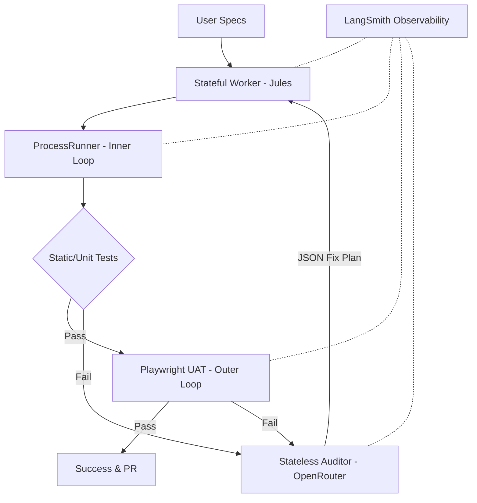

# SYSTEM ARCHITECTURE

## Summary

This document outlines the system architecture for the new automated User Acceptance Testing (UAT) pipeline for the NITPICKERS framework. Currently, the framework utilizes highly capable AI agents to generate full-stack software from declarative markdown specifications but suffers from a critical blind spot in its Quality Assurance phase. The existing UAT phase operates on an assumed success model, and the static code reviews performed by Large Language Models are fundamentally incapable of deterministically verifying dynamic application states. This lack of rigorous testing degrades the user experience and obscures the complex routing decisions and state mutations occurring within the agentic workflows.

To overcome these challenges, we are introducing a fully automated, dynamic, and highly observable UAT pipeline. This new pipeline serves as an impenetrable mechanical gatekeeper designed to deterministically verify both structural backend logic and frontend Human-Centered Design compliance. It operates strictly within a local sandboxed environment, ensuring that the entire execution flow is traced and monitored to provide instantaneous debugging and prompt evaluation capabilities. The architecture is built upon three core conceptual pillars: The Stateful Worker, The Stateless Auditor, and The Observability Layer. This tripartite division ensures a resilient UAT system free from infinite debugging loops and context window collapse.

## System Design Objectives

The primary objective of this system design is to implement a robust, fully automated User Acceptance Testing pipeline that eradicates the current assumed success model. We aim to establish a true zero-trust validation environment where every piece of generated code must pass strict mechanical gates before being considered complete. The system must fundamentally change how quality assurance is performed by shifting from static code reviews to dynamic, stateful verifications within a secure local sandbox environment. This pipeline acts as an impenetrable mechanical gatekeeper, ensuring that both structural backend logic and frontend Human-Centered Design (HCD) compliance are rigorously validated.

Furthermore, the system must provide deep observability into the AI agentic workflows. By integrating a dedicated observability layer, we aim to eliminate the black box nature of complex routing decisions. This transparency allows developers to trace node transitions, state mutations, and raw inputs and outputs of Vision LLM calls seamlessly. To avoid infinite loops and context dilution—a common pitfall known as the 'Lost in the Middle' phenomenon—the system is designed around three conceptual pillars with explicitly defined responsibilities. First, the Stateful Worker handles the long-running session context, building features and fabricating Pytest scripts. Second, the Stateless Auditor operates on a per-request basis, providing surgical diagnostics and outputting structured JSON Fix Plans without suffering from context fatigue. Third, the Observability Layer guarantees transparent execution tracing and state snapshot tracking.

This layered approach not only guarantees that no unverified code merges into the production baseline but also serves as an invaluable dataset generation mechanism. Failed UAT traces will be transformed into datasets utilized for continuous prompt engineering and quantitative regression testing. Ultimately, these design objectives culminate in a framework that maximizes development velocity without compromising on software quality, user experience, or system reliability. The architectural constraints enforce strict boundaries, ensuring that each component executes its responsibility efficiently and transparently. We strive to create an AI-native development environment where trust is earned through deterministic testing, multi-modal artifact capture, and adversarial double-checking. This ensures that the framework remains resilient against hallucination bottlenecks and delivers high-fidelity, production-ready software consistently. By mandating explicit tracing variables and mechanical blockades, the system guarantees that every phase of the development lifecycle is strictly monitored, controlled, and deterministically validated.

## System Architecture

The system architecture is structured around the Worker, Auditor, and Observer pattern, ensuring a strict separation of concerns and clear boundary management. The Stateful Worker, driven by Jules via Gemini Pro, constitutes the Inner Loop. It is responsible for fabricating code, orchestrating Pytest hooks, and managing long-running stateful conversational sessions. To prevent context dilution, the worker's session management explicitly segregates fast-fix reuse sessions from new development cycle sessions. The Stateless Auditor, powered by OpenRouter, forms the Outer Loop. Operating without context fatigue, it serves as a highly specialized diagnostician. Upon receiving multi-modal artifacts such as screenshots, DOM traces, and error logs from a failed Playwright execution, it evaluates the Human-Centered Design compliance and structural logic. The auditor rigidly outputs structured JSON Fix Plans, strictly avoiding massive code rewrites.

The Observability Layer, utilizing LangSmith, acts as the Panopticon. It tracks node routing, state dictionary mutations, and the exact latency and token usage of Vision LLM calls. This layer provides an invaluable window into the black box of agentic workflows. A critical requirement in this architecture is the explicit rule on boundary management and separation of concerns. The Worker must never perform stateless auditing, and the Auditor must never hold long-running session state. Interactions between these pillars are mediated through strictly typed Pydantic models and deterministic JSON schemas. The environment gatekeeper in the CLI enforces that all required secrets and tracing variables are securely configured before any execution begins.

During execution, the ProcessRunner mechanically blocks any pull request creation if the underlying structural tests, types, or linters yield non-zero exit codes. This explicit boundary ensures that failure states are immediately detected and surgically routed to the Auditor for a stateless review, rather than relying on the Stateful Worker to self-diagnose beyond its current context window. By integrating a custom Pytest hook, the system natively parses markdown specifications to dynamically yield executable test items, bridging the gap between documentation and behavioral verification. The architecture mandates that all multi-modal artifacts captured during the outer loop execution are strictly serialized and passed through the observability layer for complete transparency. This zero-trust validation model dictates that no code artifact is accepted without explicit proof of correct execution in the local sandboxed environment. The entire flow from generation to testing, auditing, and fixing is tightly coupled with LangSmith's tracing capabilities to expose every internal state transition. By isolating logic into these precise functional domains, we prevent the emergence of God Classes and ensure a highly scalable, maintainable codebase.



## Design Architecture

The design architecture strictly adheres to a Pydantic-based domain schema to guarantee determinism and type safety throughout the agentic workflow. The file structure is explicitly organized to enforce the separation of concerns, providing clear integration points where new schema objects extend the existing domain models. The core domain Pydantic models govern the structured inputs and outputs of the Worker, Auditor, and Observer layers. By utilizing Pydantic's robust validation mechanisms, the system ensures that the Stateless Auditor strictly returns a compliant JSON Fix Plan that the Stateful Worker can natively parse and apply.

The architecture introduces new state dictionaries and multi-modal artifact structures that seamlessly inherit from and extend the pre-existing project state models. These extended models encapsulate the uat_exit_code, the current_fix_plan, and paths to screenshots and DOM traces captured during the Playwright execution. Key invariants enforce that any output from the Vision LLM must adhere to the Fix Plan schema before routing back to the Worker, thereby preventing hallucinatory or unparsable recovery attempts. Extensibility is maintained through a modular service container that dynamically injects the appropriate implementation for the Auditor and the Observability tracer.

The file structure encapsulates domain models, workflow nodes, and business logic services in distinct directories. The integration points with the existing architecture are meticulously designed so that the legacy qa_usecase.py is safely deprecated and gracefully replaced by the new auditor_usecase.py and updated uat_usecase.py without causing breaking changes to the core CLI runner. The design guarantees that environment variables, especially the LangSmith tracing keys, are strictly parsed and validated during the Phase 0 environment gate initialization. This ensures that the system fails fast if the required observability context is missing. Overall, the Pydantic schemas serve as the authoritative contract across the entire system, securing the data flow from markdown parsing via Pytest hooks to complex LLM interactions. The design explicitly avoids God Classes by distributing the parsing, executing, and auditing logic across specialized, single-responsibility modules. This robust typing foundation guarantees that the entire pipeline operates predictably, deterministically rejecting malformed inputs and facilitating accurate state transitions within the LangGraph orchestrator.

```text
/
├── dev_documents/
│   ├── system_prompts/
│   │   ├── CYCLE01/
│   │   ├── CYCLE02/
│   │   ├── CYCLE03/
│   │   ├── CYCLE04/
│   │   ├── CYCLE05/
│   │   ├── CYCLE06/
│   │   ├── CYCLE07/
│   │   └── CYCLE08/
│   ├── ALL_SPEC.md
│   └── USER_TEST_SCENARIO.md
├── src/
│   ├── cli.py
│   ├── domain_models/
│   │   ├── state.py
│   │   ├── uat_models.py
│   │   └── fix_plan.py
│   ├── nodes/
│   │   ├── coder.py
│   │   └── auditor.py
│   ├── services/
│   │   ├── uat_usecase.py
│   │   └── auditor_usecase.py
│   └── utils.py
├── tests/
│   └── conftest.py
└── pyproject.toml
```

## Implementation Plan

This implementation plan decomposes the project into eight valid sequential cycles (CYCLE01 through CYCLE08). Each cycle is carefully scoped to incrementally build the pipeline while preserving the integrity of the existing architecture. We focus on test-driven development, schema-first design, and rigorous separation of responsibilities.

### CYCLE01
Architecture Definition & Core Domain Models Updates. In this cycle, we will define the overarching Pydantic models for the new state structures, encompassing `uat_exit_code`, `current_fix_plan`, and multi-modal artifacts. This establishes the strict typing contract for all subsequent cycles. The primary focus is ensuring that the state models can seamlessly accommodate the complex payloads generated by the visual and structural testing loops. We will meticulously define the JSON schema required for the Auditor's output, ensuring that the Fix Plan model enforces surgical file modifications rather than unbounded code generation. This foundation guarantees that all inter-node communication within LangGraph remains highly deterministic.

### CYCLE02
Phase 0 Environment & Observability Gate Setup. This cycle focuses on integrating the pre-flight checks into `cli.py` and the `ManagerUseCase` to mechanically halt execution if required secrets and LangSmith variables are missing. We will extend the existing Pydantic configuration settings to strictly mandate the presence of `LANGCHAIN_TRACING_V2=true`, the API key, and the project name. A dedicated verification utility will parse the `SPEC.md` to identify dynamic environment dependencies. By implementing this gate, we ensure that no agentic workflow begins operating within a blind spot; total observability is guaranteed from the very first shell command execution.

### CYCLE03
Phase 1 Inner Loop - ProcessRunner & Gatekeeping. We will enhance the existing asynchronous `ProcessRunner` to mechanically enforce strict type checking (`mypy`) and linting (`ruff`). This cycle introduces the explicit blockade logic: any non-zero exit code encountered during these structural tests will automatically block pull request creation. The orchestration layer will be updated to capture the error trace securely and inject it back into the Stateful Worker's session. This step requires careful handling of shell subprocesses, utilizing proper quoting to avoid injection vulnerabilities while streaming standard output and error reliably back into the application state.

### CYCLE04
Phase 1 Inner Loop - Docs-as-Tests Pytest Hooks. Here, we implement the custom Pytest hook in `tests/conftest.py` to natively parse `ALL_SPEC.md` and dynamically yield executable test items. This strategy eliminates the LLM "Translation Gap" by executing the exact markdown behavior definitions as native Python assertions. We will define a specialized `pytest.Item` class that securely evaluates the extracted code fences within an isolated context. This ensures that the documentation is the definitive source of truth and that the system directly validates the user's intent without intermediate interpretation layers.

### CYCLE05
Phase 2 Outer Loop - Playwright Multi-Modal Capture. This cycle integrates the `pytest-playwright` plugin into the test suite to automatically capture screenshots, DOM traces, and console logs upon simulated UI failures. We will configure Pytest fixtures to recognize failure states dynamically and invoke the Playwright capture routines before tearing down the browser context. These artifacts must be saved to deterministic file paths so that the state machine can reference them securely. The implementation focuses heavily on artifact reliability, ensuring that even under severe test failure conditions, the visual context is preserved for the Auditor.

### CYCLE06
Phase 2 Outer Loop - Dynamic Execution with UAT. We will rewrite `uat_usecase.py` to permanently replace assumed success placeholders with an asynchronous `ProcessRunner` execution of the complete Pytest/Playwright suite. This service will orchestrate the sandbox execution, wait for completion, and then parse the results. If a failure occurs, it will locate the artifacts generated in CYCLE05 and map them into the Pydantic models designed in CYCLE01. This cycle activates the true mechanical gatekeeper, transitioning the system from a theoretical validation model to a dynamic, reality-based testing framework.

### CYCLE07
Phase 3 Evaluator Loop - Self-Critic & Auditor Integration. We establish the `auditor_usecase.py` and the corresponding LangGraph node to interface with the OpenRouter API. This cycle implements the stateless diagnostician. It will process the multi-modal artifacts, Base64 encode the screenshots, and construct a precise prompt enforcing the adversarial Devil's Advocate reasoning sequence. The auditor will be constrained to output only the Pydantic-compliant JSON Fix Plan. This step finalizes the automated recovery loop, allowing the agent to heal its own structural and HCD defects based on undeniable visual evidence.

### CYCLE08
Phase 3 Observability - LangSmith Tracing UI Setup. The final cycle ensures the entire LangGraph builder is fully wrapped in the LangSmith tracing context. We will instrument the workflow nodes to pass explicit `RunnableConfig` parameters, ensuring that the custom State object is serialized for complete visual observability. LiteLLM callbacks will be attached to capture the raw inputs and outputs of the OpenRouter Vision LLM calls. This final implementation step transforms the system into a panopticon, allowing developers to visually dissect node routing, state diffs, and LLM reasoning logic to continually refine the framework's prompts and behaviors.

## Test Strategy

The test strategy for this architecture mandates a comprehensive suite of unit, integration, and end-to-end tests to guarantee absolute functional correctness and strict schema adherence. A critical aspect of this strategy is the explicit execution of tests without any side-effects, achieved through the aggressive application of dependency injection, the utilization of temporary directories for file I/O operations, and the comprehensive mocking of all external API interactions.

### CYCLE01
The unit tests will rigorously validate the Pydantic schemas using `pytest`. We will instantiate the models with valid data to verify successful parsing, and intentionally inject malformed or missing data to guarantee that standard Pydantic validation errors are correctly raised. Special attention will be given to the Fix Plan model, ensuring nested JSON objects are parsed deterministically without silent failures.

### CYCLE02
The test strategy for the Phase 0 Environment Gate requires mocking `os.environ` via `unittest.mock.patch.dict` or by utilizing `pytest.MonkeyPatch`. We will verify that the settings model correctly raises a `ValidationError` when the LangSmith variables are absent or incorrectly formatted. Integration tests will simulate the CLI startup phase to ensure the system mechanically halts and prints the exact Hard Stop Prompt.

### CYCLE03
The unit testing approach will thoroughly test the `ProcessRunner` using `unittest.mock.patch` on `asyncio.create_subprocess_exec`. We will verify that simulated non-zero exit codes correctly bubble up as parsed error messages. Integration tests will execute the node transition logic within a mock LangGraph context, verifying that the router correctly directs the workflow back to the coding node upon simulated linting failures.

### CYCLE04
The tests for the Docs-as-Tests Pytest hooks will verify the parser logic within `conftest.py`. We will provide mock markdown strings containing valid Python code blocks and assert that the correct number of Pytest items are yielded. Integration tests will execute `pytest` against a temporary directory containing a mock `.md` file, asserting that the tests are executed and correctly report success or failure based on the embedded assertions.

### CYCLE05
The test strategy for the Playwright Multi-Modal Capture involves mocking the Pytest report object and the Playwright `page` fixture. We will verify that the capture logic correctly creates the artifact paths and calls the appropriate Playwright serialization methods on simulated failure. Integration tests will execute a dummy UI test designed to fail, verifying that the output directory contains the generated `.png` and `.txt` artifacts.

### CYCLE06
The unit tests will use `unittest.mock.patch` to mock the `ProcessRunner` execution within `uat_usecase.py`. We will simulate a successful run returning exit code 0 and a failed run returning exit code 1 with mock paths. We will verify that the `UatUseCase` correctly parses the exit code and instantiates the `UATResult` model accurately. Integration tests will invoke the Use Case to execute a pre-configured failing test, ensuring the state dictionary is correctly populated with the artifact paths.

### CYCLE07
The test strategy for the Auditor Integration relies on mocking the LiteLLM completion function. We will simulate a successful Vision LLM response containing a valid JSON string conforming to the `FixPlan` schema. We will assert that the `AuditorUseCase` correctly extracts, parses, and instantiates the domain model. Integration tests will inject a mock failing UAT state with a dummy screenshot file, verifying that the node updates the state dictionary with the JSON Fix Plan before routing back to the Worker node.

### CYCLE08
The test strategy for LangSmith Observability involves mocking the tracing callbacks. We will use `unittest.mock.patch` to verify that `RunnableConfig` is properly constructed and passed into the graph's invoke method without throwing type errors. Integration testing will execute a full simulated cycle using `vcrpy` or specific mock patches to intercept the LangSmith API calls, verifying that the State dictionary diffs and the Base64 image payloads are successfully formulated in the trace payload.