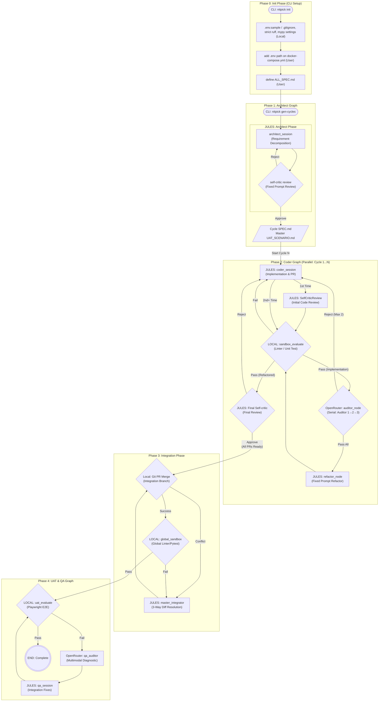

# System Architecture: NITPICKERS 5-Phase Restructuring

## Summary
The NITPICKERS application uses an AI-native code development environment built on top of LangGraph. This document defines the architecture and design strategy for refactoring the current workflow into a highly stable and well-separated "5-Phase Architecture". This architecture orchestrates requirement decomposition, parallel feature implementation, 3-way difference integration, and full-system end-to-end (E2E) UI testing using multi-modal diagnostic capture.

## System Design Objectives
The core objective of this refactoring is to enhance stability, explicitly define the boundaries and roles of the agents, and enforce a strict Zero-Trust Code Validation policy across the software development lifecycle. The previous workflow had tightly coupled components; the 5-phase structure introduces distinct boundaries that isolate concerns, allowing independent execution, targeted testing, and robust failure recovery.

**Goals:**
1. **Explicit Phase Separation:** Clearly separate initialization, planning, coding, integration, and final User Acceptance Testing (UAT).
2. **Serial Auditing Loop:** Implement a serial, multi-stage auditing process during the coding phase to catch edge cases systematically before integration.
3. **Automated 3-Way Merge Resolution:** Create a distinct integration phase capable of autonomously resolving merge conflicts using base and branch comparisons.
4. **Independent UAT Execution:** Isolate dynamic End-to-End testing to execute only after all code is successfully integrated.
5. **Zero-Trust Validation:** Ensure that pull requests and state transitions are explicitly blocked until all structural checks (linting, type checking, unit tests) and dynamic checks (Playwright UI tests) pass without errors.

**Constraints:**
- The solution must leverage existing LangGraph routing capabilities and Pydantic-based state management (`CycleState`).
- We must maximize the reuse of existing modules, services, and domain models, only extending them where explicitly required by the new requirements.
- The pipeline must tolerate external API rate limits and sandbox timeouts via retries and graceful degradation strategies.

**Success Criteria:**
- The pipeline successfully processes multiple concurrent coding cycles, handles conflict resolution autonomously, and passes a comprehensive End-to-End Marimo notebook test.
- No direct code modifications occur to the target project without prior validation in isolated sandbox environments.
- The entire system can be run completely disconnected from live models in a CI/CD context ("Mock Mode").

## System Architecture

The refactored architecture relies on a highly structured LangGraph orchestration broken into five distinct phases. By isolating responsibilities, the architecture prevents "God Classes" and tightly coupled logic.

### Components & Data Flow

**Phase 0: Init Phase (CLI Setup)**
The user executes `nitpick init` via the command line. This scaffolds the workspace (generating `.env.example`, `pyproject.toml` linter rules, and `.gitignore`) and configures Docker for Sidecar execution. The state is purely file-based.

**Phase 1: Architect Graph**
The `nitpick gen-cycles` command triggers the Architect Phase. The `JULES` agent reads `ALL_SPEC.md` and decompose requirements into atomic cycles, writing `SPEC.md` and `UAT.md` files. A self-critic node reviews the output before finalization.

**Phase 2: Coder Graph (Parallel)**
This is the core implementation loop, executed concurrently for each cycle defined in Phase 1.
- The Coder (`JULES`) implements the feature.
- A local sandbox evaluates structural integrity.
- If passed, a series of OpenRouter Auditors review the code sequentially.
- A final Refactor node applies fixes, followed by a final self-critic check.

**Phase 3: Integration Phase**
Once Phase 2 concludes for all cycles, the pipeline integrates branches into a central integration branch.
- Standard `git merge` is attempted.
- If conflicts arise, a 3-Way Diff is generated using Base, Local, and Remote versions. The Master Integrator (`JULES`) resolves the conflict.
- A Global Sandbox node verifies the integrated codebase.

**Phase 4: UAT & QA Graph**
Following successful integration, the UAT evaluation node executes End-to-End tests (e.g., Playwright).
- Failures trigger the OpenRouter QA Auditor, which performs multimodal analysis on error logs and screenshots.
- The `JULES` QA Session applies fixes, iterating until the tests pass.

### Architectural Diagram



### Boundary Management Rules
- **State Integrity:** Components must strictly interact through the LangGraph `State` definitions (`CycleState`, `IntegrationState`). Direct manipulation of global variables or implicit data passing is forbidden.
- **Dependency Injection:** Services like `GitManager`, `SandboxRunner`, and `JulesClient` must be injected via the `ServiceContainer` to facilitate rigorous testing.
- **No Artifact Editing:** The Coder and Refactor agents must edit source code files only. Build artifacts must be ignored.

## Design Architecture

The application design relies heavily on Pydantic to ensure strict validation of LangGraph states and internal message payloads.

### File Structure
```text
src/
├── state.py                  # Pydantic state definitions (CycleState, IntegrationState)
├── graph.py                  # LangGraph orchestrator mappings
├── nodes/
│   └── routers.py            # LangGraph conditional edge routing logic
└── services/
    ├── conflict_manager.py   # 3-Way diff and integration resolution logic
    ├── uat_usecase.py        # Independent QA/UAT pipeline service
    └── workflow.py           # Global CLI/Orchestration service layer
```

### Domain Model Extensibility
1. **`CycleState` (in `src/state.py`):**
   - The state is an aggregate of sub-states (e.g., `CommitteeState`, `AuditState`). We will cleanly extend `CommitteeState` with new fields: `is_refactoring: bool`, `current_auditor_index: int`, and `audit_attempt_count: int` to manage the serial loop.
2. **`IntegrationState` (New):**
   - A dedicated state class for Phase 3, avoiding pollution of the `CycleState`. It will hold paths for conflicting files, base/local/remote contents, and resolution status.

## Implementation Plan

The refactoring will be executed across exactly 5 strict, isolated cycles:

- **CYCLE01: State Management & Phase 0/1 Setup**
  - Define the newly required fields in `CycleState` (`src/state.py`).
  - Implement validation rules for `current_auditor_index` and `audit_attempt_count`.
  - Finalize Phase 0 (Init) and Phase 1 (Architect) structure.
- **CYCLE02: Phase 2 - Coder Graph (Serial Auditing)**
  - Re-wire the `_create_coder_graph` inside `src/graph.py` to enforce the serial loop (`coder_session` -> `sandbox` -> `auditor` -> `refactor` -> `final_critic`).
  - Implement conditional routing functions in `src/nodes/routers.py` (`route_sandbox_evaluate`, `route_auditor`, `route_final_critic`).
- **CYCLE03: Phase 3 - Integration Graph (3-Way Diff)**
  - Implement `_create_integration_graph` in `src/graph.py`.
  - Refactor `ConflictManager` (`src/services/conflict_manager.py`) to generate robust 3-Way Diff payloads using Git base ancestors.
- **CYCLE04: Phase 4 - UAT & QA Graph**
  - Decouple the UAT evaluation from Phase 2.
  - Refactor `uat_usecase.py` to operate entirely as a distinct graph handling only integrated results and multimodal diagnostics.
- **CYCLE05: CLI & Workflow Orchestration**
  - Update `run_full_pipeline` in `src/services/workflow.py` to sequentially transition from Phase 1 to Phase 4.
  - Ensure the parallel `asyncio.gather` logic for the Coder Graph correctly pauses before the Integration phase begins.

## Test Strategy

Each cycle relies heavily on contract testing, utilizing isolated environments to verify functionality without side effects.

- **CYCLE01:** Unit tests will instantiate `CycleState` and test boundaries (e.g., rejecting negative attempt counts). No external DB or API is required.
- **CYCLE02:** LangGraph path tests. By injecting a mocked `JulesClient` that consistently returns known code or audit results, we assert the routing logic correctly loops `audit_attempt_count` times before routing to the refactor node.
- **CYCLE03:** Integration testing for `ConflictManager` will initialize a local temporary git repository using `pyfakefs` or standard Python `tempfile` libraries. Three branches will be created programmatically to trigger a genuine conflict, ensuring `git show :1`, `:2`, `:3` correctly extract the 3-Way diff.
- **CYCLE04:** The UAT usecase will be tested via Mock Mode. Playwright errors will be simulated with predefined screenshots and trace dumps to ensure `qa_auditor` handles the data without real network overhead.
- **CYCLE05:** Workflow testing will utilize `pytest.MonkeyPatch` to simulate the execution of `nitpick run-pipeline`, validating that the execution order (Phase 1 -> 2 -> 3 -> 4) is perfectly enforced. Any DB states involved in manifest writing must use transaction rollback fixtures.