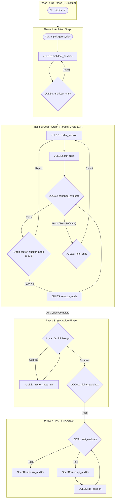

# System Architecture

## Summary
The NITPICKERS environment is evolving into a more rigorous and reliable "5-Phase" architecture. This restructure ensures strict zero-trust code validation, clearer separation of concerns between code generation, static analysis, and multimodal UAT, and safer integration. The new phases enforce sequential checks before integration and guarantee the codebase meets high professional standards at every step.

## System Design Objectives
The core objective of the 5-Phase architecture is to systematically transform unpredictable AI-generated code into robust, production-ready software. To achieve this, the architecture imposes a strict zero-trust philosophy where no AI output is trusted implicitly. Every code change must traverse a gauntlet of static linters, isolated sandbox tests, and external red-team audits before it is considered for integration.

A key constraint in our design is the need for isolated and reproducible testing. We rely heavily on containerized sandboxes (like E2B) to execute generated code without polluting the host environment or risking security breaches. This isolation ensures that if an AI agent generates malicious or unstable code, the damage is strictly contained. Furthermore, the architecture mandates deterministic state management via LangGraph, allowing us to trace, pause, resume, and debug every micro-interaction between the orchestrator and the worker agents.

Another crucial objective is maximizing the separation of concerns. The system is intentionally divided into distinct phases—from initial planning and architectural breakdown to parallel implementation, strict integration conflict resolution, and finally, full end-to-end user acceptance testing. This prevents the emergence of "God Classes" and chaotic agent behavior. By isolating the 'Coder' logic from the 'Auditor' and 'Integrator' logic, we ensure that agents do not suffer from context fatigue. Each agent has a single, well-defined responsibility.

Success criteria for this architecture include the flawless execution of the entire 5-Phase pipeline without manual intervention. The system must autonomously detect syntax errors, failing tests, and integration conflicts, subsequently employing self-healing loops to resolve them. Ultimately, a successful implementation means the master branch remains entirely pristine, accepting only code that has demonstrably passed 100% of its required automated checks and architectural audits.

## System Architecture
The 5-Phase architecture establishes a robust, highly orchestrated workflow designed to govern the entire lifecycle of AI-driven software development. The system is fundamentally composed of five distinct, sequentially enforced phases, orchestrated by a central workflow service and mediated by strictly typed Pydantic state models passing through LangGraph nodes.

At the highest level, the data flows linearly from requirement inception to final verified deployment, but internally, each phase may contain complex self-healing loops. External systems such as the LLM providers (Google, OpenRouter), the sandbox execution environment (E2B), and the local file system act as critical boundary points. Strict boundary management rules dictate that the orchestrator never interacts directly with the file system; instead, it issues serialized commands to the sandbox runner, which then applies the changes.

The architectural boundary between the parallel implementation phase and the serial integration phase is absolute. Code generated in a parallel 'Coder' cycle is quarantined in an isolated branch. It is only permitted to advance to the Integration Phase after successfully navigating the local static analysis (Ruff, Mypy) and the external red-team Auditor evaluations. This separation guarantees that unstable code in one feature branch cannot contaminate the validation pipeline of another feature branch.



## Design Architecture
The design architecture is heavily rooted in robust, strictly typed Pydantic models. We utilize the power of Pydantic to ensure that data flowing between LangGraph nodes is always structurally sound. This preempts many runtime errors caused by unexpected LLM outputs or malformed internal state mutations.

The core domain model is the `CycleState`. This object represents the cumulative state of a single development cycle as it traverses the graph. To avoid creating a monolithic "God Class", `CycleState` is composed of several specialized sub-states: `CommitteeState` (managing auditor iterations and refactoring flags), `SessionPersistenceState` (handling branch and git context), `AuditState` (storing reviews and feedback logs), `TestState` (holding sandbox execution results), and `UATState` (managing final UI validation). This composability allows internal modules to consume only the subset of data they require, strictly enforcing the Principle of Least Privilege.

Key invariants include the `current_auditor_index` in the `CommitteeState`, which must strictly be an integer between 1 and 3, ensuring the serial audit loop cannot spin out of control. Similarly, the `is_refactoring` boolean flag acts as a critical constraint, preventing a cycle from endlessly bouncing between initial implementation and post-audit refactoring. Extensibility is achieved by allowing the addition of new sub-states to the `CycleState` without disrupting existing accessors, thanks to property delegates.

```text
src/
├── state.py                  (Core Domain Models: CycleState, IntegrationState)
├── graph.py                  (Graph Builder: Defines edges and nodes)
├── nodes/
│   ├── routers.py            (Conditional edge routing logic)
│   ├── base.py               (BaseNode definitions)
│   └── ...
└── services/
    ├── conflict_manager.py   (3-Way Diff construction logic)
    ├── workflow.py           (High-level phase orchestration)
    └── uat_usecase.py        (UAT execution and QA orchestration)
```

## Implementation Plan

### CYCLE01: State Management and Phase 2/3 Core Logic Refactoring
In this initial cycle, we will focus on establishing the foundational state changes and the logic required for the Phase 2 (Coder) and Phase 3 (Integration) graphs. This involves extending the `CycleState` to support the new `is_refactoring` and `current_auditor_index` fields. We will also implement the crucial routing logic in `src/nodes/routers.py` to handle the new serial auditor progression and the conditional branching based on the refactoring flag. Finally, we will overhaul the `conflict_manager.py` to construct a true 3-way diff, moving away from simple conflict marker parsing. This cycle is purely structural and does not touch the overarching workflow orchestrator.

### CYCLE02: Orchestration, Graph Definition, and UAT Refactoring
The second cycle builds upon the state and routing logic established in CYCLE01. We will update `src/graph.py` to physically wire up the new 5-Phase architecture, officially defining the `_create_integration_graph` and redefining the `_create_coder_graph` and `_create_qa_graph`. Concurrently, we will modify the high-level `WorkflowService` in `src/services/workflow.py` to properly execute these distinct graphs in the correct parallel and sequential order. Lastly, the UAT logic in `src/services/uat_usecase.py` will be isolated entirely into Phase 4, removing any legacy hooks that tied it prematurely to the Coder phase.

## Test Strategy

### CYCLE01
The testing strategy for CYCLE01 will focus heavily on unit and isolated integration tests. For the state extensions, we will instantiate `CycleState` objects and verify that the new fields (`is_refactoring`, `current_auditor_index`) initialize correctly and respect their Pydantic constraints. The routing functions in `routers.py` will be tested using purely mocked `CycleState` inputs, asserting that the correct next-node strings (e.g., "next_auditor", "pass_all") are returned under various simulated conditions. For the `conflict_manager.py`, we will use isolated temporary Git repositories (`pytest` fixtures) to simulate merge conflicts, verifying that the 3-way diff string is constructed perfectly without relying on external network calls. All database or persistent state setup must utilize Pytest fixtures that start a transaction before the test and roll it back after, ensuring lightning-fast state resets.

### CYCLE02
CYCLE02 testing shifts focus towards integration and workflow orchestration. We will utilize the LangGraph testing utilities to verify the physical structure of the newly defined graphs in `graph.py`, ensuring that all edges and conditional routes connect the nodes exactly as depicted in the architectural diagrams. The `WorkflowService` will be tested using mocked instances of the graph builder, verifying that `run_cycle` correctly handles the parallel execution of multiple branches and sequentially invokes the integration graph only after all parallel tasks complete. UAT refactoring will be verified by asserting that the `uat_usecase.py` functions correctly process isolated state objects without side-effects, relying on mocked sandbox runners to simulate Playwright execution. All external API calls, especially those invoking OpenRouter or Jules, must be strictly mocked to ensure sandbox resilience.