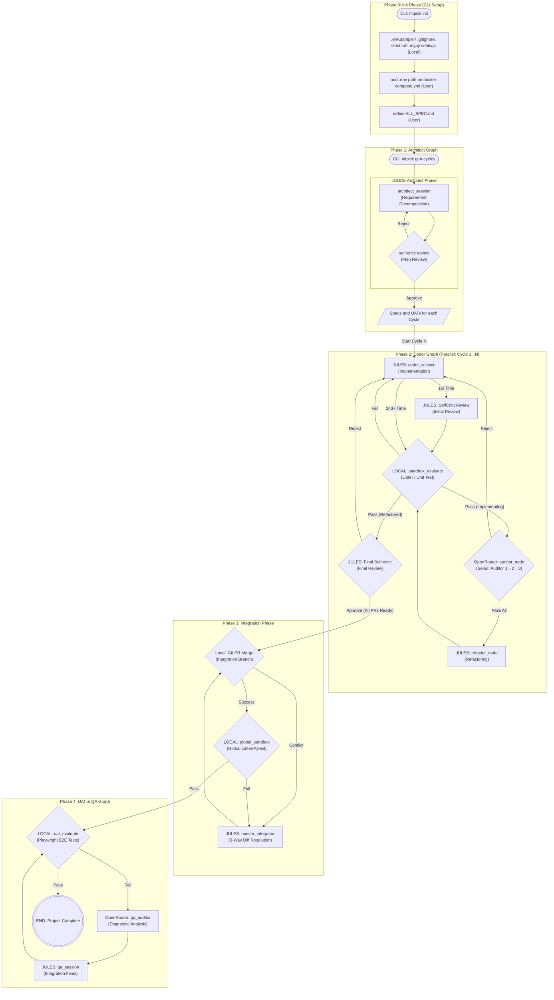

# System Architecture

## Summary
The NITPICKERS system is an AI-native development environment designed to enforce absolute zero-trust validation of AI-generated code. This architectural documentation outlines a comprehensive refactoring of the existing LangGraph-based AI agent workflow into a highly stable, decoupled, and robust "5-phase" configuration. The primary objective is to enhance role separation, ensure state consistency, and provide a systematic approach to code generation, red team auditing, dynamic execution in a secure sandbox, and automated conflict resolution.

This refactoring aims to build upon the existing architecture, modifying specific Pydantic state models, graph routing logic, and service use-cases without discarding the underlying foundation. The new 5-phase structure will explicitly map out the lifecycle of a development cycle from initial planning to final integration and end-to-end testing, guaranteeing that all generated code passes rigorous structural and behavioral checks before being accepted.

## System Design Objectives
The primary goal of this architectural refactoring is to transition the current monolithic or tightly coupled LangGraph execution flow into a well-defined, modular 5-phase pipeline. This transition addresses several key objectives that are critical for maintaining a scalable and reliable AI-driven development environment.

Firstly, the system must achieve **Strict Role Separation**. By clearly defining the boundaries between different agents—such as the Architect, Coder, Auditor, and Master Integrator—the system prevents context bleeding and reduces cognitive load on individual language models. This separation ensures that each agent operates within a specific, focused context, thereby improving the quality and precision of their outputs. For instance, the Coder agent focuses solely on implementation, while the stateless Auditor agent acts as an independent diagnostician, evaluating the Coder's output without historical bias.

Secondly, the architecture must ensure **Robust State Management**. The LangGraph state, primarily represented by the `CycleState` Pydantic model, needs to be augmented to handle complex control flows, including series-based auditing and explicit refactoring loops. This involves introducing new state variables such as `is_refactoring`, `current_auditor_index`, and `audit_attempt_count`. These additions are crucial for tracking the progress of a cycle, managing retry limits to prevent infinite loops, and explicitly differentiating between the initial implementation phase and subsequent code improvement phases.

Thirdly, the system emphasizes **Safe and Automated Integration**. A significant enhancement is the introduction of a dedicated Integration Phase (Phase 3). This phase tackles the challenge of merging concurrent code changes by implementing a 3-Way Diff conflict resolution strategy. Instead of relying on standard source control merges that may fail or require human intervention, the Master Integrator agent will intelligently synthesize conflicting changes by analyzing the common ancestor (Base), local modifications, and remote modifications, ensuring that the intentions of both branches are preserved.

Fourthly, the architecture mandates **Zero-Trust Validation**. Every piece of code generated must pass through a mechanical blockade. This means that pull requests or code integrations are explicitly blocked until all static analysis checks (like Ruff and Mypy) and dynamic tests (like Pytest) succeed with a zero exit code. This principle eliminates assumed success and guarantees that only structurally sound and functionally correct code progresses through the pipeline.

Finally, the design must remain **Additive and Extensible**. The refactoring strategy explicitly avoids rewriting the entire system from scratch. Instead, it leverages the existing schemas, service containers, and test frameworks, extending them safely to accommodate the new 5-phase logic. This approach minimizes disruption, preserves existing functional capabilities, and ensures that the system can be easily adapted to future requirements or new agent capabilities.

## System Architecture
The refactored NITPICKERS system architecture is divided into five distinct phases, each managed by specific LangGraph nodes and interconnected through well-defined routing functions. This modular approach ensures that the development process is logical, traceable, and resilient to errors.

**Phase 0: Init Phase (CLI Setup)**
This phase is responsible for the static initialization of the environment. Triggered by CLI commands, it generates necessary boilerplate files, configures linters in `pyproject.toml`, and sets up the foundational workspace. It relies heavily on user-provided inputs, such as the `ALL_SPEC.md` document, to establish the requirements for the subsequent phases.

**Phase 1: Architect Graph (Requirement Planning)**
In this phase, the Architect agent analyzes the raw requirements and decomposes them into executable, sequential development cycles (e.g., `CYCLE01`). This process includes a self-critic review mechanism to ensure that the proposed plan is viable and well-structured before proceeding. The output of this phase is a set of specification and User Acceptance Testing (UAT) documents for each cycle.

**Phase 2: Coder Graph (Implementation and Audit)**
This is the core execution loop for a given cycle. The Coder agent implements the required features and tests. The generated code is then evaluated in a local sandbox (static analysis and unit tests). If it passes, the code is subjected to a serial Audit process involving multiple independent Auditor agents. If any Auditor rejects the code, it is sent back to the Coder for revision. Once all Auditors approve, the code undergoes a final Refactor step to improve its quality, followed by a final sandbox evaluation and a self-critic review.

**Phase 3: Integration Phase (3-Way Diff)**
After all parallel Coder cycles complete successfully, the system attempts to merge the changes into an integration branch. If conflicts arise, the Master Integrator agent utilizes a 3-Way Diff strategy—analyzing the Base, Branch A, and Branch B code—to resolve the conflicts intelligently. The integrated code is then verified in a global sandbox to ensure that the merge did not introduce any regressions.

**Phase 4: UAT & QA Graph (Dynamic E2E Testing)**
The final phase involves rigorous End-to-End (E2E) testing against the integrated codebase. Playwright or similar tools execute the UAT scenarios. If a test fails, a stateless QA Auditor analyzes the failure artifacts (logs, screenshots) and provides a fix plan to a QA Session agent, which implements the necessary corrections. This loop continues until all UATs pass, signifying the completion of the project.



## Design Architecture
The design architecture is heavily reliant on Pydantic models to enforce strict typing, validation, and schema definitions. By extending the existing models, we ensure backward compatibility while introducing the new capabilities required by the 5-phase structure.

```text
src/
├── cli.py
├── state.py
├── graph.py
├── nodes/
│   └── routers.py
├── domain_models/
│   └── (Existing schemas...)
└── services/
    ├── conflict_manager.py
    ├── uat_usecase.py
    └── workflow.py
```

### Core Domain Pydantic Models Structure
The central piece of state management is the `CycleState` model located in `src/state.py`. This model aggregates various sub-states (like `CommitteeState`, `AuditState`, `TestState`) to manage the lifecycle of a cycle.

To support the new Phase 2 (Coder Graph) logic, the `CommitteeState` (or the root `CycleState` depending on the exact implementation preference, though `CommitteeState` is ideal for grouping) must be extended to include:
- `is_refactoring: bool`: A flag to determine if the cycle has passed the audit phase and is currently undergoing the final refactoring loop.
- `current_auditor_index: int`: Tracks which auditor in the serial chain (e.g., 1 to 3) is currently reviewing the code.
- `audit_attempt_count: int`: Counts the number of times an auditor has rejected the code, acting as a circuit breaker to prevent infinite loops.

In Phase 3 (Integration Graph), the `IntegrationState` model (which may need to be defined or extended) will handle variables specific to merging, such as a queue of successful feature branches (`branches_to_merge: list[str]`), lists of unresolved conflicts, or the current integration branch status. This state is strictly aggregated by the Orchestrator after Phase 2 completes successfully.

### Integration Points & Structured Data Handoffs
The new schema objects directly extend the existing domain objects. For instance, `route_sandbox_evaluate`, `route_auditor`, and `route_final_critic` in `src/nodes/routers.py` will explicitly rely on the newly added fields in `CycleState` to make routing decisions (dynamically querying configurations rather than using hardcoded limits).

Crucially, the transition from Phase 2 to Phase 3 involves a **State Aggregator** mechanism within the Orchestrator (`workflow.py`). It extracts the `integration_branch` from the `SessionPersistenceState` of each successful `CycleState` and populates the `IntegrationState.branches_to_merge` list.

All LLM interactions (Auditor feedback, Master Integrator resolution, Refactor outputs) must strictly utilize Pydantic-based structured outputs (e.g., `ConflictResolutionSchema`) to guarantee safe parsing and eliminate fragile markdown regex extraction. The `services/conflict_manager.py` will interact with `GitManager` or `GitOps` classes to safely retrieve the necessary Base, Local, and Remote file contents (gracefully handling missing files) to construct the 3-Way Diff prompt.

## Implementation Plan

### CYCLE01: Implement 5-Phase Workflows
- **Focus**: Implement all required state changes, graph refactoring, 3-Way diff and UAT capabilities into a single cohesive development cycle. This encompasses state modifications, routing enhancements, integration graph, and UAT execution.
- **Tasks**:
  1. Update `src/state.py` to include `is_refactoring`, `current_auditor_index`, and `audit_attempt_count` in the appropriate Pydantic models (e.g., `CommitteeState` or `CycleState`). Define the `IntegrationState` model, ensuring it can track merge attempts and conflicts.
  2. Implement new routing functions in `src/nodes/routers.py`: `route_sandbox_evaluate`, `route_auditor`, and `route_final_critic`.
  3. Modify `src/graph.py` to re-wire `_create_coder_graph` according to the 5-phase specification, replacing existing nodes as necessary and introducing `refactor_node` and `final_critic_node`. Create the `build_integration_graph` containing the `git_merge_node`, `master_integrator_node`, and `global_sandbox_node`.
  4. Implement the 3-Way Diff logic in `src/services/conflict_manager.py`. This requires fetching the Base, Local (Branch A), and Remote (Branch B) versions of conflicted files using Git commands.
  5. Refactor `src/services/uat_usecase.py` to ensure it only operates after Phase 3 is fully complete, acting as the dedicated executor for Phase 4. Update `src/services/workflow.py` and `src/cli.py` to control the overall execution flow: running Phase 2 cycles in parallel, awaiting completion, triggering Phase 3 integration, and finally executing Phase 4 UAT. Ensure that the QA Auditor loop in Phase 4 correctly analyzes failures and routes them back for correction within the integrated environment.
- **Expected Outcome**: A fully cohesive system that seamlessly transitions from parallel feature development to integrated system testing and final validation without manual intervention.

## Test Strategy

### CYCLE01
- **Unit Testing**:
  - Test the state transitions in `src/state.py` to ensure that setting `is_refactoring` or incrementing `current_auditor_index` behaves as expected and passes Pydantic validation.
  - Test the routing logic in `src/nodes/routers.py` by providing mocked `CycleState` objects with various combinations of flags and asserting the correct string output (e.g., "failed", "auditor", "final_critic").
  - Test the `build_conflict_package` method in `src/services/conflict_manager.py`. Mock the Git subprocess calls to return specific file strings for Base, Local, and Remote, and verify that the constructed prompt accurately contains all three sections.
  - Test the orchestration logic in `src/services/workflow.py`. Verify that the workflow correctly awaits all parallel Coder cycles before initiating the Integration phase.
  - Test `src/services/uat_usecase.py` to ensure it correctly processes the integrated state and triggers the QA loop upon simulated test failures.
- **Integration Testing**:
  - Mock the LLM nodes and execute the `_create_coder_graph` to verify that the edges trigger correctly. Ensure that the loop breaks after `audit_attempt_count` exceeds its limit and that it transitions to `refactor_node` only when all auditors pass.
  - Test the `build_integration_graph` transition logic. Simulate a merge conflict state and ensure it routes to `master_integrator_node`. Simulate a successful merge and ensure it routes to `global_sandbox_node`.
  - Perform an end-to-end simulation of the workflow orchestrator. Mock the actual execution of the graphs but verify that `build_coder_graph`, `build_integration_graph`, and `build_qa_graph` are called in the correct sequence and with the appropriate state payloads.
  - **Side-effect Management**: Use an in-memory `Checkpointer` for LangGraph and mock `ProcessRunner` to avoid executing actual linting or testing commands during the graph traversal test. Utilize a temporary Git repository setup using `pytest.fixture(scope="function")` to safely test the Git operations and merge scenarios without affecting the real project repository. Ensure that mock API keys are active (via `tests/conftest.py` configurations) to prevent any actual LLM calls. Use mock directories for any file generation steps. Any testing requiring database or persistent state setup MUST utilize Pytest fixtures that start a transaction before the test and roll it back after, ensuring lightning-fast state resets without relying on heavy external CLI cleanup commands.
