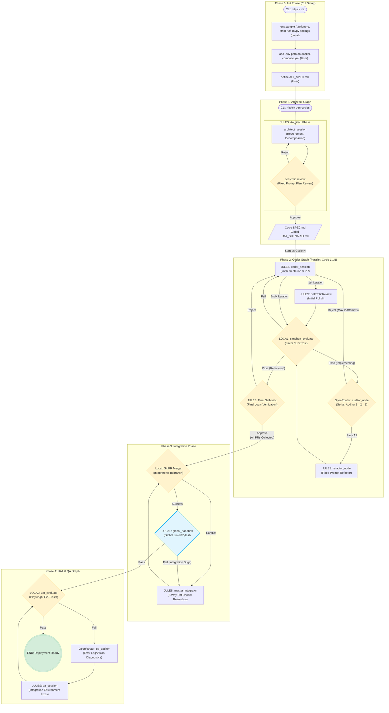

# System Architecture

## Summary
The NITPICKERS system is an AI-Native Code Development Environment designed with a rigorous, 5-Phase Parallel & Sequential Architecture. The core goal is to provide a robust, state-based workflow utilizing LangGraph to separate concerns between architecture planning, parallel code generation, deterministic 3-way git integration, and multi-modal User Acceptance Testing (UAT). This architecture mandates "zero-trust validation," meaning that every code change must pass static and dynamic tests before proceeding, completely preventing "assumed success."

## System Design Objectives
The primary objective of this architecture is to restructure the existing LangGraph workflow into an explicit "5-Phase" pipeline, increasing stability, preventing infinite loops, and establishing a clear separation of responsibilities.

- **Phase 0 (Init)**: Static CLI initialization.
- **Phase 1 (Architect)**: Requirement decomposition and planning.
- **Phase 2 (Coder)**: Parallel implementation cycles featuring a serial audit loop and self-healing refactoring.
- **Phase 3 (Integration)**: A centralized bottleneck phase where parallel branches are deterministically merged using a 3-way diff AI Conflict Manager, followed by a global static analysis.
- **Phase 4 (UAT & QA)**: Dynamic End-to-End UI testing and automated visual debugging using Vision LLMs.

**Additive Constraints & Boundary Management**:
- **Minimal Code Disruption**: This modernization must safely extend existing files (`src/state.py`, `src/graph.py`, `src/cli.py`) without rewriting core domain models or utility functions.
- **Separation of Concerns**: Each LangGraph phase must be isolated. The `Coder Phase` must no longer trigger UAT directly; UAT must be strictly reserved for `Phase 4` after all cycles are globally integrated.
- **State-Driven Routing**: Graph traversals must be strictly controlled by explicit `CycleState` variables (`is_refactoring`, `current_auditor_index`) rather than opaque logic within nodes.
- **Idempotency**: Execution scripts and test setups must be strictly idempotent.

## System Architecture

The following diagram illustrates the 5-Phase orchestration, detailing the progression from requirement parsing to global deployment validation.



## Design Architecture

The implementation targets specific components of the project while retaining the core Pydantic-based domain schema.

```text
nitpickers/
├── src/
│   ├── cli.py                        # Updated to orchestrate parallel/serial phases
│   ├── graph.py                      # Updated _create_coder_graph, new _create_integration_graph
│   ├── state.py                      # Extended CycleState (is_refactoring, audit counts)
│   ├── nodes/
│   │   └── routers.py                # New conditional edge routers
│   ├── services/
│   │   ├── conflict_manager.py       # Updated for 3-way diff prompting
│   │   ├── workflow.py               # Updated to trigger Integration and QA graphs sequentially
│   │   └── uat_usecase.py            # Decoupled from Phase 2
```

### Schema Extensibility Strategy
- `src/state.py`: The `CycleState` TypedDict/Pydantic model must be extended securely without breaking existing LangGraph reducers. We will add `is_refactoring` (bool), `current_auditor_index` (int), and `audit_attempt_count` (int) to explicitly control the serial audit loop and prevent infinite loop exhaustion.

## Implementation Plan

The architecture refactoring is strictly divided into 5 sequential, isolated cycles (CYCLE01 to CYCLE05).

- **CYCLE01: State Management Updates**
  - Extend `CycleState` in `src/state.py` to include `is_refactoring`, `current_auditor_index`, and `audit_attempt_count`.

- **CYCLE02: Phase 2 Coder Graph Refactoring**
  - Update `src/graph.py` to redefine `_create_coder_graph`.
  - Remove existing parallel committee logic.
  - Establish a serial loop: `coder_session` -> `sandbox_evaluate` -> `auditor_node` (1 to 3) -> `refactor_node` -> `final_critic`.
  - Implement conditional routing functions in `src/nodes/routers.py`.

- **CYCLE03: Phase 3 Integration Graph & Conflict Manager**
  - Add `_create_integration_graph` to `src/graph.py` containing git merge, master integrator, and global sandbox nodes.
  - Upgrade `build_conflict_package` in `src/services/conflict_manager.py` to fetch exact Git historical states (Base `:1:`, Local `:2:`, Remote `:3:`) and synthesize them into a 3-way diff prompt.

- **CYCLE04: Phase 4 UAT & QA Graph Adjustments**
  - Ensure `_create_qa_graph` in `src/graph.py` functions independently.
  - Refactor `src/services/uat_usecase.py` to sever any direct triggers from the Phase 2 Coder graph, ensuring it strictly accepts state from Phase 3 completions.

- **CYCLE05: Orchestration CLI & Workflow Service**
  - Modify `src/cli.py` and `src/services/workflow.py`.
  - Implement asynchronous gathering (`asyncio.gather`) to execute multiple Cycle instances of `_create_coder_graph` concurrently.
  - Block until completion, then sequentially trigger `build_integration_graph` and `build_qa_graph`.

## Test Strategy

Each cycle must be rigorously validated without introducing side-effects or exhausting external API credits.

- **Resilience and Mocking**: All graph transitions, OpenRouter Auditor calls, and Jules agent calls MUST be mocked using `pytest-mock` or `unittest.mock.AsyncMock` to ensure CI pipelines run seamlessly without live `.env` variables.
- **Database Rollbacks**: Any tests interacting with a database or persistent JSON state (e.g., `.nitpick/project_state_local.json`) MUST use Pytest fixtures that yield the setup state and strictly clean up/rollback after the test execution, ensuring zero test pollution.
- **Graph Traversal Tests**: Integration tests must manually seed a starting `CycleState` and execute the compiled graph step-by-step, validating that conditional routers increment variables like `current_auditor_index` correctly.