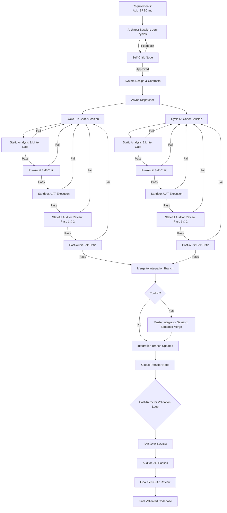

# System Architecture: NITPICKERS (NEXUS-CDD)

## 1. Summary
The NITPICKERS (NEXUS-CDD) project is a comprehensive evolution of the existing Autonomous Contract-Driven Development (AC-CDD) framework. This new architecture introduces true Concurrent Development and Zero-Trust Validation into the AI-native development lifecycle. The system is designed to act as a virtual development team, automating the entire software engineering process from requirements definition to deployment-ready, fully tested code. By breaking down the sequential bottlenecks of traditional AI coding assistants, NITPICKERS parallelises development cycles while enforcing rigorous quality gates through static analysis, dynamic testing in an isolated sandbox, and a rigorous, multi-layered Red Team audit loop that operates both before and after external auditing. The architecture heavily reuses existing robust LangGraph states, Git operation modules, and Pydantic-based domain schemas, extending them safely to support asynchronous task dispatching and stateful multi-agent workflows without rewriting the core foundation. Crucially, the system architecture mandates a clean, flattened source directory structure, moving from `dev_src/ac_cdd_core` directly to `src/`.

## 2. System Design Objectives
The primary objective of the NITPICKERS architecture is to achieve massive throughput and unparalleled code quality through a combination of concurrent execution and zero-trust validation. In traditional AI-assisted development, a significant bottleneck arises from the sequential nature of task execution. NITPICKERS shatters this bottleneck by introducing a highly parallelised, contract-driven concurrent development model. By explicitly defining the interfaces and contracts for multiple development cycles upfront during the architectural phase, the system enables multiple AI agents (specifically, stateful Jules sessions) to work simultaneously on different components of the system without stepping on each other's toes.

A paramount objective is to institute a zero-trust validation paradigm. Large Language Models (LLMs) are prone to hallucinations, logical errors, and deviations from best practices. Relying solely on AI self-review or superficial checks is insufficient. Therefore, NITPICKERS establishes strict, physical quality gates that every piece of generated code must pass before it can be merged. These gates are not merely prompt-based reviews; they encompass deterministic static analysis tools (like Ruff and MyPy running in strict mode) and dynamic, execution-based testing within an isolated, secure sandbox environment (E2B). This means that code is not accepted based on an AI's assertion of correctness, but rather on verifiable, empirical evidence that it compiles, type-checks, and successfully passes its required User Acceptance Tests (UATs).

Furthermore, the audit process is designed to be exhaustive and stateful. Not only does the AI self-criticize its code *before* it goes to an external Auditor agent, but it also undergoes a secondary Self-Critic evaluation *after* the Auditor's review to ensure no regressions or inconsistencies were introduced during the fix loop. Crucially, when an Auditor is invoked multiple times within a cycle, it must maintain a completely stateful session to preserve context, preventing the "amnesia" that often plagues multi-turn AI interactions.

The system is designed to be evolutionary and self-healing. When parallel development efforts converge, merge conflicts are inevitable. Instead of treating these conflicts as fatal errors, NITPICKERS views them as opportunities for architectural refinement. By feeding the conflicting code and its surrounding context into a specialized, stateful "Master Integrator" AI session, the system can perform semantic conflict resolution.

The architectural constraints dictate that these advanced capabilities must be built upon the existing AC-CDD foundation without resorting to a zero-base rewrite. The current LangGraph workflows, Git managers, and Pydantic models represent significant investments in stability. All new features are implemented as modular extensions that hook into the existing state machines gracefully.

## 3. System Architecture
The NITPICKERS system architecture is a sophisticated orchestration of AI agents, deterministic validation tools, and secure execution environments, tied together by a robust state machine. At its core, the architecture leverages LangGraph to manage complex, non-linear workflows. The system transitions from a sequential execution model to an asynchronous, concurrent model, driven by a newly introduced asynchronous dispatcher (`AsyncDispatcher`).

Crucially, the architecture enforces strict boundaries and separation of concerns. The flattened `src/` module houses the domain models, interface definitions, and core orchestration logic. We introduce new nodes within the LangGraph definitions to handle Self-Critic evaluations (both pre- and post-audit), UAT Sandbox integrations, and Semantic Merge resolutions. These new components interact with the existing system exclusively through well-defined Pydantic schemas.

The boundary management rules are absolute: AI agents are never permitted to execute code directly on the host machine. All code execution is strictly confined within an ephemeral E2B sandbox environment.

Furthermore, separation of concerns is maintained by distinctly segregating the roles of the various AI sessions. The Architect session designs and plans. The Coder sessions implement according to strict contracts. The Auditor sessions (maintaining state across their two mandatory passes) independently review the code. The Master Integrator session exclusively performs semantic merge conflict resolution. The Global Refactor node performs holistic optimizations.



## 4. Design Architecture
The design architecture of NITPICKERS builds upon the existing foundation of the AC-CDD framework, heavily utilising Pydantic for strict domain modelling and validation. We extend the existing directory structure and class definitions to accommodate the new concurrent and validation-heavy workflows. The primary focus is on extending the `CycleState` and associated schemas, and fundamentally flattening the codebase structure.

### File Structure Overview
```ascii
.
├── dev_documents/
│   ├── ALL_SPEC.md
│   ├── USER_TEST_SCENARIO.md
│   └── system_prompts/
│       ├── SYSTEM_ARCHITECTURE.md
│       ├── CYCLE01/
│       │   ├── SPEC.md
│       │   └── UAT.md
│       └── ... (CYCLE02 to CYCLE08)
├── src/
│   ├── __init__.py
│   ├── cli.py
│   ├── config.py
│   ├── domain_models.py
│   ├── enums.py
│   ├── graph.py
│   ├── graph_nodes.py
│   ├── jules_session_graph.py
│   ├── jules_session_nodes.py
│   ├── sandbox.py
│   ├── service_container.py
│   ├── state.py
│   ├── state_manager.py
│   ├── utils.py
│   └── validators.py
├── tests/
└── pyproject.toml
```

### Core Domain Pydantic Models Structure and Typing
The domain models are strictly defined using Pydantic to ensure type safety and runtime validation. We extend the existing `CycleState` to include comprehensive tracking of execution artifacts and conflict resolution states.

1.  **Extended CycleState**: We introduce fields to store sandbox execution results, linter validation statuses, pre-audit and post-audit Red Team feedback, and a boolean flag indicating if the Auditor session is currently active and stateful.
2.  **ConflictRegistry Schema**: A schema to track merge conflicts, recording files, specific Git conflict markers, context from conflicting branches, and resolution status.
3.  **SandboxArtifact Schema**: Encapsulates the results of an E2B sandbox run.
4.  **Integration Points**: The new schema objects extend `CycleState` and `ProjectManifest`. The `AsyncDispatcher` uses these models to monitor progress. Existing functions are updated to handle the new extended fields and the new `src/` import paths.

## 5. Implementation Plan

### CYCLE 01: Planning & Self-Critic Setup
Integrates the Self-Critic Node into the `gen-cycles` pipeline. The `SelfCritic` operates within the exact same Jules session as the `Architect` to evaluate the architecture against a static checklist of anti-patterns (N+1 problems, race conditions, etc.) and enforces strict Interface Locks.

### CYCLE 02: Concurrent Dispatcher & Workflow Modification
Rewrites the synchronous loop in `workflow.py` to support asynchronous, parallel execution using an `AsyncDispatcher` (`asyncio.gather`). Implements network-layer safety nets (exponential backoff) for HTTP 429 errors. Crucially, this cycle updates the state management to ensure that when an `Auditor` is invoked multiple times (e.g., 2 passes by 3 auditors), the dispatcher strictly maintains the exact same session context for that specific auditor to prevent context loss.

### CYCLE 03: Red Teaming Intra-cycle & Linter Enforcement
Introduces the first layer of Zero-Trust Validation. Implements the `linter_gate_node` (Ruff and MyPy in strict mode). Furthermore, it implements two critical Red Team nodes: `pre_audit_critic_node` (evaluating code before external audit based on `CODER_CRITIC_INSTRUCTION.md`) and a `post_audit_critic_node` (evaluating the codebase again *after* the Auditor pass to ensure fixes did not introduce new flaws).

### CYCLE 04: Sandbox UAT Verification Setup
Builds the dynamic execution pipeline using the E2B sandbox. Implements file synchronization, remote test execution (`pytest`), and the extraction of artifacts (stdout, stderr, exit codes). Failed tracebacks are dynamically routed back to the Jules Coder session for evidence-based self-debugging.

### CYCLE 05: Agentic TDD Flow Implementation
Mandates strict Test-Driven Development. Enforces the 'Red-Green-Refactor' sequence within LangGraph. The AI must write tests against stubbed logic, prove they fail in the sandbox (Red), implement the logic (Green), and verify success, guaranteeing the validity of the generated test suite.

### CYCLE 06: Cascading Merge Resolutions
Implements Semantic Merge strategy. Intercepts failed `git merge` commands, extracts Git conflict markers into a `ConflictRegistry`, and instantiates a stateful `MasterIntegrator` Jules session. The AI semantically resolves the conflict, and a rigid regex parser ensures all markers are physically removed before finalization.

### CYCLE 07: Global Refactor Node
Executes a comprehensive, system-wide refactoring pass across the entire `src/` directory to consolidate duplicate logic and enforce DRY principles. Following the structural refactoring, this cycle mandates the codebase passes through a rigorous, explicitly ordered validation sequence: Self-Critic Review -> Stateful Auditor Passes (2x3) -> Final Self-Critic Review.

### CYCLE 08: Refinement, Dependency Cleanup, and System Stabilization
Finalizes the project by generating documentation (`README.md` and Marimo tutorials), autonomously auditing and purging unused dependencies from `pyproject.toml`, and automatically generating the final Pull Request.

## 6. Test Strategy
*All test strategies prioritize mocking LLM responses and executing assertions against the state machine and physical file artifacts.*

### CYCLE 01: Planning & Self-Critic Setup
Unit tests for the `architect_critic_node` function in isolation, mocking the `JulesClient` to assert state transitions (`ARCHITECTURE_APPROVED`, `CRITIC_REJECTED`) based on specific flawed or flawless architectural specifications.

### CYCLE 02: Concurrent Dispatcher & Workflow Modification
Unit testing the `AsyncDispatcher` using `pytest.mark.asyncio`, simulating tasks of varying duration to prove parallel execution. Integration tests verify that stateful Auditor sessions correctly retain context across multiple mock invocations and that HTTP 429 errors are gracefully caught and retried.

### CYCLE 03: Red Teaming Intra-cycle & Linter Enforcement
Unit testing the `linter_gate_node` by mocking `subprocess.run` with exit codes 0 and 1. Integration tests simulate a flawed Coder generation, proving the workflow correctly routes through the Linter, Pre-Audit Critic, and Post-Audit Critic sequentially.

### CYCLE 04: Sandbox UAT Verification Setup
Mocking the `e2b-code-interpreter` SDK for unit tests. Integration tests use a temporary directory to push a trivial passing/failing script to a live (or robustly mocked) container, asserting the LangGraph state correctly captures the execution traceback and routes it back for fixing.

### CYCLE 05: Agentic TDD Flow Implementation
Unit tests verifying the state machine logic governing the Red/Green phases. Simulating sandbox results to ensure the system rejects tests that pass against stubbed code and only proceeds to the implementation phase after a verified 'Red' state.

### CYCLE 06: Cascading Merge Resolutions
Unit tests for the `extract_git_conflicts` utility using files with complex Git conflict markers. Integration tests simulate an actual Git conflict, provide a mocked AI resolution, and assert the validation parser strictly rejects any residual markers before committing the merge.

### CYCLE 07: Global Refactor Node
Unit tests verifying the node's ability to bundle the directory structure into a coherent prompt. Integration tests use a dummy project with intentional redundancies, asserting the Global Refactor node consolidates them and subsequently triggers the full, ordered validation pipeline (Critic -> Auditor -> Critic).

### CYCLE 08: Refinement, Dependency Cleanup, and System Stabilization
Unit testing the `audit_dependencies_node` with a mocked `pyproject.toml` containing unused dependencies, asserting they are safely removed. Integration tests simulate the `finalize-session` command, verifying the generation of an accurate `README.md` and Marimo tutorial based on the final project state.
