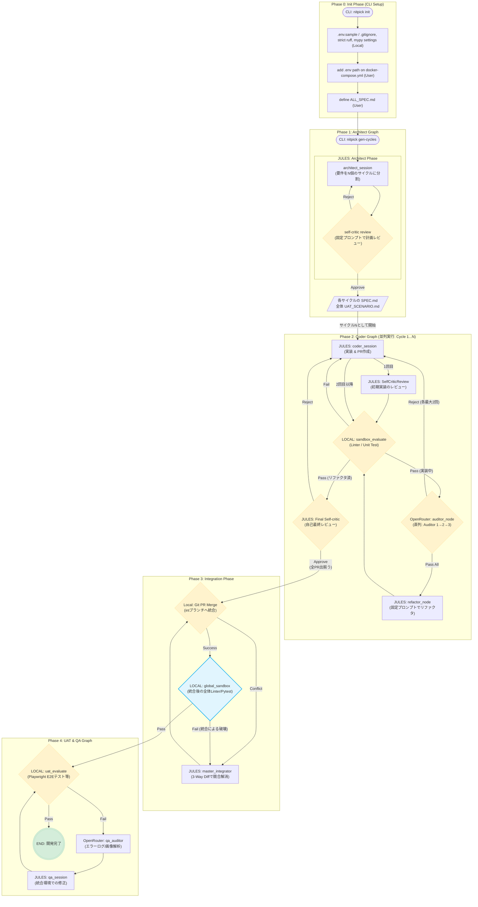

# System Architecture

## Summary
The NITPICKERS framework is transitioning to a newly implemented 5-Phase Architecture designed to bolster the stability, clear delineation of duties, and zero-trust validation inherent in the AI-native code development lifecycle. This comprehensive redesign decomposes the previously monolithic workflow into sequential, isolated phases: Initiation, Architecture Planning, Parallel Implementation (Coding), Conflict Integration, and User Acceptance Testing (UAT). Each phase is engineered as an autonomous domain that executes specifically defined LangGraph networks and interacts safely with an environment using dependency injection. The architecture enforces meticulous isolation so that the parallel execution of multiple development cycles does not corrupt the overarching system state. Furthermore, a 3-Way Diff mechanism allows a master integrating node to resolve source code conflicts safely. Existing codebase elements like `CycleState` and internal graph definitions in `src/graph.py` form the foundational pillars for these new structural adjustments.

## System Design Objectives
The core objective of this system architecture upgrade is to enhance the overall robustness, maintainability, and extensibility of the AI-native development environment. Currently, the workflow tends to merge multiple responsibilities into an intertwined graph, making it challenging to scale or debug when failures occur within sub-tasks. By strictly adhering to a 5-Phase strategy, the system design aims to decouple the execution into well-defined boundaries.

First, the Initialization Phase (Phase 0) must establish a deterministic environment via the Command Line Interface (CLI), ensuring that templates and required parameters are securely deployed without interfering with the local target projects. Second, the Architect Graph (Phase 1) is intended to parse high-level requirement documents (`ALL_SPEC.md`) and autonomously partition the tasks into manageable, parallelizable units called cycles.

Phase 2, the Coder Graph, is the most computationally intensive segment. Here, the system must seamlessly run parallel AI agents that generate implementation code, execute static checks in isolated sandboxes, and solicit rigorous scrutiny through a serial chain of Auditor agents. The objective here is to instantiate a self-correcting feedback loop—where code is implemented, critiqued, and refactored dynamically before being proposed for integration. To prevent infinite regression, a strict limit is imposed on retry attempts for the same validation context.

Following successful implementations across cycles, Phase 3 addresses integration. The system design mandates a resilient Integration Phase where concurrent changes from different branches are coalesced into a unified master branch. Utilizing a 3-Way Diff mechanism (involving the common base code, the local branch, and the remote branch), a designated Master Integrator agent must elegantly resolve conflicts without overwriting logical intents.

Finally, Phase 4 embodies User Acceptance Testing (UAT) and Quality Assurance (QA). The objective is to validate the fully integrated source code dynamically. Rather than static linting, this phase must execute E2E tests, interpret runtime logs, and capture graphical interfaces. If errors arise, automated remediation procedures are engaged. Overall, these explicit objectives dictate the construction of loosely coupled, highly cohesive domains governed by strict Pydantic schemas and predictable LangGraph workflows.

## System Architecture
The system architecture revolves around the concept of LangGraph-driven state machines executing targeted operational nodes. By segregating the logic into five core phases, the system restricts the blast radius of potential failures and enforces precise separation of concerns. The architecture relies heavily on existing abstractions like `WorkflowService` and `ProjectManager`, mapping new graph definitions cleanly onto them.

The 5-Phase configuration is articulated as follows:
- **Phase 0 (CLI Initialization)**: Intercepts user inputs to provision target environments via `nitpick init`. It provisions `.env.sample` files, sets up correct ruff and mypy configurations, and instructs users to define their target capabilities.
- **Phase 1 (Architect Phase)**: Operates within a dedicated graph that consumes the user's specification (`ALL_SPEC.md`) and formulates multiple implementation cycles.
- **Phase 2 (Coder Phase)**: This phase runs a specialized graph for each generated cycle concurrently. The state is maintained within a `CycleState` dictionary extended to track the `is_refactoring` boolean and the `current_auditor_index`.
- **Phase 3 (Integration Phase)**: Executes sequentially after all Phase 2 graphs conclude successfully. It invokes `git_merge_node` to attempt standard merges, falling back to a `master_integrator_node` that applies a 3-Way Diff heuristic to rectify source code conflicts. A `global_sandbox_node` validates the post-merge integrity.
- **Phase 4 (UAT & QA Phase)**: An independent graph that triggers dynamic E2E testing (e.g., Playwright scripts) via the `uat_evaluate` node, dispatching diagnostic data to a `qa_auditor` for automated bug fixing.

Explicit Rules on Boundary Management:
1. **No Shared Sandbox State**: Each cycle running in Phase 2 must execute its static checks against an isolated temporary directory or specifically partitioned Git worktree. Under no circumstances should the side-effects of one parallel cycle compromise another.
2. **Strict Schema Interfacing**: All transitions between nodes must be serialized and deserialized using rigidly defined Pydantic states.
3. **Mock Mandate for External APIs**: Any testing that traverses integration boundaries must mock external SaaS endpoints to prevent inadvertent pipeline suspensions due to missing API keys in CI/CD environments.



## Design Architecture
The design architecture dictates how application domains are mapped onto explicit Pydantic-based schemas, enforcing strong typing and invariant data encapsulation. The underlying structure focuses on preserving existing logic within `src/state.py` while safely extending it to meet new orchestrations.

```
src/
├── state.py              # Extended to track new states: `is_refactoring`, `current_auditor_index`
├── graph.py              # Houses `_create_integration_graph` alongside revised `_create_coder_graph`
├── cli.py                # Command line orchestration
├── nodes/
│   ├── routers.py        # Logic for route_auditor, route_sandbox_evaluate, etc.
│   └── integrations.py   # Specialized nodes for merging and 3-Way Diff integration
└── services/
    ├── conflict_manager.py # Logic for extracting Git 3-Way differences
    └── workflow.py       # Manages the transition from Phase 2 to Phase 3
```

Within `src/state.py`, the core domain model `CycleState` will be extended to encompass boolean and integer fields strictly validated through Pydantic constraints. The flag `is_refactoring` directs the router downstream from the sandbox, determining whether the current node traverses back toward an Auditor or proceeds to a Final Critic. Similarly, `current_auditor_index` dictates loop conditions for sequential reviews. To support Phase 3, an `IntegrationState` model will be formalized. It will encapsulate details regarding base commits, incoming cycle commits, and resolved code blobs to prevent context mixing during conflicts.

The newly extended schema objects integrate perfectly with the existing domain objects. `CycleState` remains inherited from generic typed dicts but is enriched with explicitly typed parameters. Because Pydantic is utilized, any invalid assignments during state transitions will yield early runtime assertions, reinforcing the reliability of LangGraph checkpoints.

## Implementation Plan
The execution of this architecture is decomposed into exactly 1 development cycle to ensure a focused, atomic delivery of the 5-Phase upgrade.

### CYCLE01: Implement 5-Phase Architecture Redesign
This cycle encapsulates the holistic transformation of the NITPICKERS framework into the 5-Phase Architecture. Specifically, it involves the surgical modification of the `CycleState` in `src/state.py` to append the necessary state tracking variables (`is_refactoring`, `current_auditor_index`, `audit_attempt_count`). Concurrently, the graph instantiations in `src/graph.py` will be overhauled. The `_create_coder_graph` will be re-wired to replace parallel auditing with a serial Auditor chain and a dedicated Refactor node.

Subsequently, a brand-new `_create_integration_graph` will be established, formalizing Phase 3. This entails building out the `master_integrator_node` and its conditional routers in `src/nodes/routers.py`. Furthermore, `src/services/conflict_manager.py` will be enriched to leverage native Git mechanisms (e.g., `git show :1:file`, `:2:file`, `:3:file`) to extract Base, Local, and Remote code snapshots, compiling them into a succinct 3-Way Diff context package for the Integrator LLM. The workflow service will be adjusted to stagger these graphs—waiting for all parallel Phase 2 tasks to complete before firing Phase 3 and, eventually, the UAT/QA Phase 4.

## Test Strategy

### CYCLE01: Test Strategy
The testing methodology for the 5-Phase Architecture upgrade hinges on maintaining sandbox resilience and avoiding state bleed between cycles. Unit tests will rigorously cover the Pydantic state extensions in `src/state.py`, asserting that validation errors properly trigger on invalid enumerations or integer ranges for `current_auditor_index`. The routing logic in `src/nodes/routers.py` will be tested using isolated mock state objects to verify correct conditional branch selections (e.g., routing to `final_critic` when `is_refactoring` is true).

Integration testing requires a more comprehensive approach. For Phase 3 logic within the `conflict_manager.py`, the strategy mandates executing operations against a temporary local bare repository. Test suites will programmatically construct artificial merge conflicts using Git commands, subsequently asserting that the `build_conflict_package` correctly delineates the Base, Local, and Remote segments without invoking live LLMs.

**DB Rollback Rule**: Any testing requiring database or persistent state setup MUST utilize Pytest fixtures that start a transaction before the test and roll it back after, ensuring lightning-fast state resets without relying on heavy external CLI cleanup commands.
